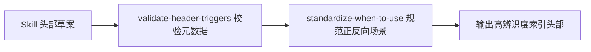

# Index Header Contract (索引头部契约规范)

## Overview

Index Header Contract 统一规范所有 Skill 的头部呈现。
确保每个进入 Skill 池的资产都具备高辨识度的使用场景、排他边界与合规的 Frontmatter。

## Workflow

## Boundaries

- 专职约束头部说明与元数据契约，不侵入主体算法逻辑。
