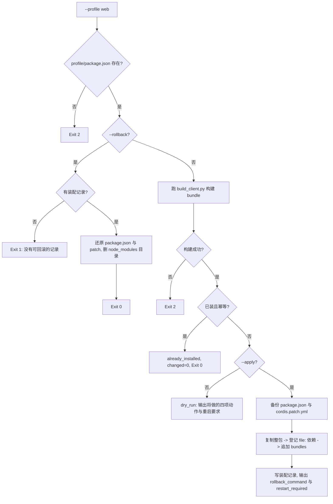

# Install Client Plugin (DSH client 插件幂等装配器)

## Overview

本技能负责把自建 client 插件**装进 profile**，并保证这一步是**可回滚且幂等**的。

**为什么落点是自建 client 插件**：宿主应用包已签名（改它即破签名，PKG-006 结论）；
插件市场本体 `dshmarket` 是第三方包，重装即覆盖。唯一合规落点是自己写一个插件。

## When to Use

- 需要把本仓 `plugins/` 下的 client 插件装进某个 profile 时；
- 需要撤销一次装配、回到装配前状态时（`--rollback`）。

**触发禁区**：不修改宿主应用包、不 patch 第三方插件、不启用/停用其他插件；
本技能只装配本仓 `plugins/` 下的插件。

## Workflow



1. `[probe:file]` 断言 `<profile>/package.json` 存在且可解析，缺失即退 2；
2. `[probe:exitcode]` `--rollback` 时断言存在装配记录，无记录即退 1（**不猜、不半回滚**）；
3. `[probe:file]` 回滚：从 `dependencies` 摘除、从 `bundles` 摘除、删 `node_modules/<id>/`、还原两份备份、删记录；
4. `[probe:exitcode]` 非回滚路径先跑 `build_client.py` 构建，构建失败即退 2（**不带旧 bundle 装配**）；
5. `[probe:file]` 断言幂等：`dependencies[id] == file:<源目录>` 且 `id ∈ bundles` 且目标目录存在 → `already_installed`、`changed=0`、退 0；
6. `[probe:file]` 非 `--apply` 即干跑：输出四项将做的动作（构建 / 拷贝 / 依赖 / bundles）与备份路径，**不写任何文件**；
7. `[probe:file]` 装配前备份 `package.json` 与 `cordis.patch.yml` 为 `.bak-<时间戳>`；
8. `[probe:file]` 复制整包（排除 `__pycache__` 与 `node_modules`）到 `<profile>/node_modules/<id>/`；
9. `[probe:regex]` 登记 `file:` 依赖并追加 `dsh.profile.bundles`，断言 `bundles` 是数组且不重复追加；
10. `[probe:exitcode]` 输出 `restart_required=true` 与具体动作——**新增插件的注册表在宿主启动时读取，只刷新页面不够**，绝不假装热更成功。

## Usage & Script

```bash
# 干跑看影响面
python3 skills/install-client-plugin/scripts/install_plugin.py --profile web

# 装配
python3 skills/install-client-plugin/scripts/install_plugin.py --profile web --apply --json

# 回滚
python3 skills/install-client-plugin/scripts/install_plugin.py --profile web --rollback
```

实测：装配后 `dependencies` 增加 `dsh-plugin-control-jump -> file:<pool>/plugins/dsh-plugin-control-jump`，
`bundles` 由 20 项变 21 项；二次运行 `already_installed` 且 `changed=0`。

## Success Contract

| 退出码 | 含义 |
| --- | --- |
| 0 | 干跑完成 / 装配成功 / 回滚成功 / 已是目标状态（幂等） |
| 1 | 目标 profile 不可写、无装配记录无法回滚 |
| 2 | 输入不可读（插件目录缺失、构建失败、package.json 不可解析） |

## Boundaries & Constraints

- **只装配本仓 plugins/**：不改宿主应用包、不 patch 第三方插件；
- **必须先备份**：没有 `.bak-<时间戳>` 就不许改 `package.json`；
- **幂等**：已装状态下重跑必须 `changed=0`；
- **诚实声明重启**：新增插件的 bundle 注册表在宿主启动时读取，装配后需重启宿主；
  本技能输出 `restart_required=true`，绝不声称「刷新页面即可」；
- **回滚是原子语义**：无记录时报错退出，不做半回滚。
