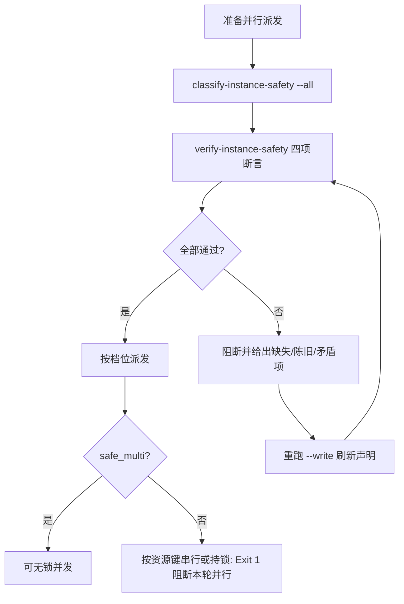

# Instance Pool Guard (实例准入门禁)

## Overview

Instance Pool Guard 是「并行之前先证明能并行」这条纪律的第一道门。
它把分档与断言串成派单前门禁，让"能不能多开"变成一个先于派单被回答的问题。

## When to Use

- 管家准备并行派发多个执行层实例之前；
- 新增或修改执行层脚本之后；
- 与 `parallel-lock-guard` 配合使用（本门禁定"能不能并行"，锁门禁定"并行时怎么加锁"）。

**触发禁区**：本门禁不负责真正起实例，也不负责锁的获取与释放。

## Workflow



1. `[probe:exitcode]` 运行 `classify-instance-safety` 分档，退出码必须为 0；
2. `[probe:exitcode]` 运行 `verify-instance-safety` 四项断言，退出码 0 方可继续；
3. `[probe:regex]` 断言阻断输出中每条违规都带技能 id，杜绝「只说不合格但不说是谁」；
4. `[probe:exitcode]` 按档位放行：`safe_multi` 直接并发；`needs_lock` 转交 `parallel-lock-guard` 按资源键加锁；`single_only` 一律串行。

## Usage & Script

```bash
python3 skills/classify-instance-safety/scripts/classify_instance_safety.py --all --write
python3 skills/verify-instance-safety/scripts/verify_instance_safety.py
```

## Success Contract

- Exit Code 0：声明齐全、不陈旧、无矛盾，档位可据此派发；
- Exit Code 1：任一项断言失败，本轮并行派发被阻断。

## Boundaries & Constraints

- **多实例不是默认允许**：文档型技能（无脚本）天然 `safe_multi`，但带写盘脚本必须受限；
- 本门禁不替代 `parallel-lock-guard`：档位判完仍需锁集合对拍。
