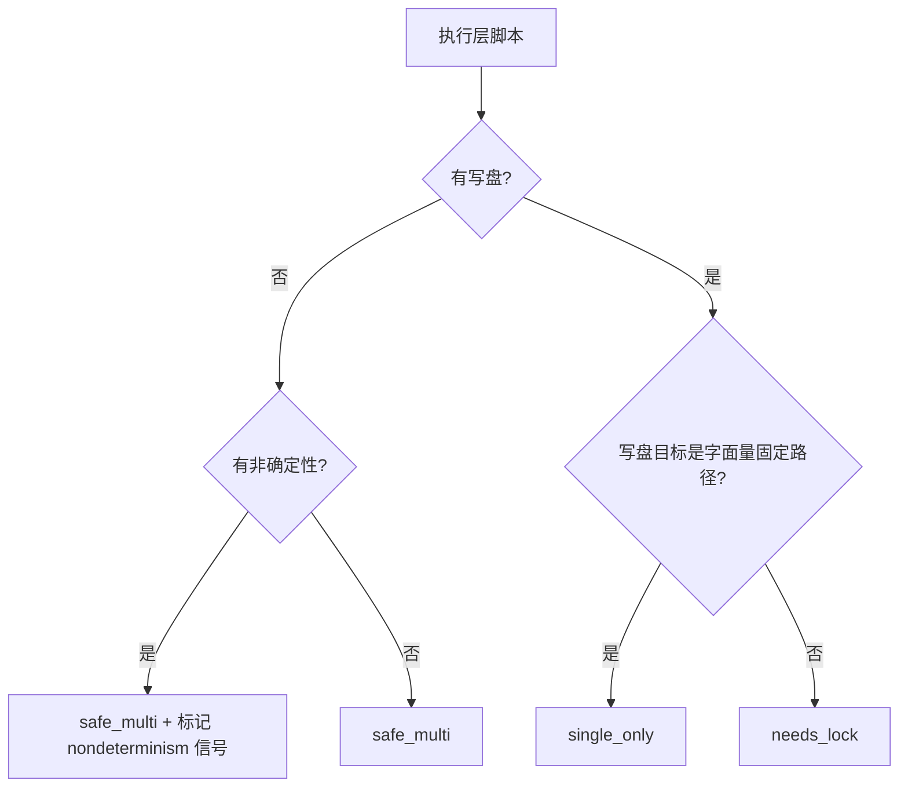

# Instance Pool Policy (执行层多实例规约)

## Overview

本技能是 L1 原子级基础规约，规定「多开」不是默认权利，而是一种**需要被声明和验证**的能力。
管家的并行调度建立在此之上：只有被判定为可多开的执行层，才允许同时发出多个实例。

## When to Use

- 设计或修改任何执行层（技能 / 命令 / 智能体）的脚本时；
- 管家准备并行派发任务之前；
- 审查某次并行是否安全时。

**触发禁区**：本规约只做**准入判定**；真正起实例是宿主 `subagent` / 后台 job 的能力，不在本层职责内。

## Workflow

1. `[probe:file]` 读取目标执行的 `scripts/*.py`（无脚本的 L1/L3 视为 `safe_multi`，它们不产生副作用）；
2. `[probe:regex]` 扫描写盘信号（`write_text` / `write_bytes` / `json.dump(` / `os.makedirs` / `open(...,'w')`）；
3. `[probe:regex]` 判定写盘目标是否为**字面量固定路径**：是则 `single_only`，否则 `needs_lock`；
4. `[probe:exitcode]` 无写盘即 `safe_multi`，并单独记录 `nondeterminism` 信号（`datetime.now` / `time.time` / `random.` / `uuid`）；
5. `[probe:length]` `needs_lock` 与 `single_only` 必须给出**非空** `resource_keys`。

## Strict Rules

1. **实例必须无状态**：状态要么不存在，要么外置到资源键（文件路径 / 目录 / 端口 / 实例 id）；
2. **禁止实例间共享可变全局**：脚本级模块变量在并发实例间是共享的，不得作为状态载体；
3. **独占资源必须声明**：写固定产物路径、用固定临时文件名、绑定固定端口的执行层必须标 `single_only`；
4. **`safe_multi` 的充分条件是无写盘**；非确定性（读时钟 / 随机）**不等于并发不安全**，它只影响可复现性，单独记录为信号而**不**据此降档。

## Boundaries & Constraints

- 本规约不保证执行层的**业务**幂等，只判定**并发副作用面**；
- 声明表是事实的快照：脚本一改，声明即过期，必须重跑扫描刷新。
