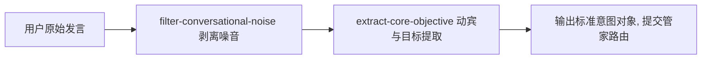

# Intent Detector (意图检测与噪音过滤)

## Overview

Intent Detector 负责充当管家与外部交互的第一道防线。
通过消除客套与语气词噪音，精准识别用户意图的核心动词、目标实体与硬性约束。

## Workflow

```mermaid
flowchart LR
    Raw[用户原始发言] --> Clean[filter-conversational-noise 剥离噪音]
    Clean --> Extract[extract-core-objective 动宾与目标提取]
    Extract --> IntentObj[输出标准意图对象, 提交管家路由]
```

## Boundaries

- 仅负责意图语义的提纯与结构化，不执行下游业务逻辑。
