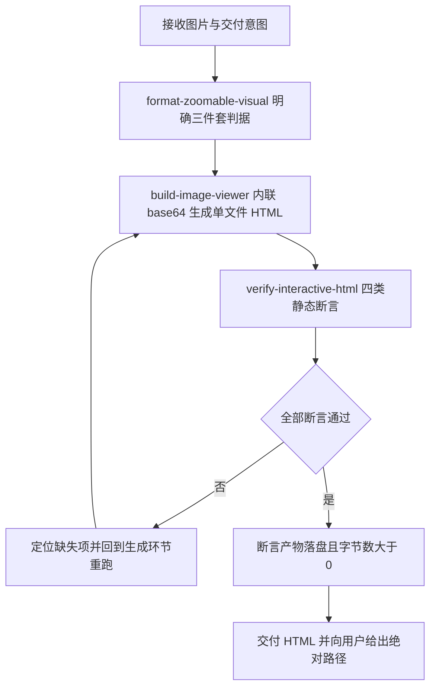

# Interactive Image Viewer (可缩放可视化端到端总控)

## Overview

Interactive Image Viewer 是管家「⑤ 需求与透视」集群下的交付总控，与 `visualize-governance-topology` 为兄弟节点：后者负责**画出来**（拓扑与调度链路的语义编译），本技能负责**看得清**（把任何图片 / 图谱 / 示意图变成可缩放的交互成品）。

它把三层能力锁成一条不可跳步的链路：

| 环节 | 承载技能 | 级别 | 职责 |
| :--- | :--- | :--- | :--- |
| 规约 | `format-zoomable-visual` | L1 | 定义「什么才算合格可视化」的唯一判据 |
| 生成 | `build-image-viewer` | L2 | 把图片编译为零依赖单文件交互 HTML |
| 自检 | `verify-interactive-html` | L2 | 对产物做四类静态断言，退出码 0/1 定生死 |

没有本技能，用户拿到的是「一张点不开的图」；有本技能，任何图片交付都自带点击放大、放大缩小与复位。

## When to Use

- 用户要求「把这张图做成能放大的」「图谱看不清」「能不能点开看」时；
- 需要把拓扑图、结构图、长截图、架构示意图作为正式交付物落盘时；
- 需要为一次可视化交付提供可复现的验收证据（退出码 + 产物字节数）时；
- 在「⑤ 需求与透视」集群中，需要对既有图片资产做可缩放改造时。

**触发禁区**：纯文本、表格、纯 Mermaid 代码块、宿主 GenUI 原生图表不适用本流程；只想「画一张图」而不涉及图片交付时，应交给 `visualize-governance-topology` 等上游技能，不要为了套流程而生成多余的 HTML。

## Workflow

1. `[probe:file]` 确认输入图片物理存在且字节数大于 0，扩展名落在 `png|jpg|jpeg|svg|webp` 白名单内；
2. `[probe:regex]` 以 `format-zoomable-visual` 的三件套判据作为唯一验收标准，不接受「图小不用缩」的例外；
3. `[probe:file]` 调用 `build-image-viewer` 产出单文件 HTML，并断言输出路径已落盘且字节数大于 0；
4. `[probe:regex]` 断言产物同时含 `data-zoom-in`、`data-zoom-out`、`data-zoom-reset` 三个控制标识；
5. `[probe:regex]` 断言产物不含 `src="http`、`href="http`、`url(http`、`<script src=`、`<link ` 五类外部引用模式；
6. `[probe:exitcode]` 调用 `verify-interactive-html`，退出码为 0 才放行；为 1 则依据其 `checks` 明细回到第 3 步重跑，禁止带病交付；
7. `[probe:file]` 交付前复核产物绝对路径真实有效，并在回复中给出该路径与验证退出码作为证据。

## Boundaries & Constraints

- 本技能只做编排，不自己实现生成与校验逻辑，不得绕过 `verify-interactive-html` 直接交付；
- 严禁在 `verify-interactive-html` 返回 1 的情况下交付产物，也不允许为通过门禁而放宽断言；
- 严禁引入 CDN、外链脚本、外链样式或 npm 依赖，产物必须是可双击打开的单文件 HTML；
- 本技能不负责图形语义的正确性（图画得对不对由上游可视化技能保证），只保证「看得清」；
- 集群归属固定为管家「⑤ 需求与透视」，不得另挂他处或重复挂载。
