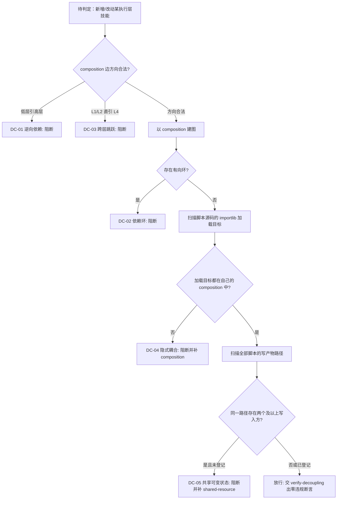

# Layer Decoupling Policy (执行层解耦判定基元)

## Overview

**核心立场**：执行层之间**只通过契约通信**。契约只有两种物理形态：

1. **组装边**：`skill-catalog.json` 中该技能的 `composition` 数组（谁被允许调用谁）；
2. **产物路径**：技能 SKILL.md 中显式声明的输入/输出产物路径（谁被允许读写哪个文件）。

**契约之外的一切调用都是耦合**。低层技能直接引用高层技能、跨层直引中枢、脚本偷偷加载别人未声明的模块、
两个技能写同一个产物却不说——这些都让「层」退化成装饰，改一处崩一片。

**依赖方向只允许 `L4 → L3 → L2 → L1` 与同层**：中枢可以调用复合流程，复合流程可以调用工序动作，
工序动作可以调用原子规约；同层之间允许（L2→L2、L3→L3），**反向一律违规**。

本技能只出判据与登记规约，不做检测：建图交 `build-layer-graph`，检测交 `detect-layer-coupling`，
断言交 `verify-decoupling`，门禁交 `decoupling-guard`。

## When to Use

- 新增、拆分、合并任一执行层技能，需要判定其 `composition` 边方向是否合法时；
- 需要判定某个脚本 `importlib`/路径常量加载了别的技能、算不算契约外耦合时；
- 两个及以上技能要写同一个产物文件，需要判定是否必须先登记为共享资源时；
- 下游检测器需要确定五类违规的判据口径、证据字段与阻断条件时。

**触发禁区**：只读查询、纯问答与单文件改动不经过本规约；本规约不检测、不写文件、不阻断任务，只给出「什么算耦合违规」。

## Violation Criteria (五类物理判据)

| 编号 | 类别 | `kind` | 物理判据（只依赖仓内文件内容） |
| :--- | :--- | :--- | :--- |
| DC-01 | 逆向依赖 | `reverse_dependency` | 技能 U 的 `composition` 含技能 V，且 `level(V)` 高于 `level(U)`（L1→L2、L1→L3、L2→L3、L2→L4、L3→L4 等），即低层引用高层 |
| DC-02 | 依赖环 | `dependency_cycle` | 以 `composition` 为有向边建图后存在有向环 `a → … → a`，参与环的每一跳都是违规 |
| DC-03 | 跨层跳跃 | `cross_layer_jump` | L1/L2 的 `composition` 直接引用 L4 中枢，跳过 L3 复合流程层 |
| DC-04 | 隐式耦合 | `implicit_dependency` | `skills/<U>/scripts/*.py` 通过 `importlib` 加载了 `skills/<V>/scripts/*.py`，但 `<V>` **未出现在 U 自己 SKILL.md 的 `composition` 中** |
| DC-05 | 共享可变状态 | `shared_mutable_state` | 两个及以上技能的脚本写入**同一个**仓库内产物路径，而该路径未被全部写入方登记为共享资源 |

判据的确定性口径（四条硬约束）：

1. **只看文件内容**：五类判据全部从 SKILL.md 的 Frontmatter 与脚本源码文本算出，不取系统当前时间、不用随机数、不联网；
2. **层级口径唯一**：层级取 SKILL.md 的 `level` 字段，`L1 < L2 < L3 < L4`，缺 `level` 的技能不入图并单独上报；
3. **未声明即违规**：`composition` 中没有的加载就是隐式耦合，不因「它只是顺手用一下」而豁免；
4. **如实上报**：判据不放宽、不为「好看」豁免，改造前就存在的违规照报，豁免只能走 `verify-decoupling --allow` 显式留痕。

## Shared Resource Registration (共享资源登记)

被两个及以上技能写入的产物路径**必须**在每个写入方显式登记，登记形态是 SKILL.md 或 README.md 中的一行标记：

```
[shared-resource] docs/operations/skill-query-log.jsonl
```

- 一行一条，路径为仓库相对路径（也可只写不含目录的文件名，按 basename 匹配）；
- 登记方必须是**写入方之一**，旁观者代登记无效；
- 只要有一个写入方没登记，整条共享关系按 `shared_mutable_state` 违规上报，证据列出全部写入方与未登记方。

## Workflow



1. `[probe:file]` 断言目标技能的 `SKILL.md` 存在，且 Frontmatter 含 `name`/`level`/`composition` 三项，缺任一即不入图；
2. `[probe:regex]` 对每条 `composition` 边匹配 `level(from)` 与 `level(to)`，命中「低层引高层」即判 DC-01 并钉死证据行号；
3. `[probe:regex]` 以 `composition` 为有向边做环检测，命中环即判 DC-02，证据必须写出完整环路径；
4. `[probe:regex]` 匹配 L1/L2 直接引用 L4 的边，命中即判 DC-03；
5. `[probe:regex]` 扫描 `skills/<U>/scripts/*.py` 中的 `skills/<V>/scripts/*.py` 路径常量，凡含 `importlib` 加载语句且 `<V>` 不在 U 的 `composition` 中即判 DC-04；
6. `[probe:length]` 汇总每个产物路径的写入方集合，`len(写入方) >= 2` 且存在未登记方即判 DC-05，证据列出全部写入方；
7. `[probe:exitcode]` 交 `verify-decoupling` 断言五类计数全为 0，该命令退 0 方可放行。

## Usage & Script

本技能为纯规约，无独立脚本；判据的物理执行由下游四个技能承载：

```bash
# 1) 建图：把 composition 图与结构类违规落成唯一真相源
python3 skills/build-layer-graph/scripts/build_layer_graph.py --json

# 2) 检测：五类违规逐条给 kind/from/to/evidence/file/line
python3 skills/detect-layer-coupling/scripts/detect_coupling.py --json

# 3) 断言：五类计数必须为 0，豁免必须显式登记
python3 skills/verify-decoupling/scripts/verify_decoupling.py --json
```

## Success Contract

本规约自身不含脚本，退出码语义由下游脚本承载：

| 退出码 | 含义 |
| :--- | :--- |
| 0 | 五类违规计数全为 0（或已用 `--allow` 显式豁免并在输出中标注 `waived`） |
| 1 | 存在未豁免的耦合违规，或 `--check` 检测到 layer-graph 陈旧 |
| 2 | 输入缺失/不可读（缺 `skill-catalog.json`、`execution-layers.json`、SKILL.md，或 `--skill` 指向不存在的技能） |

## Boundaries & Constraints

- 本规约**不检测、不写文件、不阻断任务**，只输出判据、登记规约与豁免纪律；
- **禁止跨层直引内部实现**：低层技能不得出现高层技能的实现细节（函数名、模块路径常量、脚本路径）；
- **禁止环**：任何 `composition` 环都是设计事故，不存在「小环可容忍」的例外；
- **共享产物必须显式登记**：`[shared-resource]` 是唯一登记形态，写在散文里的「大家共用一个日志」不算登记；
- 豁免只能通过 `verify-decoupling --allow <kind,...>` 显式给出，且必须在输出里留痕为 `waived`，禁止静默放宽判据；
- 判据只认仓内文件内容，不新增第二套层级口径与第二套违规命名。
