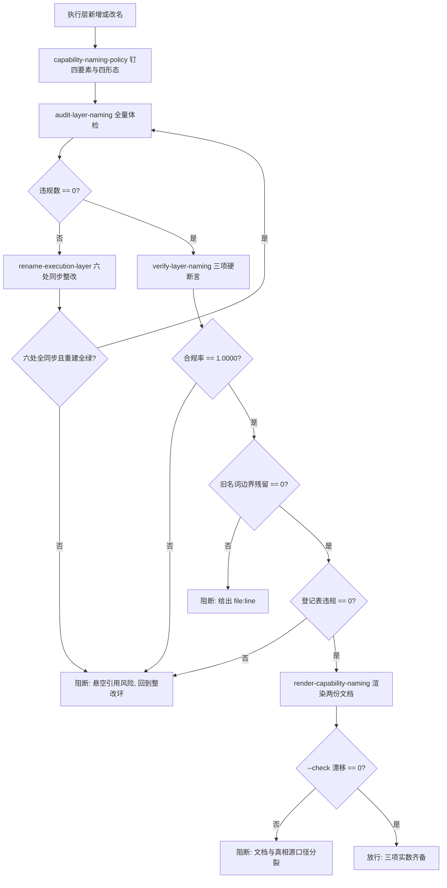

# Layer Naming Guard (执行层命名规范门禁)

## Overview

本技能是 L3 复合流程级总控，把命名治理的四个原子能力串成**一道放行门禁**：

| 序 | 环节 | 承载技能 | 物理产物 | 不通过时 |
| :---: | :--- | :--- | :--- | :--- |
| 1 | 口径 | `capability-naming-policy` | 四要素 + 四种形态 + 六处同步契约 | 写不出物理判据即不得改名 |
| 2 | 体检 | `audit-layer-naming` | `violations[]`（含违规码与 `file:line`）+ `compliance_rate` | 有违规即阻断，进入整改环 |
| 3 | 整改 | `rename-execution-layer` | 六处同步证据 + `retired-names.json` | 改名不成立即阻断 |
| 4 | 断言 | `verify-layer-naming` | `checks[]` 三项与实数合规率 | 任一断言不过即阻断 |
| 5 | 渲染 | `render-capability-naming` | 两份受管区块 + `drift` | 文档与真相源漂移即阻断 |

**放行的唯一合法证据是三项实数齐备**：

1. 合规率 == **1.0000**（分子分母必须打印，禁止「已合规」字样）；
2. 旧名悬空引用 == **0**（按词边界扫描，不是子串）；
3. 规范文档与真相源漂移 == **0**（`--check` 退 0）。

**为什么第 3 项也算放行条件**：规则一旦改了口径而文档没跟着刷新，人读的是一个规则、
机器执行的是另一个规则。这种漂移不会立刻报错，只会在下一次人工按文档操作时静默出错。

### 与相邻门禁的分工

| 门禁 | 判什么 | 属于 |
| :--- | :--- | :--- |
| `execution-tree-guard` | 执行层树与索引是否与 catalog 四方一致 | 结构一致性 |
| `catalog-consistency-guard` | SKILL.md / catalog / docs 受管区块是否三方一致 | 口径一致性 |
| `layer-naming-guard` | **名字本身是否合规、旧名是否清干净、规范文档是否同步** | 命名规范 |
| `atomic-fission-guard` | 步骤是否可绑定物理探针 | 粒度 |

四者串联而非互相取代：树一致不代表名字合规，名字合规也不代表树一致。

## When to Use

- 新增或改名任何执行层之后，需要一条可复算的命名放行判据时；
- 批量整改前需要先看全量违规清单、整改后需要给出三项实数证据时；
- 交付验收需要证明「命名规范已进知识库、存量已整改、树与索引已同步」时。

**触发禁区**：纯只读代码改动、不涉及执行层增删改名时不经过本门禁；
本门禁只做裁决与阻断，**不体检、不改名、不渲染**（那四件事归上游四个原子技能）。

## Workflow

以下 Mermaid 图即本门禁的链条（口径 → 体检 → 整改 → 断言 → 渲染），随后十条有序步骤是它的物理执行序：



1. `[probe:regex]` 由 `capability-naming-policy` 钉死四要素与四种形态，断言每条都有物理判据（归属可判定、层名在六层闭集、描述带前缀、id 匹配语法）；
2. `[probe:file]` 断言 `docs/operations/capability-naming.json` 存在且可解析，缺失即阻断（**无真相源就没有可复算的判据**）；
3. `[probe:exitcode]` 调 `audit-layer-naming` 做全量体检：退 0 进入断言环，退 1 携带 `violations` 进入整改环，退 2 判输入不可读；
4. `[probe:regex]` 断言 `violations[].location` 形如 `<file>:<line>`，无法定位的违规不接受（**改不了的问题不该进整改队列**）；
5. `[probe:exitcode]` 调 `rename-execution-layer --dry-run` 先看影响面，命中 `target_invalid` / `target_taken` / `source_missing` 任一即阻断；
6. `[probe:exitcode]` 调 `rename-execution-layer --apply --rebuild` 执行整改：五件派生产物（catalog / 依赖图 / 倒排索引 / 实例安全 / 执行层树）全部 exit 0 才算六处同步成立；
7. `[probe:exitcode]` 调 `verify-layer-naming --strict`：退 0 进入渲染环，退 1 阻断并保留 `checks[]` 与 `dangling_references` 现场；
8. `[probe:length]` 断言 `compliance.compliance_rate == 1.0000` 且 `dangling_total == 0` 且 `registry_violations` 为空——三项必须**同时**成立，且输出必须是实数而非布尔声称；
9. `[probe:exitcode]` 调 `render-capability-naming --check`：退 0 表示两份文档与真相源零漂移，退 1 阻断并逐目标给出期望与实际字节数；
10. `[probe:exitcode]` 三项实数齐备即放行并输出证据串；任一环失败一律回到第 3 环重跑，禁止「记录后继续」。

## Usage & Script

本技能为链式门禁，无独立脚本，按序执行承载技能的命令（任一环失败即停止，不进入下一环）：

```bash
# 1) 体检：全量违规清单（退 0/1/2）
python3 skills/audit-layer-naming/scripts/audit_naming.py --all --json

# 2) 整改：先干跑看影响面，再执行并重建（退 0/1/2）
python3 skills/rename-execution-layer/scripts/rename_layer.py --plan <plan.json> --dry-run --json
python3 skills/rename-execution-layer/scripts/rename_layer.py --plan <plan.json> --apply --rebuild --json

# 3) 断言：合规率 / 悬空引用 / 登记表三项实数（退 0/1/2）
python3 skills/verify-layer-naming/scripts/verify_naming.py --strict --json

# 4) 渲染：把口径同步到本仓文档与知识库文档，并做漂移检测（退 0/1/2）
python3 skills/render-capability-naming/scripts/render_naming_spec.py --write --json
python3 skills/render-capability-naming/scripts/render_naming_spec.py --check --json
```

## Success Contract

链上门禁的退出码语义（取最后一条未通过的命令的退出码）：

| 退出码 | 含义 |
| :--- | :--- |
| 0 | 五环全过：口径齐备、体检零违规、六处同步且重建全绿、三项断言实数达标、文档零漂移 |
| 1 | 任一环失败：`target_invalid` / `target_taken` / 合规率 < 1.0 / 悬空引用 > 0 / 登记表违规 / 文档漂移 |
| 2 | 输入不可读或依赖脚本不可用（真相源缺失、catalog 不可解析、判据模块缺失） |

**唯一放行判据**：`verify-layer-naming` 的 `checks` 三项 `pass == true`，且 `render-capability-naming --check` 退 0。
**禁止事项**：不得用「名字看起来没问题」代替合规率实数；不得跳过 `--check` 直接放行；
不得在悬空引用非零时只记录不修复。

## Boundaries & Constraints

- 门禁只做**裁决与阻断**，不体检、不改名、不渲染、不重建（那四件事归上游四个原子技能）；
- **三项实数缺一不可**：合规率、悬空引用、文档漂移都必须有实数输出，禁止布尔声称；
- **判据不在本层新增**：四要素与四形态归 `capability-naming-policy`，判据实现归 `naming_rules.py`，门禁只串联不复制；
- **禁止「记录后继续」**：任一环失败即停止推进，修复后必须从体检环重跑，不得从中间环续跑；
- 本门禁不替代 `execution-tree-guard`（树四方一致）与 `catalog-consistency-guard`（三方口径一致），也不替代 `atomic-fission-guard`（粒度可断言）；
- 本门禁通过只代表**命名合规**，不代表可以跳过任何既有写入前置门禁（如 `zero-restart-guard`、`token-economy-guard`）。
