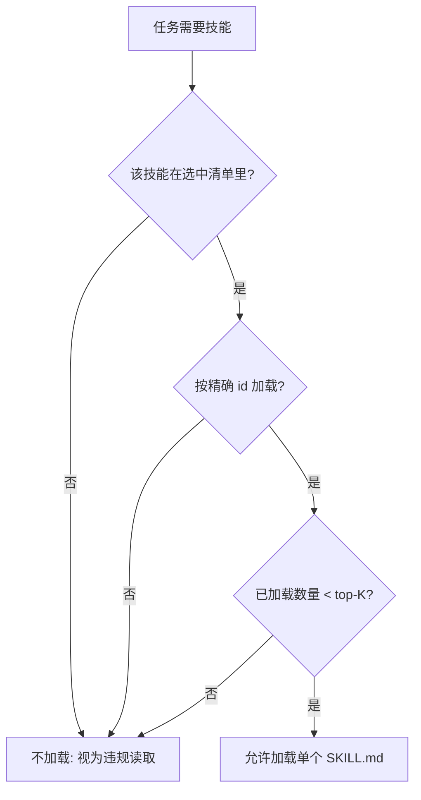

# Lazy Load Policy (按需加载规约)

## Overview

本技能是 L1 原子级基础规约，规定管家的下属**什么时候才允许被读进上下文**。
默认答案是不读：只有被检索命中的技能，才允许按 id 精确加载。

## When to Use

- 设计或修改任何「找技能 / 用技能」的能力时；
- 审查某个流程是否偷偷把全部技能正文读进了上下文时；
- 与 `select-skills-for-task` / `load-skill-contract` / `on-demand-dispatcher` 组合使用时。

**触发禁区**：本规约只管加载时机与数量；检索返回面由 `snippet-only-recall` 管。

## Workflow

1. `[probe:regex]` 检查读取路径是否含通配符 `*` 或目录递归，命中即违规；
2. `[probe:regex]` 检查被读技能 id 是否在选中清单内，不在即违规；
3. `[probe:length]` 断言本次任务累计加载的 `SKILL.md` 数量 ≤ top-K（默认 5）；
4. `[probe:file]` 断言累计技能正文字节 ≤ 12 KB。

## Strict Rules

1. **未命中不加载**：未出现在选中清单里的技能，一次读取都不允许发生；
2. **禁止通配**：`skills/*/SKILL.md`、`skills/**`、目录递归读取一律禁止；
3. **README 不进上下文**：`README.md` 是给人读的，加载它不是违规之外的小事，而是明确禁止；
4. **超出 top-K 即停**：宁可少读一个技能，也不允许无上限扩散。

## Boundaries & Constraints

- 本规约限制的是**技能正文**的加载；编目与索引由检索层以片段形式使用，不受此限；
- 需要读取多个技能时，必须逐个显式调用 `load-skill-contract`，不允许一次性批量读目录。
