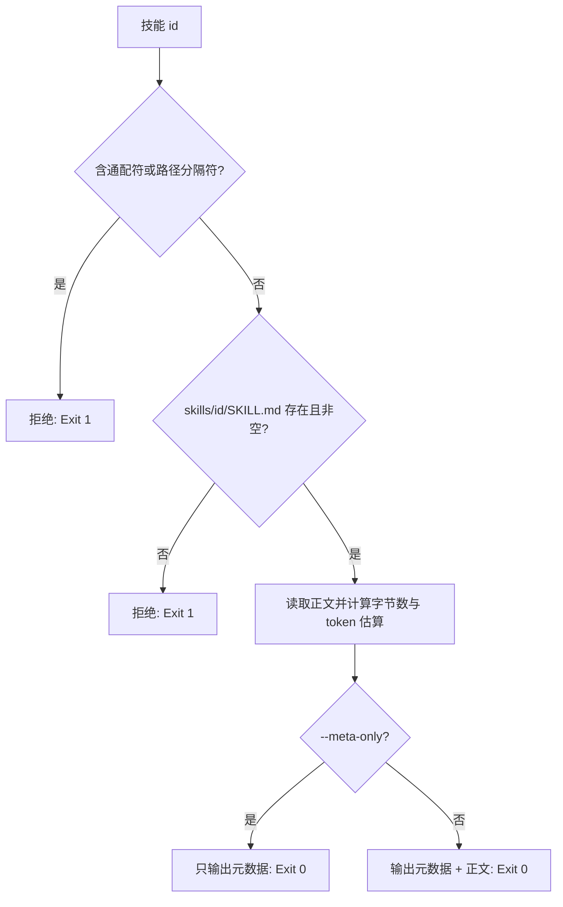

# Load Skill Contract (单契约按需加载)

## Overview

本技能是 L2 工序动作级工具，是技能正文进入上下文的**唯一合法入口**。
它一次只加载一个技能，并如实报告这次加载花了多少字节与 token。

## When to Use

- 选中清单已确定，需要真正读取某个技能契约时；
- 需要先看「读进来要花多少 token」再决定是否读时（`--meta-only`）；
- 作为 `on-demand-dispatcher` 的第二步时。

**触发禁区**：不接受通配符、目录路径或批量列表；批量是调用方的事，不是本工具的职责。

## Workflow



1. `[probe:regex]` 校验 id 只含 `[a-z0-9-]`，出现 `*`、`/`、`..` 一律拒绝；
2. `[probe:file]` 断言 `skills/<id>/SKILL.md` 存在且字节数 > 0；
3. `[probe:length]` 按统一公式 `ceil(CJK + ASCII/4)` 估算 token；
4. `[probe:exitcode]` `--meta-only` 只回元数据，否则回元数据 + 正文，均返回 0。

## Usage & Script

```bash
python3 skills/load-skill-contract/scripts/load_contract.py --name verify-file-exists --meta-only
python3 skills/load-skill-contract/scripts/load_contract.py --name verify-file-exists
python3 skills/load-skill-contract/scripts/load_contract.py --name '*' ; echo $?   # 期望 1
```

## Success Contract

- Exit Code 0：单个契约加载成功；
- Exit Code 1：id 非法、通配、路径穿越，或目标文件缺失/为空；
- 输出恒含 `bytes` 与 `tokens`，便于调用方做预算核算。

## Boundaries & Constraints

- 一次调用只加载一个技能；调用方负责累计数量与字节预算；
- 不读取 `README.md`，不读取 `scripts/`。
