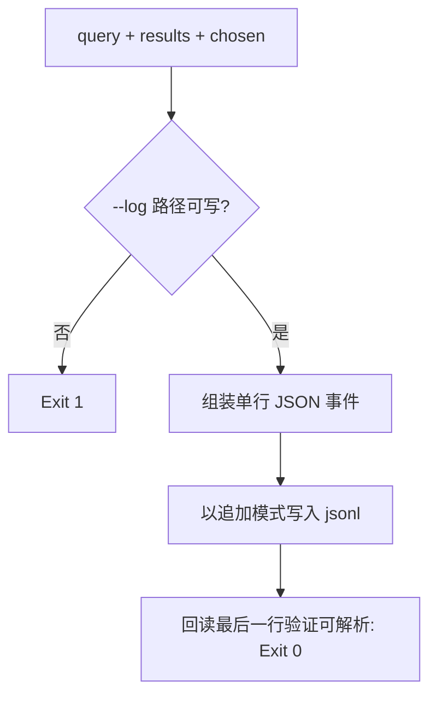

# Log Query Events (检索质量信号落盘)

## Overview

本技能是 L2 工序动作级工具，对应 Google 检索链里的点击/质量反馈环节。
没有质量信号，排序只能靠猜；有了它，触发词修订就有据可依。

## When to Use

- 一次检索完成后，记录本次查询与返回结果；
- 任务结束、确定真正用到哪个技能后，补记 `chosen`；
- 定期复盘「查询了但没选中」的长尾，用于补触发词。

**触发禁区**：日志不是验收证据，不得用它替代测试用例。

## Workflow



1. `[probe:regex]` 校验 `--query` 与 `--results` 非空，`--results` 为逗号分隔 id 列表；
2. `[probe:file]` 确认 `--log` 目标目录存在，文件不存在则创建；
3. `[probe:exitcode]` 以追加模式写入一行 JSON（含 `ts` / `query` / `results` / `chosen` / `top_k`）；
4. `[probe:file]` 回读最后一行并解析，确认写入合法后返回 0。

## Usage & Script

```bash
python3 skills/log-query-events/scripts/log_query.py \
  --query "校验文件是否存在" --results "verify-file-exists,qa-gatekeeper" --chosen verify-file-exists
```

## Success Contract

- Exit Code 0：事件已追加且可被 JSON 解析；
- Exit Code 1：参数缺失、目标目录不可写；
- 只追加、不重写历史行。

## Boundaries & Constraints

- 日志属可丢弃的观测数据，不参与 `consistency` 口径对拍；
- 禁止把技能正文或大段文本写入日志（只记 id 与查询串）。
