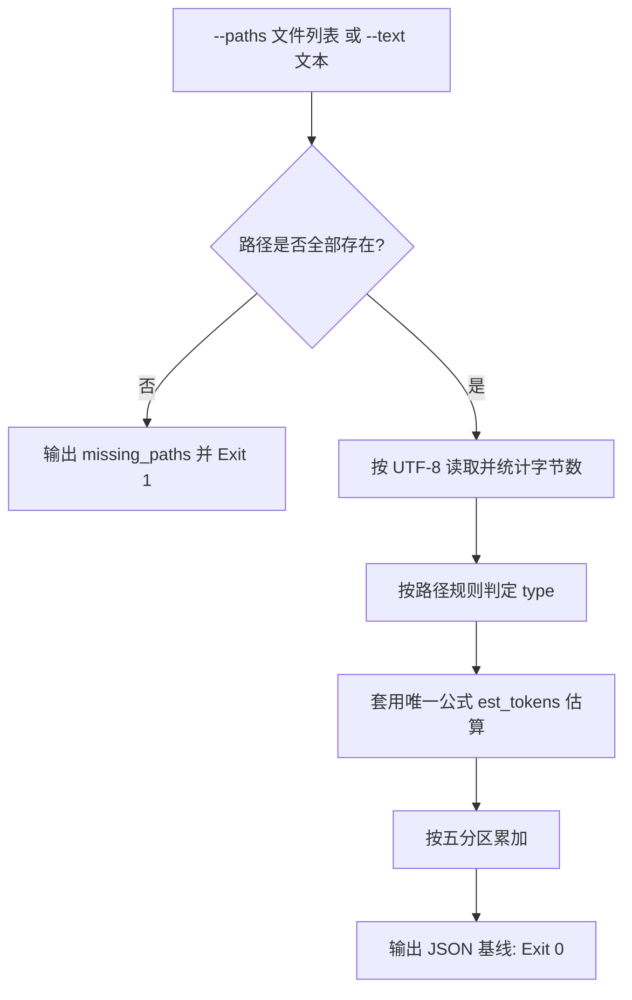

# Measure Token Budget (确定性 token 占用测算)

## Overview

本技能是 L2 工序动作级工具，把 `token-budget-policy` 的优先级分层落成一个可复算的数值基线。
它对给定文件或文本执行确定性 token 估算，并按来源分区汇总，使「先测 → 裁剪 → 断言」中的「先测」有物理证据。

## When to Use

- 需要知道某个技能、索引或文档占多少 token 时；
- 裁剪前后需要对拍同一口径的 token 数值时；
- 新增技能/文档入库前，需要判断其对上下文的增量成本时。

**触发禁区**：本技能只测算，不裁剪、不改写、不删除任何文件；真实语义评估与分词器精度不在其职责内。

## Token Estimation Formula (唯一标准)

**三个脚本共用同一公式，逐字一致，不得出现第二套口径：**

```python
import math
def est_tokens(text: str) -> int:
    cjk = sum(1 for ch in text if '\u4e00' <= ch <= '\u9fff')
    ascii_bytes = sum(1 for ch in text if ord(ch) < 128)
    return math.ceil(cjk + ascii_bytes / 4)
```

即：**汉字约 1 token/字，ASCII 约 4 字节 1 token**（非 ASCII 非汉字字符按 0 计）。
这是**确定性估算，不是真实分词器**：同一输入恒得同一数值，可复算、可对拍、可入证据链；但它不承诺等于任何模型的真实分词结果。

## Workflow



1. `[probe:file]` 逐个校验 `--paths` 目标存在且为普通文件，任一缺失立即产出 `missing_paths` 并退 1；
2. `[probe:length]` 以 UTF-8 读取内容并统计 `bytes = len(text.encode("utf-8"))`，与 token 数分开记账；
3. `[probe:regex]` 按路径正则判定 `type`：`skills/*/SKILL.md` → `skill_contract`、`skills/*/README.md` → `readme`、文件名匹配 `skills?-(catalog|index)`（覆盖 `skill-catalog` / `skills-catalog` / `skill-index` / `skills-index`）→ `catalog`、路径含 `docs/` → `docs`，依次判定，其余落 `other`；
4. `[probe:length]` 用唯一公式 `est_tokens` 计算每条 `tokens`，并断言 `tokens >= 0` 且 `bytes >= tokens / 4`；
5. `[probe:length]` 把每条 `tokens` 累加进 `partitions` 对应分区，断言五分区之和恒等于 `total_tokens`；
6. `[probe:exitcode]` 输出含 `total_tokens`/`total_bytes`/`items`/`partitions` 的 JSON，成功退 0。

## Usage & Script

```bash
# 文件测算：输出 items 与五分区
python3 skills/measure-token-budget/scripts/measure_tokens.py --paths docs/operations/skill-catalog.json docs/operations/skills-catalog.md docs/requirements/product.md --json

# 文本测算：条目 path 记为 <text>
python3 skills/measure-token-budget/scripts/measure_tokens.py --text "汉字与ASCII混排" --json
```

## Success Contract

- Exit Code 0：全部输入测算完成，stdout 为合法 JSON，且 `partitions` 五分区之和等于 `total_tokens`；
- Exit Code 1：`--paths` 任一路径不存在或不是普通文件（输出 `missing_paths`），或既未给 `--paths` 也未给 `--text`；
- stdout 恒为合法 JSON；`--json` 为显式 JSON 模式开关（本脚本恒输出 JSON）。

## Boundaries & Constraints

- 只读测算，**绝不写入、裁剪或删除**任何文件；
- 只测量文本内容，不继承目录递归语义：给目录即视为非法路径；
- 估算公式是唯一口径，禁止在本技能内引入第二套 token 折算规则；
- `--text` 模式不落盘，仅用于临时对拍，产出不构成证据文件。
