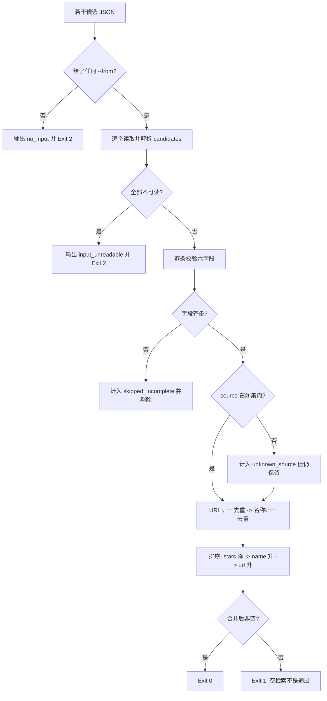

# Merge Search Candidates (多源候选去重归一器)

## Overview

本技能把四类源（local / github / official-site / awesome-list）的候选合并成**同一份契约**。
它是纯数据变换：不联网、不读 catalog、不写文件。

## When to Use

- 四源检索完成，需要去重、排序、统一字段时；
- 需要证明「检索结果不是同一批东西重复三遍」时。

**触发禁区**：不联网、不做检索、不写文件；不判断候选质量（那是 `audit-imported-skill` 的事）。

## Workflow



1. `[probe:regex]` 校验至少给一个 `--from`，缺失即输出 `no_input` 并退 2；
2. `[probe:file]` 逐个读取候选文件，文件不存在或不可解析即记入 `errors`；
3. `[probe:exitcode]` 全部输入都不可读时输出 `input_unreadable` 并退 2（**不吞错误**）；
4. `[probe:regex]` 逐条断言六字段齐备（`name`/`url`/`source`/`license`/`has_scripts`/`stars`），缺失即计入 `skipped_incomplete` 并剔除；
5. `[probe:regex]` 断言 `source` 落在四类闭集内，越界即计入 `unknown_source`（保留但留痕，不静默丢弃）；
6. `[probe:regex]` 一级去重：URL 归一（小写 scheme+host、剥尾斜杠、剥 `utm_*`）后相同即合并；
7. `[probe:regex]` 二级去重：URL 不同但 `name` 归一（小写、下划线转连字符、折叠连字符、剥首尾）后相同即合并；
8. `[probe:length]` 按 `stars` 降序 → `name` 升序 → `url` 升序做全序排序，断言同输入两次输出逐字节相同；
9. `[probe:length]` 汇总 `source_counts`，让调用方能看到「四类源各贡献了几条」；
10. `[probe:exitcode]` 合并后为空一律退 1——**空检索不是通过，禁止继续下游审计**。

## Usage & Script

```bash
python3 skills/merge-search-candidates/scripts/merge_candidates.py --from a.json --from b.json --json
```

实测：2 个输入文件 / 5 条原始候选 → 去重 1 条（URL 归一命中）、剔除 1 条（缺字段），
输出 3 条，来源分布 `{awesome-list:1, github:1, official-site:1}`；连跑两次逐字节相同。

## Success Contract

| 退出码 | 含义 |
| --- | --- |
| 0 | 合并后候选非空 |
| 1 | 输入都读到了但合并后为空（空检索不是通过） |
| 2 | 输入不可读（未给 `--from`、文件缺失或非法） |

## Boundaries & Constraints

- **纯数据变换**：不联网、不读 catalog、不写文件；
- **空检索不是通过**：合并后为空一律退 1；
- **缺字段不静默丢**：必须计入 `skipped_incomplete` 并输出；
- **越界源不静默丢**：必须计入 `unknown_source` 并输出；
- **全序排序**：同输入恒得同一字节输出，禁止随机与时间参与。
