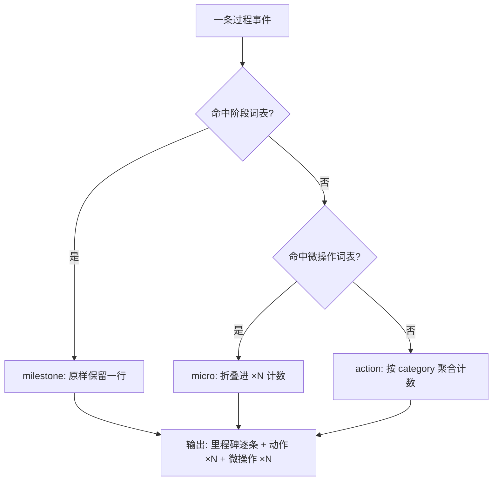

# Milestone Only Progress (过程输出里程碑化规约)

## Overview

本技能是 L1 原子级基础规约，回答一个问题：**过程输出里，哪些事件配得上独占一行？**
用户在长任务里关心的是「走到哪了」，不是「又敲了一次回车」。本规约把过程事件切成三档，并强制折叠最低档。

| 档位 | 定义 | 判据 | 输出形态 |
| :--- | :--- | :--- | :--- |
| milestone（阶段目标） | 状态发生推进的关键节点 | 命中阶段词表：完成 / 已完成 / 到达 / 通过 / 落库 / 交付 / 生成完毕 / 合并 / 发布 / 验收 / 门禁通过 / 全量 / 里程碑 / 阶段目标 / 结束 / 就绪 | 每条**原样占一行** |
| action（工序动作） | 有业务含义、可归类的动作 | 未命中阶段词表，也未命中微操作词表 | 按 `category` 聚合为 `· {category} ×N` |
| micro（微操作） | 高度重复、无信息增量的机械操作 | 命中微操作词表：读取文件 / 打开 / 关闭 / 写入一行 / 执行命令 / 调用脚本 / 点击 / 滚动 / 复制 / 粘贴 / 切换窗口 / 重试一次 / 重试 / 格式化 / 编译单文件 / 单条测试 / 查看 / 列出 / 打印 / 上车 / 下车 / 进站 / 出站 / 驶入 / 驶出 / 开门 / 关门 / 拾取 / 拿起 / 放下 / 按下 | 一律折叠为 `· 微操作 ×N`，**禁止出现单条原文** |

例：从惠州去北京，只报「到达长沙」「到达武汉」「到达北京」；严禁输出「上车」「下车」「上车」「下车」。

标杆样例（判定口径的唯一基准，必须逐条对齐）：

| 事件原文 | 判定 | 依据 |
| :--- | :--- | :--- |
| `上车` / `下车` | micro | 交通载具上下，高度重复的机械动作 |
| `已到达长沙` / `已到达武汉` / `已到达北京` | milestone | 命中阶段词表「到达」，状态已推进 |
| `在长沙加了一次油` | action | 两表皆未命中，属可归类的工序动作 |
| `已完成全部装卸` | milestone | 命中「完成」；**milestone 优先于 micro**，即使文本含 micro 词也判 milestone |

**优先级铁律**：milestone ＞ micro ＞ action。凡命中阶段词表即判 milestone，不再下沉匹配微操作词表（如「已完成上车准备」判 milestone）。

## When to Use

- 任何多步长任务（≥3 个工序动作）的过程播报与最终进度回报；
- 用户抱怨「刷屏」「一条条跳」「看不出到哪了」时；
- 编写子智能体进度回报契约、任务日志骨架、进度面板文案时。

**触发禁区**：纯只读问答与单步即时回答（一问一答即可完成）不启用本规约，避免为简单交互制造折叠开销。

## Workflow



1. `[probe:regex]` 用阶段词表（完成 / 到达 / 通过 / 落库 / 交付 / 合并 / 发布 / 验收 / 全量 / 里程碑 / 阶段目标 / 结束 / 就绪）匹配每条事件，命中即定为 milestone；
2. `[probe:regex]` 未命中阶段词表的事件，再用微操作词表（读取文件 / 打开 / 关闭 / 写入一行 / 执行命令 / 调用脚本 / 点击 / 滚动 / 复制 / 粘贴 / 切换窗口 / 重试一次 / 重试 / 格式化 / 编译单文件 / 单条测试 / 查看 / 列出 / 打印 / 上车 / 下车 / 进站 / 出站 / 驶入 / 驶出 / 开门 / 关门 / 拾取 / 拿起 / 放下 / 按下）匹配，命中即定为 micro；
3. `[probe:length]` 两表皆未命中的事件定为 action，并归入读取 / 命令 / 写入 / 检索 / 测试 / 网络 / 其他 之一；
4. `[probe:length]` 统计同类 micro 条数与同 category 的 action 条数，压缩为 `· 微操作 ×N` 与 `· {category} ×N` 两类折叠行；
5. `[probe:exitcode]` 交付前对 rendered 跑 `grep -c` 断言微操作原文计数为 0，非 0 即阻断并回到第 2 步重新折叠。

## Usage & Script

本规约无独立脚本，成功契约由下面两条可直接执行的断言承载：

```bash
# 造一段含微操作噪点的过程输出
printf '到达长沙\n上车\n下车\n打开文件\n到达武汉\n' > /tmp/progress.txt

# 断言 1：micro 原文残留计数必须为 0（输出 0 才合规）
grep -cE '上车|下车|打开|关闭|点击|滚动|查看|列出|打印|读取文件|执行命令' /tmp/progress.txt

# 断言 2：合规输出只保留阶段目标行
grep -E '到达|完成|通过|交付|发布|验收|就绪' /tmp/progress.txt

# 折叠后的目标形态（里程碑逐条 + 微操作计数一行）
printf '到达长沙\n到达武汉\n· 微操作 ×3\n'
```

## Success Contract

- Exit Code 0：`grep -c` 对微操作词表的计数为 0，且阶段目标逐条保留，过程输出只由里程碑行与折叠行构成；
- Exit Code 1：`grep -q` 命中任一微操作原文，或里程碑行被折叠吞掉，视为规约被违反，必须先折叠/补齐再交付。

下游脚本 `classify-step-tier` 与 `fold-repeated-events` 的 0 / 1 语义与本规约一致。

## Boundaries & Constraints

- **里程碑只增不删**：折叠只作用于 micro 与 action，任何 milestone 不得被合并、缩写或丢弃；
- **折叠必须留痕**：micro 折叠为 `×N` 计数，禁止静默丢弃，否则读者无法判断真实工作量；
- **判定必须确定性**：三档划分由词表驱动，禁止引入随机数、时间戳或模型主观判断；
- 本规约只约束「过程输出形态」，不改变任务本身的技术结论与交付物内容。
