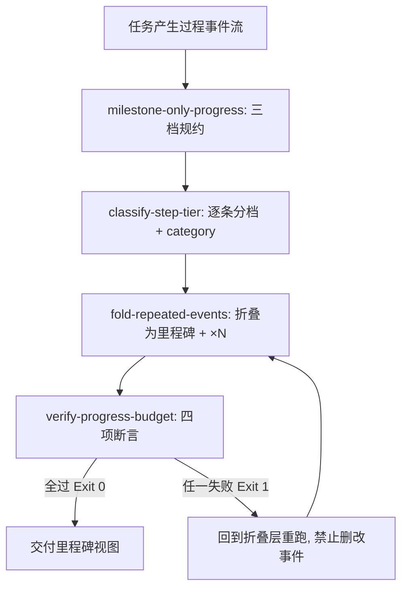

# Milestone Progress Reporter (过程输出里程碑化总控)

## Overview

Milestone Progress Reporter 是过程输出形态的唯一总控出口，挂载于管家**「④ 输出规约」集群**（与 `standard-output-framework`、`concise-chinese-bold-guard`、`schema-guard`、`iconized-output-showcase`、`tail-metrics-showcase` 同集群）。
它把四块能力积木按依赖顺序串成一条流水线：L1 定规约、L2 分档、L2 折叠、L2 断言。
对外只交付一份「里程碑逐条 + 折叠计数」的过程输出，对内保证这条链路的每一步都可复算、可阻断。

两条不可让渡的红线：

- **里程碑只增不删**：任何 milestone 原文必须逐条出现在最终输出中，禁止合并、缩写、丢弃；
- **微操作只折叠不静默丢弃**：micro 必须留下 `· 微操作 ×N` 计数，N 与输入中 micro 事件条数逐条相等。

## When to Use

- 多步长任务（≥3 个工序动作）执行中的过程播报与收尾进度回报；
- 子智能体向父智能体上报进度、需要统一形态时；
- 用户反馈「刷屏」「看不出到哪了」，需要立刻切换为里程碑视图时。

**触发禁区**：纯只读问答、一步即可完成的交互、以及用户明确要求逐条原始日志的场景，一律不启用本总控。

## Workflow



1. `[probe:regex]` 按 `milestone-only-progress` 的三档定义与两份词表确认本次规约口径（阶段词表 / 微操作词表）；
2. `[probe:exitcode]` 调用 `classify-step-tier` 对每条事件分档，退出码非 0 即判定输入不可用并停止播报；
3. `[probe:exitcode]` 调用 `fold-repeated-events` 折叠：milestone 逐条原样保留，action 按 `category` 计 `×N`，micro 汇总为 `· 微操作 ×N`；
4. `[probe:regex]` 断言最终输出中不含任何单条 micro 原文（微操作只能以计数形态出现），命中即判定折叠失败；
5. `[probe:exitcode]` 调用 `verify-progress-budget` 做四项断言，退出码非 0 时回到第 3 步重跑，禁止就地删改事件；
6. `[probe:length]` 断言最终交付的 milestone 条数等于输入 milestone 条数（只增不删），且 ≤ 8 条预算。

## Usage & Script

```bash
# 端到端三步：分档 → 折叠 → 预算断言（全过程零第三方依赖）
cat > /tmp/events.jsonl <<'EOF'
{"text": "已完成需求拆解"}
{"text": "读取文件 skill.md"}
{"text": "打开编辑器"}
{"text": "扫描全仓依赖拓扑并建立索引"}
{"text": "写入一行配置"}
EOF

python3 skills/classify-step-tier/scripts/classify_tier.py --file /tmp/events.jsonl --json
python3 skills/fold-repeated-events/scripts/fold_events.py --file /tmp/events.jsonl --json
python3 skills/verify-progress-budget/scripts/verify_progress.py --file /tmp/events.jsonl --json
```

## Success Contract

- Exit Code 0：分档、折叠、四项预算断言全部通过，交付的过程输出只由「里程碑逐条 + `· {category} ×N` + `· 微操作 ×N`」构成；
- Exit Code 1：任一环节失败（输入不可读 / 折叠违规 / 断言失败），此时**不得交付过程输出**，必须修正折叠层后重跑。

## Boundaries & Constraints

- **里程碑只增不删**：折叠层只作用于 micro 与 action，milestone 数量与原文在终态必须与输入一致；
- **微操作只折叠不静默丢弃**：`· 微操作 ×N` 的 N 必须等于输入 micro 条数，禁止以「省略」为名丢计数；
- **触发禁区优先**：纯只读问答与单步交互不启用本总控，避免治理开销污染轻量交互；
- 本总控只规约过程输出的形态，不改变技术结论、不复写交付物内容；
- 全链路纯 Python 3 标准库、确定性判定，禁止随机数与时间依赖。
