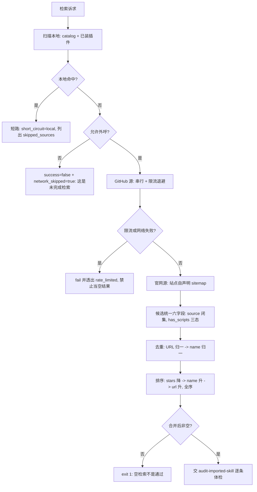

# Multi Source Search Policy (执行层检索源判定基元)

## Overview

本规约是「去哪儿找执行层、找到的算不算数」这件事的**唯一口径来源**：只出定义与判据，
不检索、不合并。检索交 `dispatch-skill-search`，合并交 `merge-search-candidates`，
放行交 `skill-import-pipeline`（L3）。

**它存在的理由**：改造前，`search-github-skill` 的唯一输入是 `--from-json` 或本地缓存——
**它自己不联网**。也就是说管线第一步「检索」没有物理探针，实际把工作外包给了模型的即兴发挥：
既不可复现，也不可断言，更无法回答「你到底搜了几个源、搜到几条」。这是典型的粒度过粗。

## 一、四类源与优先级

| 序 | `source` | 物理手段 | 必填字段 | 说明 |
| :---: | :--- | :--- | :--- | :--- |
| 1 | `local` | 读 `skill-catalog.json` + 扫已装插件目录（`generation.json`） | `name` `url` | **命中即短路**，不再外呼 |
| 2 | `github` | GitHub Search API（标准库 urllib，无凭据） | `stars` `license` | 未认证实测 **10 次/分钟** |
| 3 | `official-site` | 官方站点自声明的 `sitemap.xml` | `url` | 来源可追溯、结果可复现 |
| 4 | `awesome-list` | 由 `github` 源内的清单型结果识别并标注 | `stars` 可空 | 与真实工具分开标注 |

### 1.1 本地优先是硬规则

**`local` 命中即短路，不再向任何外部源发起检索。**

理由有三，且都是可验证的：① 已有能力先复用，重造只会产生两份必然漂移的真相；
② 外呼有成本（GitHub 10 次/分钟），能用本地结果回答的问题不该消耗预算；
③ 本地命中意味着**已经在跑的实现**，其可靠性已被本池的十二道门禁验证过。

短路必须留痕：输出 `short_circuit: "local"` 与 `skipped_sources`（非空），
**内部计数不算证据，被跳过的源必须列出来**。

### 1.2 为什么官网源走 sitemap 而不是搜索引擎

`sitemap.xml` 是**站点自己声明的**页面全集：来源可追溯、结果可复现、不依赖第三方排序。
搜索引擎结果会随排序策略漂移——同一个查询今天第 1 名明天第 7 名，写不进可复算的判据。

## 二、统一候选契约（六字段）

每个候选必须同时具备下列字段，缺一即判不合格并**在合并阶段被剔除**：

| 字段 | 类型 | 口径 |
| :--- | :--- | :--- |
| `name` | 字符串 | 非空 |
| `url` | 字符串 | 非空；归一去重见下节 |
| `source` | 枚举 | ∈ `{local, github, official-site, awesome-list}`，**闭集** |
| `license` | 字符串 | 未知写 `UNKNOWN`，**禁止把 license 对象 `str()` 成一坨 dict repr** |
| `has_scripts` | **三态** `true`/`false`/`null` | `null` = 未探测。**未探测写 `false` 是假阴性** |
| `stars` | 整数 | 无则 0 |

`has_scripts` 必须三态，是一条踩出来的教训：审计步（`audit-imported-skill`）把 `false`
读成「对方没有可执行面」从而误判来源性质。`null` 才诚实地表示「没看过」。

## 三、去重与排序

| 级别 | 判据 | 归一方式 |
| :---: | :--- | :--- |
| ① | URL 归一后相同 | 小写 scheme+host、剥尾斜杠、剥 `utm_*` 查询参数 |
| ② | URL 不同但 `name` 归一后相同 | 小写、下划线转连字符、折叠连续连字符、剥首尾连字符 |

排序：`stars` 降序 → `name` 升序 → `url` 升序。**全序**，同输入恒得同一顺序与同一字节输出。

## 四、中英同义桥

用户说「信息图」，GitHub 上的仓库叫 `infographic` / `chart` / `diagram`。
**没有这座桥，中文查询在英文生态里的召回率接近 0。**

| 中文查询词 | 桥接词 |
| :--- | :--- |
| 信息图 | `infographic` `infographics` `diagram` `chart` `visualization` |
| 图表 | `chart` `diagram` `graph` `plot` `infographic` |
| 架构图 | `architecture` `diagram` `archify` |
| 可视化 | `visualization` `visualize` `visual` |
| 插件 / 技能 / 下载 / 缩放 | `plugin` / `skill` / `download` / `zoom` 等 |

桥接是**召回增强**不是**替换**：原始查询词必须保留在 tokens 里。

## 五、失败语义（本规约最容易被偷懒绕过的一条）

| 情形 | 必须的语义 | 禁止 |
| :--- | :--- | :--- |
| GitHub 返回 403 限流 | `success=false` + `rate_limited=true` + 退避提示 | 当作「零结果」返回 `success=true` |
| 本地零命中且未允许外呼 | `success=false` + `network_skipped=true` + 「这是未完成检索」 | 静默返回空清单 |
| 全部官网源不可达且零候选 | `exit 1` + 逐域名错误 | 返回空清单当成功 |
| 合并后为空 | `exit 1` | 空检索当通过 |

**空检索不是通过，检索失败不是没找到。** 把这两件事混起来，机制就会在最需要它说话的时候闭嘴。

## 六、限流口径

未认证的 GitHub Search API 实测 **10 次/分钟**，超出即 403。因此：

- 检索必须**串行**，禁止并发打同一个 API；
- 命中限流必须**退避重试**，并把 `rate_limited` 透出给调用方；
- 本地优先因此不只是效率问题，也是**限流预算问题**。

## When to Use

- 需要找执行层（技能 / 插件 / 工具）而本地不确定有没有时；
- 需要判断一个检索结果算不算「找到」时；
- 需要为下游 `dispatch-skill-search` / `merge-search-candidates` / `skill-import-pipeline` 引用源清单、候选契约、失败语义的唯一真相源时。

**触发禁区**：纯本地已有能力可直接命中的任务不经过本规约（不必检索）；
本规约只出定义与判据，**不联网、不检索、不合并、不写文件**。

## Workflow



1. `[probe:file]` 断言本地源可读：`docs/operations/skill-catalog.json` 存在且可解析，缺失即退 2（**本地优先的前提是本地读得到**）；
2. `[probe:regex]` 断言每个候选的 `source` 落在四类闭集内，越界即判不合格；
3. `[probe:regex]` 断言六字段齐备，缺任一字段的候选在合并阶段被剔除并计入 `skipped_incomplete`；
4. `[probe:regex]` 断言 `has_scripts` 为三态之一（`true`/`false`/`null`），出现其他取值即判契约破损；
5. `[probe:regex]` 断言 `license` 是字符串：出现 `{` 开头即判「把 license 对象直接字符串化」；
6. `[probe:length]` 断言去重按两级判据生效：URL 归一后重复计一次，`name` 归一后重复也计一次，`duplicates_removed` 必须等于两者之和；
7. `[probe:length]` 断言排序为全序：同一输入连跑两次，输出**逐字节相同**；
8. `[probe:exitcode]` 断言本地命中时 `network_used == false` 且 `skipped_sources` 非空（短路必须留痕，内部计数不算证据）；
9. `[probe:regex]` 断言限流与失败被区分：`rate_limited` 字段存在且为布尔，失败时 `success == false` 且带 `error`；
10. `[probe:exitcode]` 断言空结果不通过：合并后候选为空一律退 1，禁止以「没找到」静默放行。

## Usage & Script

本规约是纯规约，无独立脚本；四源调度、GitHub 适配、官网适配、去重归一由四个探针承载：

```bash
# 1) 四源调度（本地优先，命中即短路）
python3 skills/dispatch-skill-search/scripts/dispatch_search.py --query "信息图" --json

# 2) GitHub 源（联网；未认证 10 次/分钟）
python3 skills/search-github-skill/scripts/search_skill.py --online --query "<query>" --probe-scripts

# 3) 官网源（sitemap 驱动）
python3 skills/search-official-source/scripts/search_official.py --query "<query>" --domain <官方域名>

# 4) 去重归一
python3 skills/merge-search-candidates/scripts/merge_candidates.py --from a.json --from b.json
```

实测（本地优先的真实效果）：

| 查询 | 短路 | 网络 | 命中 |
| :--- | :--- | :--- | :--- |
| 信息图 | `local` | 未使用 | `@tt-a1i/archify-dsh`、`@changfenhuang/dsh-genui` |
| 命名 | `local` | 未使用 | `audit-layer-naming`、`capability-naming-policy`、`layer-naming-guard` |
| zzz-nonexistent | 未短路 | 未允许 | 0（`success=false` + 「这是未完成检索」） |

## Success Contract

| 退出码 | 含义 |
| :--- | :--- |
| 0 | 产出非空候选（本地短路，或外呼成功） |
| 1 | 零候选（本地未命中且未允许外呼 / 外呼失败 / 合并后为空 / 官网源全不可达） |
| 2 | 输入不可读（缺 `--query`、catalog 不可解析、夹具不可读、未给任何来源） |

## Boundaries & Constraints

- **本地优先是硬规则**，不是优化选项：命中即短路，且必须留痕 `skipped_sources`；
- **空检索不是通过**：合并后为空一律退 1，禁止静默放行；
- **检索失败不是没找到**：限流、网络错误、源不可达都必须显式失败并透出原因；
- **`has_scripts` 必须三态**：未探测写 `false` 是假阴性，会让审计步误判来源性质；
- **`source` 是闭集**：越界即判不合格，禁止自创源名；
- **官网必须可追溯**：只走站点自声明的 sitemap，不依赖第三方搜索排序；
- **禁止把模型回忆当候选**：候选必须来自脚本产出或可引用的检索返回；
- **确定性**：排序为全序，同输入恒得同一字节输出；禁止随机、禁止时间参与。
