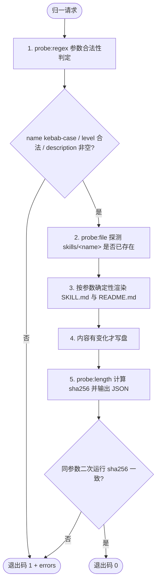

# Normalize Skill Contract (技能契约归一)

## Overview

本技能是「GitHub 技能引入管线」的第 3 步（T18，REQ-BUTLER-IMPORT-012）。
外部技能自带五花八门的文档结构，无法被本池索引与路由直接消费；本技能把候选**物理改造**为本池统一契约：

- YAML Frontmatter：`name` / `level` / `composition`（仅 L3 写入）/ `description`；
- `## Overview`、`## When to Use`（正触发 + 触发禁区）、`## Workflow`（Mermaid + 带 `[probe:...]` 的有序步骤）、`## Usage & Script`、`## Success Contract`、`## Boundaries & Constraints`。

**幂等是硬指标**：输出内容完全由命令行参数决定，不含时间戳、随机数或递增计数；
同一参数连续运行两次，`SKILL.md` 逐字节一致、sha256 不变。

## When to Use

**正触发**：
- `audit-imported-skill` 裁决为 `accept` 后，需要把候选落地为本池标准契约；
- 存量技能契约缺字段、缺 `## When to Use` 或 `## Workflow`，需要按参数重生成受管区块；
- 作为 `skill-import-pipeline` 的第 3 步被串联调用。

**触发禁区**：本技能**只生成 `skills/<name>/SKILL.md` 与 `README.md` 两个文件**——不判定集群归属（交 `place-skill-into-cluster`）、不跑全量门禁（交 `qa-gatekeeper` / `./bin/skill-pool validate`）、不执行目录同步（`sync_catalog.py` 属编目任务，不在本技能职责内）。

## Workflow



**有序步骤**：

1. `[probe:regex]` 校验 `--name` 命中 `^[a-z0-9]+(-[a-z0-9]+)*$`、`--level` ∈ {L1,L2,L3,L4}、`--description` 压实后非空；任一不合法即退出码 1 并列出 `errors`。
2. `[probe:file]` 探测 `skills/<name>/SKILL.md` 是否存在，据此置 `created` 真值。
3. `[probe:regex]` 按参数确定性渲染 `SKILL.md`（Frontmatter + 六大章节 + Mermaid + 探针步骤）与 `README.md`。
4. `[probe:length]` 内容与磁盘现状一致时**完全不写盘**，避免无谓抖动；不一致才覆盖写入。
5. `[probe:exitcode]` 输出 `{"success": true, "skill", "path", "created", "sha256"}` 并退出 0；二次运行 sha256 必须与首次相同。

## Usage & Script

```bash
# 1. 归一一个 L2 外部技能（首次运行 created=true）
python3 skills/normalize-skill-contract/scripts/normalize_skill.py \
  --name pdf-toolkit --level L2 --description "PDF 解析与文本抽取工序技能"

# 2. 同参数再跑一次，sha256 必须与上一条完全一致（幂等）
python3 skills/normalize-skill-contract/scripts/normalize_skill.py \
  --name pdf-toolkit --level L2 --description "PDF 解析与文本抽取工序技能"

# 3. L3 复合技能：composition 才会写入 Frontmatter
python3 skills/normalize-skill-contract/scripts/normalize_skill.py \
  --name pdf-pipeline --level L3 --composition pdf-scan,pdf-extract \
  --description "PDF 处理总控"

# 4. 参数非法必须退出 1（不得走 argparse 的 2）
python3 skills/normalize-skill-contract/scripts/normalize_skill.py \
  --name Bad_Name --level L2 --description "x"; echo "exit=$?"
```

## Success Contract

| 退出码 | 语义 |
| :--- | :--- |
| `0` | 归一成功（新建或幂等更新），stdout 输出含 `sha256` 的 JSON |
| `1` | 参数非法：`name` 非 kebab-case、`level` 非法、`description` 为空，或 composition 项非法 |

输出结构：

```json
{"success": true, "skill": "pdf-toolkit", "path": "skills/pdf-toolkit", "created": true, "sha256": "..."}
```

**幂等断言**：同一参数连续运行两次，`skills/<name>/SKILL.md` 的 sha256 必须一致（TC-IMPORT-012-03）。

## Boundaries & Constraints

- 写入范围仅限 `skills/<name>/SKILL.md` 与 `skills/<name>/README.md`，禁止触碰 `docs/`、`bin/` 或其他技能目录；
- **禁止时间戳/随机数/计数器**：任何非参数依赖的字节都会破坏幂等基线；
- `composition` 仅 L3 写入 Frontmatter（L1/L2 不写该字段）；
- 归一完成的技能仍需经 `place-skill-into-cluster` 定级挂载与 `./bin/skill-pool validate` 门禁，本技能不代替二者。
