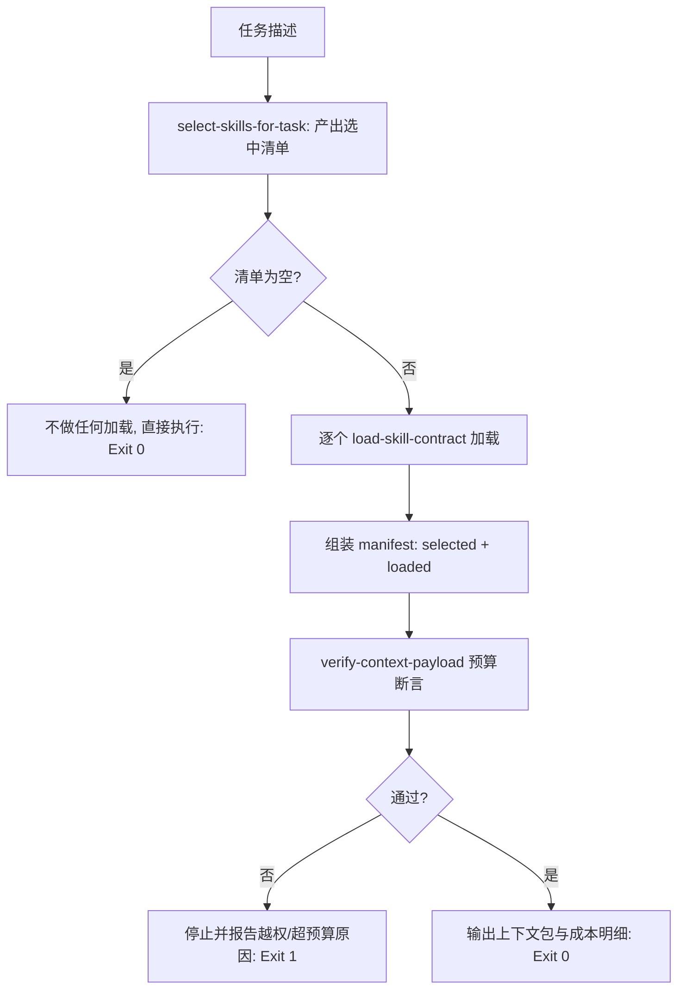

# On Demand Dispatcher (按需调用总控)

## Overview

本技能是管家派发下属的执行闸门：**先算清楚要用谁，再只读那几个**。
它把「检索 → 选技 → 单契约加载 → 预算断言」串成一条不可绕过的链路。

## When to Use

- 任何需要用到管家下属的任务，进入执行之前；
- 需要向用户汇报本次上下文成本时（输出 `total_bytes` / `total_tokens`）；
- 审计某次任务为什么读了这么多内容时。

**触发禁区**：不负责具体技能的执行，只负责「把该读的读进来、不该读的不读」。

## Workflow



1. `[probe:file]` 断言 `skill-index.json` 可读，否则拒绝继续；
2. `[probe:exitcode]` 调用 `select-skills-for-task` 取得选中清单（恒 ≤ top-K）；
3. `[probe:exitcode]` 对清单内每个 id 调 `load-skill-contract`，**清单外的技能一次都不读**；
4. `[probe:length]` 组装 manifest 并调 `verify-context-payload` 断言数量与字节预算；
5. `[probe:exitcode]` 断言通过才输出上下文包（`--emit` 时含正文）与成本明细，否则返回 1。

## Usage & Script

```bash
# 只看成本，不输出正文（默认）
python3 skills/on-demand-dispatcher/scripts/dispatch_on_demand.py --task "校验交付文件是否存在"

# 需要真正把技能正文装进上下文时
python3 skills/on-demand-dispatcher/scripts/dispatch_on_demand.py --task "校验交付文件是否存在" --emit
```

## Success Contract

- Exit Code 0：清单与预算断言均通过（空清单也算通过，且不加载任何内容）；
- Exit Code 1：索引缺失、越权加载、超出 top-K 或超出字节预算；
- 输出恒含 `manifest`、`total_bytes`、`total_tokens`。

## Boundaries & Constraints

- **清单即白名单**：清单之外的技能即使「看起来很相关」也不允许临时加载，需要重新选技；
- 预算断言失败时不允许「先凑合执行」，必须停下来修正选技或预算。
