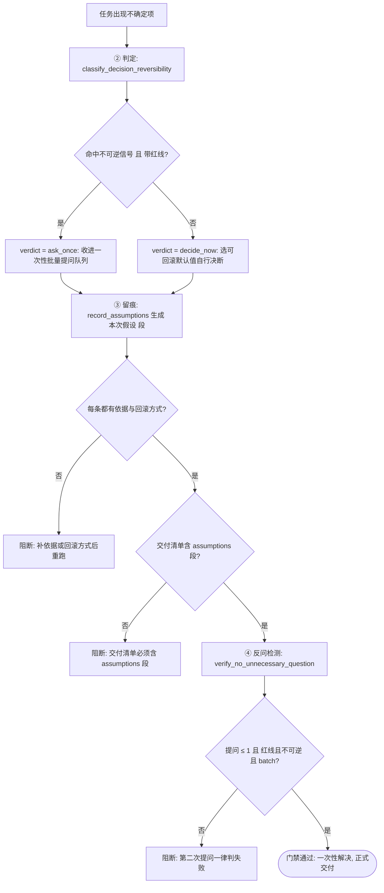

# One Shot Guard (一次性解决门禁)

## Overview

One Shot Guard 是「一次性解决、不反复提问」（REQ-BUTLER-ONESHOT-025）的复合流程门禁，
把四层原子能力串成一条**不可跳步**的流水线：

| 环节 | 承接技能 | 产物 |
| :--- | :--- | :--- |
| ① 判定 | `one-shot-resolution-policy`（L1 元规则） | 判定优先级与提问例外口径 |
| ② 决断 | `classify-decision-reversibility`（L2） | 每项 `decide_now` / `ask_once` + 建议可回滚默认值 |
| ③ 留痕 | `record-assumptions`（L2） | 假设四元组「项 / 取值 / 依据 / 回滚方式」 |
| ④ 反问检测 | `verify-no-unnecessary-question`（L2） | 提问 ≤ 1、必须红线 + 不可逆 + 批量合并 |

**挂载位置**：管家「③ 冲突·冗余·质量」集群。凡任务进入派单前与交付前，都必须过这道门禁。

两道硬约束：

- **交付清单必须含 `assumptions` 段**：缺段或段内条目缺依据/回滚方式即阻断；
- **同一次任务出现第二次提问即判失败**：不论理由，第二次提问一律硬判失败。

红线清单唯一真相源是 `skills/fastlane-redline-policy/SKILL.md`，
本门禁只传递 R1~R5 编号，不复制红线定义。

## When to Use

- 任何任务在派单前，需要确认「该自己拍板还是允许问一次」时；
- 任何任务在交付前，需要确认「假设已留痕、没有不必要的追问」时；
- 复审一次交付「凭什么它算一次性解决」时；
- 用户抱怨「你怎么又问了一遍」时，用它定位是判定错、留痕漏还是反问检测被跳过。

**触发禁区**：本门禁只判定与断言，不代替执行层做变更；纯只读问答与一步可完成、无任何不确定项的交互不过门禁。

## Workflow



1. [probe:regex] 收集本次任务的全部不确定项，用不可逆/可逆信号词表逐项打标（信号词表口径来自 `one-shot-resolution-policy`）；
2. [probe:exitcode] 调用 `classify-decision-reversibility` 判定每项归属，得到 `decide_now` / `ask_once` 与建议默认值，判定失败即阻断；
3. [probe:file] 断言交付清单含 `assumptions` 段：段存在、且段内每条四元组齐备（项 / 取值 / 依据 / 回滚方式）；
4. [probe:length] 断言每条假设的 `basis` 与 `rollback` 均非空，任一为空即 Exit 1 阻断并列出违规条目；
5. [probe:exitcode] 调用 `verify-no-unnecessary-question` 做反问检测，要求「提问 ≤ 1 且每次有红线且不可逆且批量合并」全部成立；
6. [probe:exitcode] 同一次任务出现第二次提问一律硬判失败（`too_many`），不得以「情况特殊」为由放行；
7. [probe:length] 全部通过后放行交付，并在交付回复中回贴 `assumptions` 段作为留痕凭证。

## Usage & Script

本技能是 L3 复合门禁，**不携带自己的脚本**，串联调用下游四层的既有命令：

```bash
# ① ② 判定：把不确定项判成 decide_now / ask_once（红线编号来自 fastlane-redline-policy）
python3 skills/classify-decision-reversibility/scripts/classify_decision.py \
  --item "阈值取 0.85 还是 0.9" \
  --item "命名风格用 kebab-case 还是 snake_case" \
  --item "输出文件放 docs/operations 还是 docs/requirements" \
  --item "删除旧的日志目录" --redline R1 \
  --json > /tmp/decisions.json

# ③ 留痕：生成可直接粘进交付回复的 本次假设 段
python3 skills/record-assumptions/scripts/record_assumptions.py \
  --from-decisions /tmp/decisions.json --format md

# ③ 交付清单断言：Markdown 段落里必须出现 assumptions 段（本次假设 标题）
grep -q '^## 本次假设' /tmp/delivery.md

# ④ 反问检测：问题记录逐条断言（默认零提问，授权后才允许 1 次）
python3 skills/verify-no-unnecessary-question/scripts/verify_no_question.py \
  --questions /tmp/questions.jsonl --json
```

门禁串联口径：②③④ 任一环 Exit 非 0，即视为本次交付未过门禁，必须补齐后整条流水线重跑。

## Success Contract

- ② 判定环 Exit 0，且 `ask_budget.used <= 1`；
- ③ 留痕环 Exit 0，交付清单含 `assumptions` 段且每条四元组齐备；
- ④ 反问检测环 Exit 0（四项断言全过）；
- 三环全部 Exit 0 才放行；任一环非 0 即阻断，禁止带病交付。

| 退出码 | 含义 |
| :--- | :--- |
| 0 | 门禁通过：判定完成、假设齐备、提问未超限 |
| 1 | 门禁阻断：假设缺依据或回滚方式、交付清单缺 `assumptions` 段、出现第二次提问、提问无红线支撑 |
| 2 | 输入不可读：判定输入或问题记录文件缺失、不可读、非法 |

## Boundaries & Constraints

- **红线不复制**：红线 R1~R5 唯一真相源是 `fastlane-redline-policy`，本门禁只传编号参数；
- **硬上限不可放宽**：同一次任务出现第二次提问即判失败，不设「特殊情况」例外；
- **假设段是交付必需件**：交付清单缺 `assumptions` 段或缺依据/回滚方式，一律阻断，不得以「问题不大」放行；
- **门禁不代执行**：本技能只做判定、留痕与断言，任何写入/删除/推送动作仍由执行层按判定结果实施；
- **只增不删**：四层承接关系与两道硬约束只增不减，收窄任何一条都需要显式需求变更。
