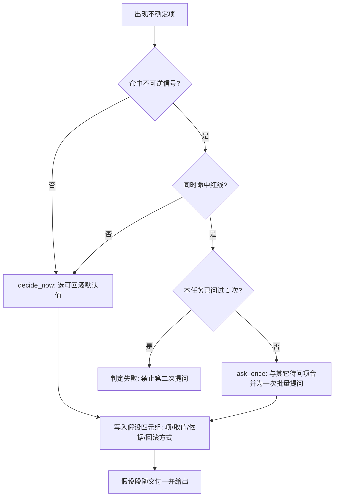

# One Shot Resolution Policy (一次性解决规约)

## Overview

本技能是 L1 原子级基础规约，是「一次性解决、不反复提问」（REQ-BUTLER-ONESHOT-025）的唯一真相源。
它用四条原子条款回答一个问题：**这件事我该自己拍板，还是必须问一次？**

四条条款：

1. **默认不提问**：遇不确定项的第一反应是自行决断，不是发起提问；
2. **选自决可回滚默认值**：决断必须落在一个**可回滚的默认值**上——宁可选「先这么做、事后一条命令能撤回」的选项，也不选「一次定死、改不回来」的选项；
3. **假设必须随交付给出**：凡自行决断处一律留痕，四元组为「项 / 取值 / 依据 / 回滚方式」，缺依据或回滚方式即视为未留痕；
4. **提问例外 = 红线 + 不可逆 + 每任务 ≤ 1 次且批量合并**：三者同时成立才允许提问，且必须一次问完，禁止挤牙膏式追问。

## When to Use

- 任务推进中出现「两个取值都说得通」「放哪个目录都行」这类不确定项时；
- 准备向用户发起确认/提问之前，先过本规约判定该提问是否被允许；
- 编写交付回复时，决定要不要附上「本次假设」段落；
- 设计新流程、新命令时，判断它该自行决断还是需要一次确认。

**触发禁区**：本规约只定义「该不该问、怎么留痕」的元规则；红线清单本身由 `fastlane-redline-policy` 定义，本规约**不复写**红线，具体判定交 `classify-decision-reversibility`。

## Workflow

1. [probe:regex] 用不可逆信号词表匹配不确定项描述（删除 / 清空 / 覆盖 / 发布 / 部署 / 推送 / 上线 / 卸载 / 安装 / 格式化 / 迁移 / `rm -rf` / `drop` / 需求变更 / 基线），未命中即落 `decide_now`；
2. [probe:regex] 命中不可逆信号时，再比对红线编号参数 `--redline R1..R5`，红线的定义与编号**唯一真相源是 `fastlane-redline-policy`**，本规约只引用不复制；
3. [probe:exitcode] 不可逆信号与红线**同时**命中才落 `ask_once`，缺任一条一律落 `decide_now` 并选可回滚默认值；
4. [probe:length] 为每个决断项产出四元组「项 / 取值 / 依据 / 回滚方式」，四字段任一为空即判定留痕不完整；
5. [probe:exitcode] 同一任务累计 `ask_once` 超过 1 次即判定违反本规约，必须把后续项全部降级为 `decide_now` 并记录假设。

## Usage & Script

本技能是 L1 原子规约，**不携带脚本**，以条款文本被下游引用：

- 判定执行层：`skills/classify-decision-reversibility/scripts/classify_decision.py`（读取本规约的判定优先级）；
- 留痕执行层：`skills/record-assumptions/scripts/record_assumptions.py`（把决断项写成假设四元组）；
- 断言执行层：`skills/verify-no-unnecessary-question/scripts/verify_no_question.py`（断言提问 ≤ 1 且被允许）；
- 复合门禁：`one-shot-guard`（L3）把上面三层串成派单前门禁。

引用方式：调用方传入 `--redline` 参数时，取值必须来自 `fastlane-redline-policy` 的 R1~R5；本规约不新增红线编号。

### 与 confirm-before-coding 的关系（范围裁决）

`confirm-before-coding`（@system L2）原要求「写入前确认」。本规约依 REQ-BUTLER-ONESHOT-025 §32.2 将其作用域**收窄为「红线内且不可逆」的变更**：

| 变更类型 | confirm-before-coding 原行为 | 本规约裁决后 |
| :--- | :--- | :--- |
| 普通写入（新建/改文档/改代码，可回滚） | 逐次确认 | **不再逐次确认**，自行决断 + 记录假设 |
| 红线内且不可逆（删除既有 / 发布推送 / 需求基线变更） | 逐次确认 | 合并为本任务**唯一一次**批量确认 |

即：普通写入的逐次确认已被本条收窄条款取代；红线内不可逆变更仍然确认，但**每个任务只确认一次**。该裁决由 `conflict-detector` 记录，避免两条规则互相打架。

## Success Contract

- 一次任务内 `ask_once` 计数 ≤ 1：达标；
- 每个决断项都有非空「依据 + 回滚方式」：达标；
- 交付清单含 `assumptions` 段落：达标；
- 违反任一条：不达标，由 `one-shot-guard` 阻断交付并退回补留痕。

| 退出码 | 含义 |
| :--- | :--- |
| 0 | 符合本规约（决策判定完成、假设完整、提问未超限） |
| 1 | 违反本规约（第二次提问、假设缺依据或回滚方式、提问无红线支撑） |
| 2 | 输入不可读（判定/留痕/断言的输入文件缺失或非法） |

以上退出码口径由下游三个 L2 执行层技能共同实现。

## Boundaries & Constraints

- **红线不复制**：红线清单唯一真相源是 `fastlane-redline-policy`，本规约只引用 R1~R5 编号，禁止另写一份红线清单；
- **默认值必须可回滚**：选不出可回滚默认值时，才退化到「最小改动 + 显式标注待确认」，但不得据此发起提问；
- **假设不是免责声明**：假设必须给依据与回滚方式，写「按经验判断」这类无依据表述视为未留痕；
- **确定性**：判定只依赖词表与固定优先级，禁止随机数、时间戳与外部网络；
- **上限是硬上限**：「每任务 1 次」不可按任务规模放宽，第二次提问一律判失败。
