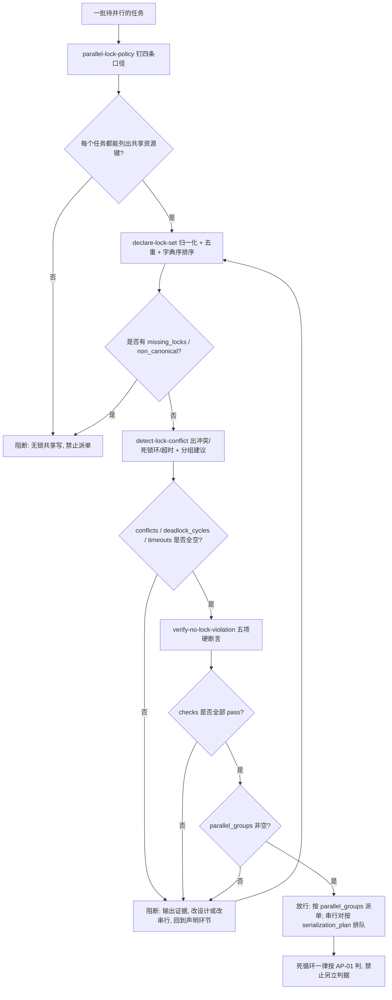

# Parallel Lock Guard (并行任务调控锁派单前门禁)

## Overview

本技能是 L3 复合流程级总控，把调控锁的四个原子能力串成**一道派单前门禁**：

| 序 | 环节 | 承载技能 | 物理产物 | 不通过时 |
| :--- | :--- | :--- | :--- | :--- |
| 1 | 口径 | `parallel-lock-policy` | 四条口径：共享资源键粒度 / 字典序固定顺序 / 300 秒超时 / 死循环复用 AP-01 | 写不出物理判据即不得派单 |
| 2 | 声明 | `declare-lock-set` | `tasks[]`（`locks` + `acquire_order`）与 `issues[]` | 有 `missing_locks` / `non_canonical` 即阻断 |
| 3 | 检测 | `detect-lock-conflict` | `conflicts[]` / `deadlock_cycles[]` / `timeouts[]` / `parallel_groups[]` / `serialization_plan[]` | 任一命中即阻断 |
| 4 | 断言 | `verify-no-lock-violation` | `checks[]` 五项与 `violations[]` | 五项未全过即阻断 |

**并行的前置条件是「先证明可并行」，不是「先跑起来再补救」。**
合法证据只有一条：`parallel_groups` 非空且 `conflicts`、`deadlock_cycles`、`timeouts` 全为空。
先并发启动再靠日志发现冲突，等于把门禁后移到事故发生之后——那不是管控，那是事后记录。

**死循环判定复用 AP-01，不另立判据**：门禁的第 4 环把「同一任务重复出现且相邻 `locks` 完全相同」
按 `anti-pattern-policy` 的 **AP-01（连续相同 `action` 且 `state` 不变 ≥ 5 次）** 判定，
由此把「锁」与「反例层」缝在一起：锁集合就是该步的 `state`，任务名就是 `action`。
门禁本身**不得引入任何第二套死循环判据**（重试次数、耗时阈值、主观「卡住了」一律无效）。

## When to Use

- 管家准备把一批任务**并行派发**之前，需要一条可复算的放行判据时；
- 复核某次并行「凭什么说它可并行」时，需要回到 `parallel_groups` 与三类零命中证据做对拍时；
- 交付验收需要给出「声明 → 检测 → 断言」三环证据串齐全的证明时。

**触发禁区**：单任务串行执行、无共享资源键的任务集不经过本门禁；本门禁只做裁决与阻断，不加锁、不中断进程、不改写任何文件。

## Workflow

以下 Mermaid 图即本门禁的链条（口径 → 声明 → 检测 → 断言），随后十条有序步骤是它的物理执行序：



1. `[probe:regex]` 由 `parallel-lock-policy` 钉死四条口径，断言每条都有物理判据（粒度可枚举、顺序为全序、超时读输入字段、死循环落在 `AP-01` 闭集）；
2. `[probe:file]` 断言待派单任务清单已落地为 JSONL 文件且非空，缺失即阻断（无输入不派单）；
3. `[probe:exitcode]` 调 `declare-lock-set`：退 0 表示锁集合已归一化排序，退 1 表示存在 `missing_locks` / `non_canonical`，退 2 表示输入不可读；
4. `[probe:regex]` 断言返回的 `acquire_order` 与 `locks` 逐元素相同（取锁顺序即字典序），不一致即判口径被绕过；
5. `[probe:exitcode]` 调 `detect-lock-conflict`：退 0 表示三类全空，退 1 表示有命中，退 2 表示输入不可读；
6. `[probe:length]` 断言 `parallel_groups` 非空且组内两两无锁交集、`conflicts` 与 `deadlock_cycles` 与 `timeouts` 均为空数组，缺一即判「可并行未被证明」；
7. `[probe:exitcode]` 调 `verify-no-lock-violation`：退 0 才进入放行，退 1 即阻断并保留 `violations` 现场；
8. `[probe:regex]` 断言 `checks` 中五项断言名齐备（`no_lock_conflict` / `no_deadlock_cycle` / `no_lock_timeout` / `locks_declared` / `no_loop_ap01`）且 `pass` 全真；
9. `[probe:regex]` 断言第 5 项 `no_loop_ap01` 的 `detail` 明确标注判据来自 `anti-pattern-policy` AP-01，出现第二套死循环判据即判门禁失效；
10. `[probe:exitcode]` 放行并输出派单方案：同组并发、`serialization_plan` 中的任务对强制串行，任一环节失败一律回到第 3 环重跑，禁止「记录后继续」。

## Usage & Script

本技能为链式门禁，无独立脚本，按序执行承载技能的命令（任一环失败即停止，不进入下一环）：

```bash
# 1) 声明：归一化 + 字典序排序 + 两类静态错误（退 0/1/2）
python3 skills/declare-lock-set/scripts/declare_lock_set.py --from-json tasks.jsonl --json

# 2) 检测：锁冲突 / 死锁环 / 超时未释放 + 可并行分组建议（退 0/1/2）
python3 skills/detect-lock-conflict/scripts/detect_lock_conflict.py --from-json tasks.jsonl --json

# 3) 断言：五项硬断言（含 AP-01 死循环体检）全过才放行（退 0/1/2）
python3 skills/verify-no-lock-violation/scripts/verify_no_lock_violation.py --from-json tasks.jsonl --json
```

## Success Contract

链上门禁的退出码语义（取最后一条未通过的命令的退出码）：

| 退出码 | 含义 |
| :--- | :--- |
| 0 | 三环全过：锁集合已声明、三类零命中、五项断言全真，按 `parallel_groups` 派单 |
| 1 | 任一环命中：`missing_locks` / `non_canonical` / `lock_conflict` / `deadlock_cycle` / `lock_timeout` / `missing_locks` / AP-01，禁止派单 |
| 2 | 输入不可读或依赖脚本不可用（缺参、文件不可读、JSONL 行非法、任务非法、依赖模块加载失败） |

**唯一放行判据**：`verify-no-lock-violation` 的 `checks` 五项 `pass == true`，且 `parallel_groups` 非空。
**禁止事项**：不得在冲突未清时先并发启动再观察；不得把命中结果只记录后继续；不得以「时间紧」「影响小」为由跳过阻断。

## Boundaries & Constraints

- 门禁只做**裁决与阻断**，不加锁、不中断进程、不重排正在运行的任务、不改写任何文件；
- **并行必须被证明**：`parallel_groups` 非空且三类命中为零是唯一合法证据，禁止以主观估计或历史经验替代；
- **禁止「记录后继续」**：任一环命中即停止推进，修复后必须从声明环节重跑，不得从中间环续跑；
- **判据不在本层新增**：四条口径归 `parallel-lock-policy`，死循环判据归 `anti-pattern-policy` 的 AP-01，门禁只串联不复制；
- **阈值唯一**：超时默认 300 秒，只由 `parallel-lock-policy` 给定，门禁层不得另立默认值；
- 本门禁不替代 `atomic-fission-guard`：粒度门禁判「步骤是否可物理断言」，本门禁判「并行是否被证明可并行」，二者串联而非互相取代；
- 写入动作与本门禁的先后关系：门禁通过只代表**可以并发派单**，不代表可以跳过任何既有写入前置门禁（如 `catalog-consistency-guard`、`zero-restart-guard`）。
