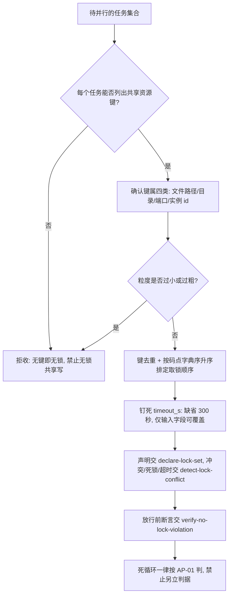

# Parallel Lock Policy (并行任务调控锁判定基元)

## Overview

本规约是并行任务调控锁的**唯一口径来源**：它只出定义与判据，不做检测、不排锁、不断言。
检测交 `detect-lock-conflict`，声明与排序交 `declare-lock-set`，放行断言交 `verify-no-lock-violation`。

**核心立场**：并行不是「同时跑起来」，而是「**先证明可并行，再跑**」。
证明可并行的物理手段只有一个——每个任务在开跑前声明自己独占的**共享资源键**集合，
由机器判定两两是否有交集。交集为空才叫可并行；交集非空就必须串行或改设计。

四条硬口径（本层只此四条，禁止任何下游技能另立第二套）：

### ① 粒度 = 共享资源键

锁的粒度**不是文件、不是目录、不是一把全局大锁**，而是「**共享资源键**」——即一个可被两个任务同时触碰、
因而必须互斥的具名资源。合法资源键只有四类：

| 类别 | 键形态（示例） | 为什么必须互斥 |
| :--- | :--- | :--- |
| 文件路径 | `skills/a/SKILL.md` | 两个任务同时写同一文件，后写覆盖先写 |
| 目录 | `skills/a/`（目录键，含其下全部条目） | 目录内新增/删除条目与目录遍历互相破坏 |
| 端口 | `port:43129` | 同一端口只能被一个进程监听 |
| 实例 id | `instance:hindsight-bank-01` | 同一实例的会话状态不能并发改写 |

**粒度纪律**：
- 粒度**太小锁不住**：把锁写成 `skills/a/SKILL.md#L12`（行级）或 `pkg-006-t1`（任务名）都不是共享资源键，
  换一个任务照样能同时写同一文件，等于没锁；
- 粒度**太粗会串行化一切**：把锁写成 `skills/`（全库目录）或 `repo`（全仓大锁），两个修改不同技能的任务也会被判冲突，
  并行度归零——这不是安全，这是把并行退化成串行；
- **真正共享才加锁**：只读同一文件不算共享写，不加锁；只有「至少一方会写」时才需要资源键。

### ② 加锁顺序 = 字典序固定顺序

所有任务**按资源键的字典序升序**依次取锁，这是一条全局约定，不得由任务自行决定顺序。

**它是防死锁的充分手段**：死锁的物理来源是「A 持有 x 等 y，同时 B 持有 y 等 x」的等待环，
而字典序是**全序**——在同一全序下取锁，任何时刻都不可能出现两个任务互相等待对方已持有的键，
等待关系只能沿字典序单向延伸，成环在数学上不可能。
因此「字典序固定顺序」不是建议，而是本层认定**唯一**的防死锁手段；
凡下游检测到等待环（`deadlock_cycle`），一律判为违反本条，必须回到声明阶段重排。

排序口径：去重后按**码点（UTF-8 字节序）升序**排列，同一次输入恒得同一顺序，禁止随机、禁止按到达时间排。

### ③ 超时默认 300 秒，超时即判失败并释放

每个任务带 `timeout_s`，**默认 300 秒**（唯一默认值，只能由输入字段显式覆盖）。

- 超时判定的输入只有事件字段：`finished_at - started_at > timeout_s`，
  **绝不取系统当前时间**，同输入恒得同结论；
- 任务只有 `started_at` 没有 `finished_at` 时，以本批次的逻辑批次终点（全部任务 `started_at`/`finished_at` 的最大值）作为参照点判定；
- **超时即判本次执行失败，并立即释放该任务持有的全部资源键**——不允许「再等等」「超时了但先让它跑完」；
- 未释放就结束，比慢更危险：它会把后续所有等待该键的任务一起拖死。

### ④ 死循环判定复用 AP-01，禁止另立判据

死循环的判据**不在本层定义**，直接复用 `anti-pattern-policy` 的 **AP-01**：
**连续相同 `action` 且 `state` 不变 ≥ 5 次**。

本层的落地形态是资源键版本：**同一任务在输入流中连续出现 ≥ 5 次且其 `locks` 集合完全相同**，
即判 AP-01 命中（锁集合就是该步的 `state`，任务本身是 `action`）。
除此以外**禁止新增任何死循环判据**——不得引入「重试次数」「耗时阈值」「主观感觉卡住了」等第二套口径，
否则同一段输入在不同技能里会得出不同结论，判据层立刻失效。

## When to Use

- 任何要**并行派发**多个任务之前，需要确定每个任务该拿哪些锁、按什么顺序拿、拿多久算超时；
- 复核某个并行方案「凭什么说它可并行」时，需要回到本层的四条口径做对拍；
- 下游 `declare-lock-set` / `detect-lock-conflict` / `verify-no-lock-violation` 需要引用阈值与判据的唯一真相源时。

**触发禁区**：纯只读、无写入、无端口/实例争用的任务不经过本规约（不产生共享资源键即无需调控锁）；本规约只出定义，不排锁、不检测、不改写任何文件。

## Workflow



1. `[probe:regex]` 逐任务检查是否至少有一个资源键：写任务（`writes:true`）却给不出键的，直接判 `missing_locks`，**无锁共享写是本层明确的禁止项**；
2. `[probe:regex]` 断言每个键落在四类合法形态（文件路径 / 目录 / `port:` 前缀 / `instance:` 前缀）内，任务名、行号、哈希等非共享资源一律拒收；
3. `[probe:length]` 检查粒度：键覆盖到单一共享资源为合格，细到行号或粗到全仓大锁一律判不合格并回退重划；
4. `[probe:regex]` 去重后按码点升序排定取锁顺序，断言同一输入两次排序结果逐字节一致（全序，无随机、无时间参与）；
5. `[probe:length]` 为每个任务钉死 `timeout_s`：缺省 300 秒，只有输入字段可显式覆盖，禁止下游另立默认值；
6. `[probe:exitcode]` 交 `declare-lock-set` 做归一化与排序声明，退 0 才算声明成立；
7. `[probe:exitcode]` 交 `detect-lock-conflict` 出锁冲突、等待环与超时证据，有任一命中即不得并行派发；
8. `[probe:exitcode]` 交 `verify-no-lock-violation` 做放行断言，退 0 才允许并行派发；
9. `[probe:regex]` 全程死循环判定只认 AP-01（连续相同 action 且 state 不变 ≥ 5 次），出现第二套判据即判本层失效。

## Usage & Script

本技能为纯规约，无独立脚本；四条口径由下游三个 L2 探针承载：

```bash
# 1) 声明：归一化 + 去重 + 字典序排序 + 静态错误检测
python3 skills/declare-lock-set/scripts/declare_lock_set.py --from-json tasks.jsonl --json

# 2) 检测：锁冲突 / 等待环 / 超时未释放 / 可并行分组建议
python3 skills/detect-lock-conflict/scripts/detect_lock_conflict.py --from-json tasks.jsonl --json

# 3) 断言：五项硬断言（含 AP-01 死循环体检）全过才放行
python3 skills/verify-no-lock-violation/scripts/verify_no_lock_violation.py --from-json tasks.jsonl --json
```

## Success Contract

本规约自身不含脚本，退出码语义由承载脚本给出：

| 退出码 | 含义 |
| :--- | :--- |
| 0 | 声明可归一化、无冲突无等待环无超时、断言全过，允许并行派发 |
| 1 | 存在 `missing_locks` / `non_canonical` / `lock_conflict` / `deadlock_cycle` / `lock_timeout` / AP-01 任一命中，禁止并行派发 |
| 2 | 输入缺失或不可解析（缺参、文件不可读、JSONL 行非法、任务非法） |

## Boundaries & Constraints

- 本规约只输出定义与判据，**不排锁、不检测、不写文件、不中断任何任务**；
- **无锁共享写是明确禁止项**：写任务声明不出共享资源键即判 `missing_locks`，禁止以「应该不会冲突」放行；
- **阈值唯一**：超时默认 300 秒、并行使能判据只此一份，禁止在检测脚本内引入第二套默认口径；
- **死循环判据唯一**：只认 `anti-pattern-policy` 的 AP-01（连续相同 action 且 state 不变 ≥ 5 次），禁止新增任何等价或近似判据；
- **确定性**：全部判定只依赖输入字段，禁止随机数、禁止取系统当前时间、禁止网络与模型主观判断，同输入恒得同结论；
- 本层不替代 `atomic-fission-guard`：粒度门禁判「步骤是否可物理断言」，本层判「并行是否被证明可并行」，二者串联而非互相取代。
