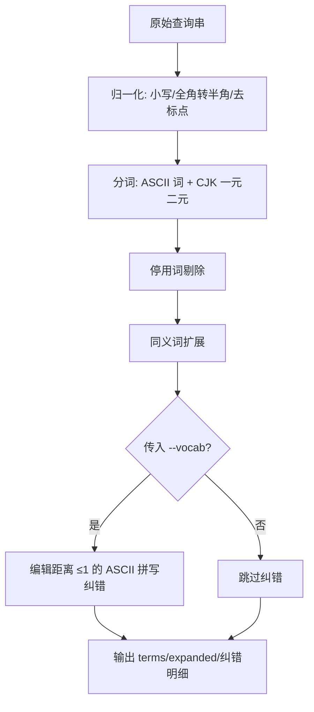

# Parse Query (查询解析)

## Overview

本技能是 L2 工序动作级工具，对应 Google 检索链里的查询理解环节。
它把用户那句自然语言，变成倒排索引能算分的 term 集合，并记录做了哪些变换。

## When to Use

- 检索前需要把自然语言查询转成 term 列表时；
- 检索结果为空，需要判断是不是分词或同义词覆盖不足时；
- 作为库被 `rank-skills-bm25` / `google-style-skill-search-router` 导入时。

**触发禁区**：不做意图判定（那是 L3 的职责），只做词法层处理。

## Workflow



1. `[probe:regex]` 归一化查询串：转小写、全角标点转半角、去首尾空白；
2. `[probe:regex]` 复用 `build-inverted-index` 的 `tokenize()` 切词，保证与索引侧一致；
3. `[probe:regex]` 剔除停用词并记录被剔除项；
4. `[probe:exitcode]` 按内置同义词表扩展 term；
5. `[probe:exitcode]` 传入 `--vocab` 时，对 ASCII term 做编辑距离 ≤1 的纠错，输出纠错明细后返回 0。

## Usage & Script

```bash
python3 skills/parse-query/scripts/parse_query.py --query "校验交付文件是否存在"
python3 skills/parse-query/scripts/parse_query.py --query "vaidate file" --vocab docs/operations/skill-index.json
```

## Success Contract

- Exit Code 0：解析完成（即使 terms 为空）；
- Exit Code 1：`--query` 与 `--file` 均缺失，或 `--vocab` 指定的文件不可读；
- 确定性：同一查询重复执行，`terms` 序列完全一致。

## Boundaries & Constraints

- 同义词表与停用词表内置于脚本，改动必须同步升 `index_version` 并重建索引；
- 不做语义向量化，不使用任何外部服务。
