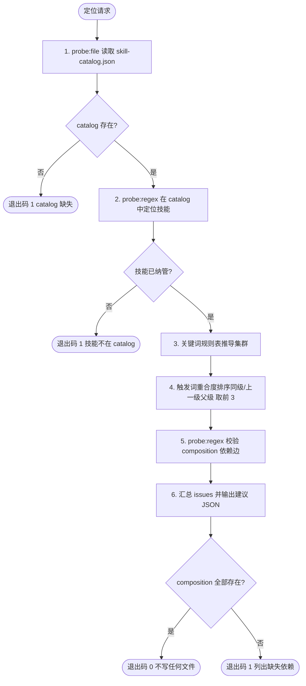

# Place Skill Into Cluster (定级挂载定位)

## Overview

本技能是「GitHub 技能引入管线」的第 4 步（T19，REQ-BUTLER-IMPORT-012）。
它读取 `docs/operations/skill-catalog.json`，按**内置关键词规则表**物理推导技能应归属的集群与建议父级，
并校验该技能 `composition` 中引用的每个技能是否真实存在于 catalog。

**归属禁止拍脑袋**：集群由规则表推导，父级由触发词重合度排序，两者都必须可被第三方脚本复算。

## When to Use

**正触发**：
- `normalize-skill-contract` 完成契约归一后，需要确定技能挂到哪个集群、挂谁下面；
- 用户问「这个技能该放哪 / 应该挂在哪个父级下 / composition 合不合法」；
- 作为 `skill-import-pipeline` 的第 4 步被串联调用。

**触发禁区**：本技能**只做定位判定，绝不写盘**——`--dry-run` 与常规运行都不修改任何文件；真正的 `composition` 接线与集群落盘由人工/管家复核建议后执行。也不做契约生成（交 `normalize-skill-contract`）、不做许可审计（交 `audit-imported-skill`）。

## Workflow



**有序步骤**：

1. `[probe:file]` 断言 `docs/operations/skill-catalog.json` 存在且可解析，缺失即退出码 1。
2. `[probe:regex]` 在 catalog 的 `skills` 数组（`name`/`id` 双键）中定位目标技能，未纳管即退出码 1。
3. `[probe:regex]` 用内置关键词规则表对 `name + description` 做顺序匹配，命中即返回对应集群；全表未命中则回落「⑦ 技能引入与演进」并记入 `issues`。
4. `[probe:length]` 在同级与上一级技能中按触发词命中共现度排序，取前 3 个作为 `suggested_parents`。
5. `[probe:regex]` 校验 `composition` 每一条依赖是否存在于 catalog 索引中，缺失项写入 `issues` 并置 `composition_ok=false`。
6. `[probe:exitcode]` 输出建议 JSON（含 `wrote_files: false`），`composition` 全部存在退出 0，否则退出 1。

## Usage & Script

```bash
# 1. 对已纳管技能做定位判定（只输出建议，不写盘）
python3 skills/place-skill-into-cluster/scripts/place_skill.py --name qa-gatekeeper --dry-run

# 2. 复核未纳管技能必须被拒绝（退出码 1）
python3 skills/place-skill-into-cluster/scripts/place_skill.py --name not-exist-skill --dry-run; echo "exit=$?"

# 3. 指定级别口径做父级范围收敛
python3 skills/place-skill-into-cluster/scripts/place_skill.py --name qa-gatekeeper --level L3 --dry-run

# 4. 只取结论字段
python3 skills/place-skill-into-cluster/scripts/place_skill.py --name qa-gatekeeper --dry-run --json \
  | python3 -c "import json,sys; d=json.load(sys.stdin); print(d['cluster'], d['composition_ok'])"
```

## Success Contract

| 退出码 | 语义 |
| :--- | :--- |
| `0` | 定位成功，且 `composition` 引用的技能全部真实存在于 catalog |
| `1` | catalog 缺失/不可解析、技能不在 catalog 中、或 `composition` 引用了不存在的技能 |

输出结构：

```json
{
  "success": true,
  "skill": "qa-gatekeeper",
  "cluster": "② 契约与合规",
  "level": "L3",
  "suggested_parents": [{"name": "...", "level": "L3", "score": 15}],
  "composition_ok": true,
  "issues": [],
  "dry_run": true,
  "wrote_files": false
}
```

## Boundaries & Constraints

- **零写入**：无论是否 `--dry-run`，本技能都不创建、不修改、不删除任何文件；`wrote_files` 恒为 `false`；
- **归属可复算**：集群必须出自关键词规则表，父级必须出自触发词重合度排序，禁止人工直接拍板写入结论；
- **未纳管即拒绝**：不在 catalog 中的技能一律退出码 1，禁止为未登记技能编造挂载建议；
- 实际接线（把 `composition` 与集群归属写回编目）属人工/管家动作，须在本技能建议基础上复核后执行。
