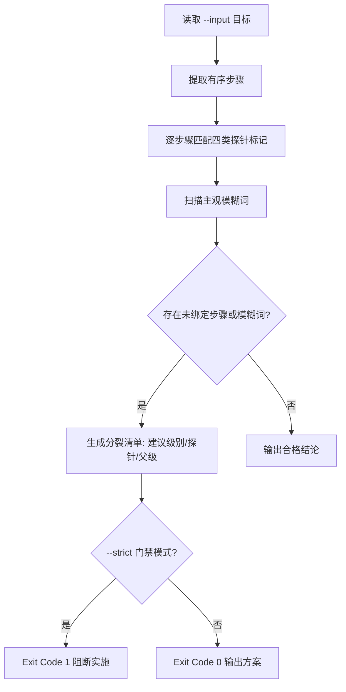

# Plan Fission (递归分裂规划)

## Overview

本技能是 L2 工序动作级工具，把 `enforce-atomic-granularity` 的判定规约落成一条可执行命令。
它扫描 SOP 的每一条有序步骤，找出未绑定物理探针或含主观模糊词的步骤，并为每一步给出分裂建议。

## When to Use

- 新写或修订任何 SOP / 技能主体后，需要自查粒度是否达到物理原子级时；
- 管家准备实施一项写入类任务前，做「不可断言即不得实施」的前置检查时；
- 需要把一条粒度过粗的规则拆成若干 L1/L2 子技能，但不确定该怎么拆时。

**触发禁区**：输入不是 SOP（例如纯散文、纯问答）时不得调用；本工具只处理有序步骤文本。

## Workflow



1. `[probe:file]` 读取 `--input` 指定的技能目录或文本文件，目录自动取 `SKILL.md`；
2. `[probe:regex]` 提取 `## Workflow` 章节内的有序步骤（形如 `1.` `1)` `- ` 的行），跳过 YAML Frontmatter、代码围栏与其他章节；
3. `[probe:regex]` 逐步骤匹配 `[probe:length|regex|exitcode|file]` 四类标记；
4. `[probe:regex]` 在这些步骤文本内扫描主观模糊词表，命中即记为粒度过粗；
5. `[probe:exitcode]` 输出 JSON 分裂清单；`--strict` 模式下存在待分裂项即返回退出码 1。

## Usage & Script

```bash
# 方案模式：输出分裂清单，输入可解析即返回 0
python3 skills/plan-fission/scripts/plan_fission.py --input skills/qa-gatekeeper

# 门禁模式：存在未绑定探针的步骤即返回 1
python3 skills/plan-fission/scripts/plan_fission.py --input skills/qa-gatekeeper --strict
```

## Success Contract

- Exit Code 0：方案模式且输入解析成功（即使存在待分裂项），或门禁模式下全部步骤已绑定探针；
- Exit Code 1：门禁模式下存在待分裂项，或 `--input` 不存在/不可读；
- stdout 恒为合法 JSON，字段含 `total_steps`、`unbound_steps`、`vague_hits`、`fission_required`、`fission_plan`。

## Boundaries & Constraints

- 本技能只**规划**分裂，不创建任何技能目录；实际创建由 `fission_engine.py` 或人工按清单执行；
- `suggested_parent` 取自输入路径，不做跨技能推断，避免越权改写他人契约。
