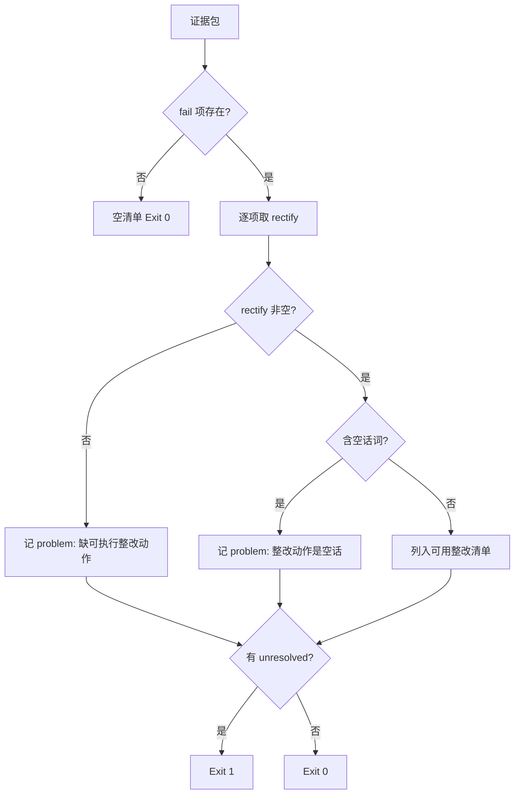

# Plan Process Rectification (流程整改清单生成器)

## Overview

本技能把 `fail` 项变成**能直接敲的命令**。

**写不出命令的整改，等于没整改。** 含「加强重视」「下不为例」这类空话的整改项一律判不合格。

## When to Use

- 流程打分未通过，需要给出可执行整改动作时；
- 需要区分「必需项整改」与「非必需项改进」时。

**触发禁区**：不执行整改命令（只生成）、不打分、不改证据包。

## Workflow



1. `[probe:file]` 读取证据包，不可解析即退 2；
2. `[probe:length]` 过滤出 `status == fail` 的步骤，无 fail 则输出空清单并退 0；
3. `[probe:regex]` 断言每项 `rectify` 非空，为空即记 `缺可执行整改动作`；
4. `[probe:regex]` 断言 `rectify` 不含空话词（加强/重视/注意/下不为例/尽快/以后），命中即记不合格；
5. `[probe:regex]` 对每项标注 `required`，把必需项失败单独列进 `required_failed`；
6. `[probe:regex]` 保留 `unverifiable` 标记，让复核者看到「这项是没证据，不是没做」；
7. `[probe:length]` 汇总 `unresolved`（有 problem 的项），非空即退 1；
8. `[probe:exitcode]` 无 unresolved 退 0；有则退 1 并逐条给出问题；
9. `[probe:length]` 断言清单里的命令都是**可直接执行**的形式（含脚本路径与参数）；
10. `[probe:exitcode]` 输出 `failed_steps` / `required_failed` / `rectification` 三块，缺一即判清单不完整。

## Usage & Script

```bash
python3 skills/plan-process-rectification/scripts/plan_rectification.py --bundle <证据包> --json
```

## Success Contract

| 退出码 | 含义 |
| :--- | :--- |
| 0 | 整改清单产出完毕（可为空 = 无需整改） |
| 1 | 存在无法整改的项（缺 rectify 或整改是空话） |
| 2 | 输入不可读 |

## Boundaries & Constraints

- **只生成不执行**：本技能不改仓库、不跑整改命令；
- **空话判不合格**：写不出命令的整改等于没整改；
- **必需项单列**：让复核者先看红线项；
- **保留 unverifiable**：区分「没证据」与「没做」。
