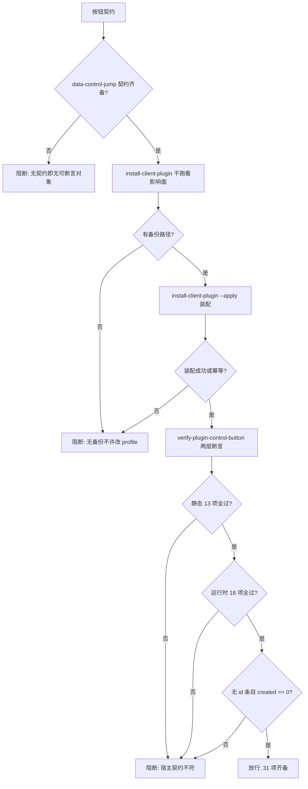

# Plugin Control Guard (插件常显调控按钮放行门禁)

## Overview

本技能把「每个插件市场下载的插件都有常显调控按钮」这件事串成一道门禁。

**为什么这条需求必须下沉到 plugin 层**：需求说的是 UI 行为（常显按钮 + 点击直达详情控制页）。
如果在 skill 层只写一段「请给插件加个按钮」的说明，它 **100% 无法被物理执行**——
没有可断言的对象，没有可安装的产物，没有可回滚的动作。
宿主的插件详情控制页（`settings.plugins` / `settings.pluginInventory`，含
`data-plugin-entry` 与 `plugin-config-*`）本来就有，缺的只是**直达它的常显按钮**，
而这个按钮只能由 client 插件注入。

**为什么不能改现成的**：宿主应用包已签名（改它即破签名，PKG-006 结论）；
`dshmarket` 是第三方包，重装即覆盖。唯一合规落点是自建 client 插件。

| 序 | 环节 | 承载技能 | 物理产物 | 不通过时 |
| :---: | :--- | :--- | :--- | :--- |
| 1 | 契约 | `plugin-control-jump-policy` | 按钮契约：`data-control-jump="<plugin-id>"` + 去重键 + 三级降级 | 契约缺失即阻断 |
| 2 | 装配 | `install-client-plugin` | profile 内 node_modules + bundles 登记 + 备份 | 无备份即阻断 |
| 3 | 断言 | `verify-plugin-control-button` | 静态 13 项 + 运行时 18 项 | 任一失败即阻断 |

## When to Use

- 交付「插件常显调控按钮」之前，需要给出可复算证据时；
- 装配脚本或注入内核变更后需要回归放行时。

**触发禁区**：本门禁只做裁决与阻断，不装配、不生成、不改内核、不改 profile。

## Workflow



1. `[probe:regex]` 断言按钮契约齐备：唯一标识 `data-control-jump="<plugin-id>"`、常显于条目、点击定位到同 id 的配置项；
2. `[probe:file]` 断言自建插件包存在且 `package.json` 可解析，缺失即阻断；
3. `[probe:exitcode]` 调 `install-client-plugin` 干跑：输出必须含备份路径，无备份路径即阻断（**不许无备份改 profile**）；
4. `[probe:file]` 断言 `cordis.patch.yml` 含本插件 id，否则装进去也不会被启用；
5. `[probe:exitcode]` 调 `install-client-plugin --apply`：成功或幂等（`changed=0`）才继续，否则阻断；
6. `[probe:exitcode]` 调 `verify-plugin-control-button`：退 0 才进入放行，退 1 阻断并保留逐项明细，退 2 判依赖不可用；
7. `[probe:length]` 断言静态层 13 项全过（平台 web、client 入口、patch 一致、`__ModuleLoader__` 注册、bundle 逐字内联内核、零外链）；
8. `[probe:length]` 断言运行时层 18 项全过（每容器每 id 恰 1 个按钮、二次扫描幂等、跨容器隔离、同容器同名去重、id 解析三级回退）；
9. `[probe:length]` 断言无插件 id 的条目 `created == 0`——**宁可不显示，也不显示点了没用的按钮**；
10. `[probe:exitcode]` 输出 `restart_required=true` 与重启说明：新增插件的 bundle 注册表在宿主启动时读取，
    **只刷新页面不够**——门禁绝不声称热更生效。

## Usage & Script

```bash
# 装配（先干跑，再落盘；有备份、可回滚）
python3 skills/install-client-plugin/scripts/install_plugin.py --profile web
python3 skills/install-client-plugin/scripts/install_plugin.py --profile web --apply --json

# 放行判据（31 项：静态 13 + 运行时 18）
python3 skills/verify-plugin-control-button/scripts/verify_plugin_button.py --all --json
```

## Success Contract

| 退出码 | 含义 |
| --- | --- |
| 0 | 三项齐备：契约齐备、装配成功（或幂等）、31 项断言全过 |
| 1 | 任一环失败（无备份、装配失败、静态或运行时断言失败、无 id 条目被注入） |
| 2 | 输入不可读或依赖不可用（包目录缺失、Node 不可用） |

## Boundaries & Constraints

- **落点只能是 plugin 层**：改宿主破签名、改第三方插件会被重装覆盖；
- **无备份不许改 profile**：门禁把「有备份路径」当作继续的前置条件；
- **缺 Node 即退 2**：不得降级为只做静态断言；
- **诚实声明重启**：装配后需重启宿主，门禁输出该事实，绝不假装热更成功；
- **判据不在本层新增**：契约归 `plugin-control-jump-policy`、装配归 `install-client-plugin`、断言归 `verify-plugin-control-button`；
- 本门禁不替代 `execution-tree-guard` 与 `catalog-consistency-guard`，也不替代 `zero-restart-guard`。
