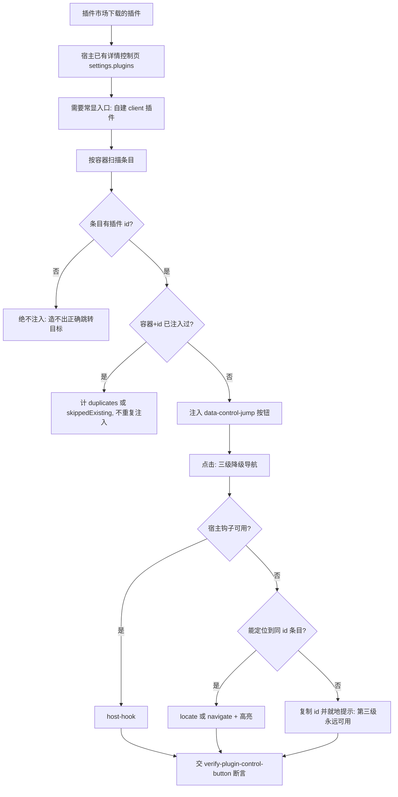

# Plugin Control Jump Policy (插件常显调控按钮判定基元)

## Overview

本规约是「每个插件市场下载的插件都带一个能直达其详情控制页的常显按钮」这件事的**唯一口径来源**：
只出定义与判据。注入交 client 插件 `dsh-plugin-control-jump`，装配交 `install-client-plugin`，
断言交 `verify-plugin-control-button`，放行交 `plugin-control-guard`。

**为什么这条规约必须存在**：需求原文是「必须常显按钮，点击直接进入对应插件的详情控制页面」。
这是一条 UI 行为约束，如果只写进执行明细，它就没有可断言的对象——
「常显」是几个？「对应」怎么算？重复渲染后会不会翻倍？没有 L1 钉死判据，这些问题在验收时只能靠嘴。

## 一、按钮契约

| 项 | 取值 | 为什么 |
| :--- | :--- | :--- |
| 唯一标识 | `data-control-jump="<plugin-id>"` | 与宿主既有的 `data-plugin-entry` / `plugin-config-*` 命名风格一致，可被正则断言 |
| 常显位置 | 市场「已安装」列表与设置→插件清单的**每个插件条目**上 | 需求原文「必须常显」——不允许折叠进菜单、不允许 hover 才出现 |
| 点击语义 | 定位到 `plugin-id` 相同的配置项，滚动进视口并高亮 | 「进入对应插件的详情控制页」的物理含义 |
| 无配置项时 | **仍然显示按钮**，点击定位到该插件的清单条目 | 「没得调」不等于「不该有入口」 |
| 卸载即撤 | 插件被移除后按钮与观察器条目一并清理 | 残留按钮会指向不存在的插件 |

**按钮不可省**：宿主详情页（`settings.plugins` / `settings.pluginInventory`）本来就有，
缺的只是直达它的入口。没有按钮，用户得自己在一屏几十条里翻。

## 二、幂等去重键 = `容器标识|插件 id`

| 情形 | 必须的行为 |
| :--- | :--- |
| 同一次渲染里同一插件出现两次 | 只注入 **1** 个按钮，第二次计 `duplicates` |
| `MutationObserver` 重复触发同一批条目 | `created = 0`（幂等），已有按钮计 `skippedExisting` |
| 同一插件出现在**不同容器**（市场页 / 宿主清单页） | 每个容器各 **1** 个按钮（互不干扰） |
| 条目上没有插件 id | **绝不注入**（`skippedNoId`） |

**为什么「无 id 绝不注入」**：造不出正确的跳转目标。宁可不显示，
也绝不显示一个点了没用的按钮——那比没有按钮更糟，用户会以为功能坏了。

## 三、三级降级导航

| 级 | 条件 | 行为 |
| :---: | :--- | :--- |
| 1 | 宿主暴露 `__DSH_OPEN_PLUGIN_SETTINGS__` | 直接调用，返回 `host-hook` |
| 2 | 能在 DOM 里找到同 id 的 `[data-plugin-entry]` | 滚动进视口 + 高亮，返回 `locate`；或找到「插件」导航并点击，返回 `navigate` |
| 3 | 以上都不可用 | 把插件 id 写入剪贴板（可用时）并**就地提示**「请在设置 → 插件中查找」，返回 `hint` |

**第三级永远可用**，因此这个按钮在任何宿主版本上都不会「点了没反应」。
**静默无反应是最坏结果**——用户以为坏了，实际只是能力缺失。

## 四、bundle 与内核不得双写

client bundle 里不能 `require` 本地文件（宿主只提供 seed 模块），因此注入内核必须**内联**。
内联必然产生「两份实现」，因此：

- 唯一真相源是 `plugins/dsh-plugin-control-jump/src/inject-core.cjs`；
- `lib/client.js` 由 `build_client.py` 从内核**逐字内联**并附 sha256 短摘要；
- 断言层必须验证 `bundle` **逐字包含**内核全文，否则判「源码改了但 bundle 没跟上」。

## 五、能力缺失是三态，不是 false

注入是否发生、脚本面是否存在这类问题，取值必须是 **`true` / `false` / `null`** 三态：

- `null` = **未探测**；
- 把未探测写成 `false` 是**假阴性**——下游会据此认为「对方没有这个东西」从而误判。

## When to Use

- 设计或验收「插件常显调控按钮」时；
- 判断一个按钮实现是「真的常显且幂等」还是「碰巧渲染对了一次」时；
- 下游 `install-client-plugin` / `verify-plugin-control-button` / `plugin-control-guard` 需要引用按钮契约、去重键、降级顺序的唯一真相源时。

**触发禁区**：本规约只出定义与判据，**不注入、不装配、不断言、不改 profile**；
不适用于宿主原生插件列表之外的任何 UI 增强需求。

## Workflow



1. `[probe:regex]` 断言按钮唯一标识为 `data-control-jump="<plugin-id>"`，出现其他标识即判契约破损；
2. `[probe:regex]` 断言注入位置覆盖市场已安装列表与宿主插件清单两处锚点（`[data-plugin-entry]` / `[data-plugin-id]`）；
3. `[probe:regex]` 断言点击语义为「定位同 id 配置项 + 滚动 + 高亮」，而非「打开一个无关页面」；
4. `[probe:regex]` 断言无配置项的插件**仍注入按钮**（清单条目兜底），不因「没得调」而隐藏入口；
5. `[probe:regex]` 断言去重键由「容器标识 + 插件 id」构成，缺容器维度会导致跨容器误去重；
6. `[probe:length]` 断言幂等：同批条目二次扫描 `created == 0`，已有按钮全部计入 `skippedExisting`；
7. `[probe:length]` 断言无 id 条目 `created == 0`（宁可不显示，也不显示点了没用的按钮）；
8. `[probe:regex]` 断言三级降级导航齐备，且第三级（复制 id + 就地提示）存在——它是「永不静默无反应」的兜底；
9. `[probe:length]` 断言 bundle 逐字内联内核全文（`bundle_inlines_core_verbatim`），否则判存在两份实现；
10. `[probe:exitcode]` 全部门禁经 `plugin-control-guard` 串联裁决，任一环失败一律阻断，禁止「记录后继续」。

## Usage & Script

本规约是纯规约，无独立脚本；内核、装配、断言由三个探针承载：

```bash
# 内核唯一真相源
python3 plugins/dsh-plugin-control-jump/build_client.py

# 装配（先干跑，再落盘；有备份、可回滚）
python3 skills/install-client-plugin/scripts/install_plugin.py --profile web
python3 skills/install-client-plugin/scripts/install_plugin.py --profile web --apply

# 断言（静态 13 项 + 运行时 18 项 = 31 项）
python3 skills/verify-plugin-control-button/scripts/verify_plugin_button.py --all --json
```

## Success Contract

| 退出码 | 含义 |
| :--- | :--- |
| 0 | 契约齐备、装配成功且可回滚、31 项断言全过 |
| 1 | 契约破损、装配失败、任一断言失败、无 id 条目被注入 |
| 2 | 输入不可读或依赖不可用（包目录缺失、Node 不可用） |

## Boundaries & Constraints

- **只出判据**：本规约不注入、不装配、不断言、不改 profile；
- **必须常显**：不允许折叠进菜单、不允许 hover 才出现；
- **无 id 绝不注入**：造不出正确跳转目标时宁可不显示；
- **幂等是硬要求**：重复渲染使按钮翻倍即为不合格；
- **永不静默无反应**：第三级降级必须存在；
- **bundle 不得双写**：内核唯一真相源在 `src/inject-core.cjs`，bundle 必须逐字内联；
- **三态不得压成两态**：未探测写 `false` 是假阴性；
- **确定性**：去重键与注入顺序只依赖容器标识与插件 id，禁止随机、禁止时间参与。
