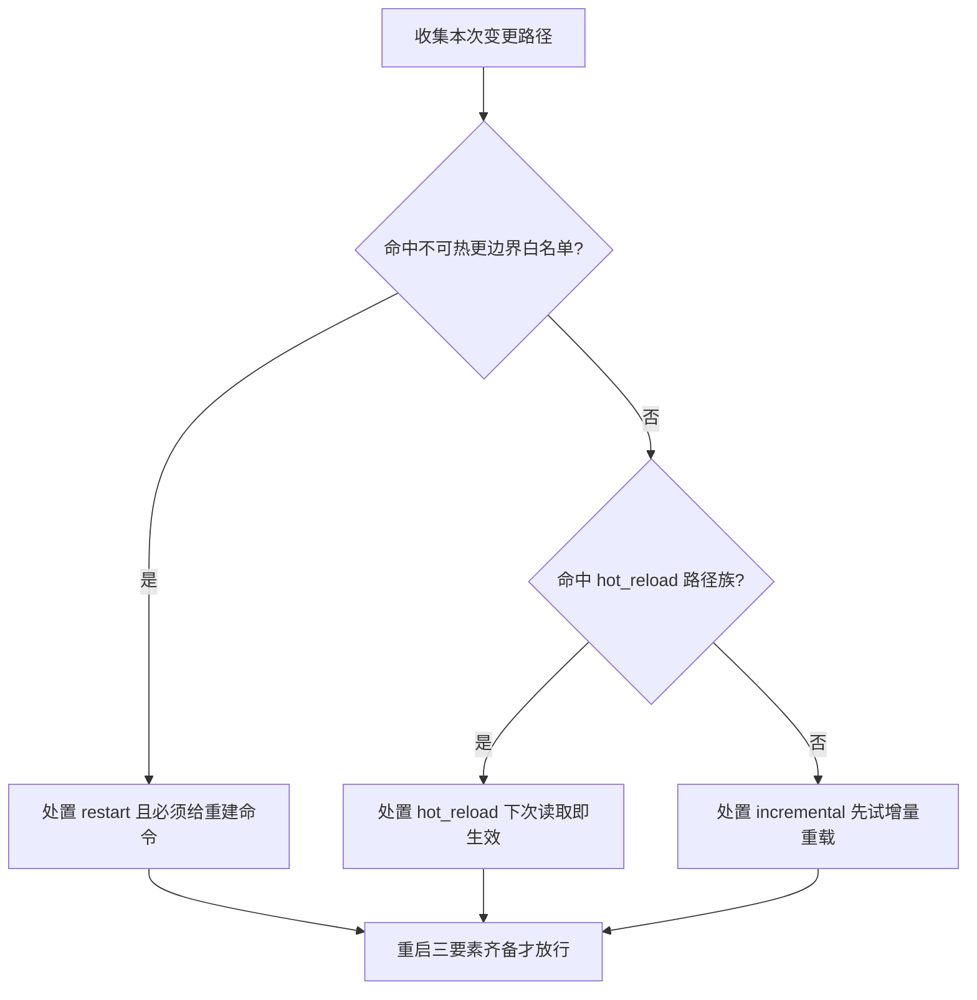

# Prefer Hot Reload Policy (能不重启就不重启规约)

## Overview

本技能是 L1 原子级基础规约，只回答一个问题：**一次变更到底需不需要重启？**

本仓库的**实测事实**是判定表的事实底座：

- 会话中途新增技能后，宿主**即时刷新技能目录，无需重启**；
- 仓库内 `skills/**`、`docs/**`、`docs/operations/*.json`、`bin/skill-pool` 都是「**下次读取 / 下次调用即生效**」；
- 真正需要重启（或重建 + 刷新）的只有**宿主侧**：DSH 应用 bundle、Web 产物、宿主注入的 system prompt 结构。

**处置优先级铁律**：`hot_reload`（热更）＞ `incremental`（增量重载）＞ `restart`（重启）。
重启是**例外**而非常态，**默认目标是零重启**；只有落在「不可热更边界」白名单里才允许 `restart`，且必须给出证据。

### 三级处置定义

| 处置 | 定义 | 生效时机 | 前置成本 |
| :--- | :--- | :--- | :--- |
| `hot_reload`（热更） | 改动落在「下次读取 / 下次调用即生效」的路径族内 | 下一次读取或调用即生效 | 零成本，不需要任何重建动作 |
| `incremental`（增量重载） | 路径未被判定表识别，但也没有证据表明落在不可热更边界内 | 先尝试增量重载，失败再升级 | 一次增量重载，不重启进程 |
| `restart`（重启） | 改动落在宿主侧不可热更边界白名单内 | 必须重建产物并刷新/重启后才生效 | 高成本，**必须有重建命令证据** |

### 判定表（最长前缀匹配，先长后短）

| 路径模式 | 处置 | 依据 |
| :--- | :--- | :--- |
| `skills/**` | hot_reload | 技能契约下次调用即生效 |
| `docs/**` | hot_reload | 文档下次读取即生效 |
| `docs/operations/*.json`（catalog/index/tree） | hot_reload | 由脚本重建后立即生效 |
| `bin/skill-pool` | hot_reload | 下次调用即生效 |
| `apps/web/**`、`*.bundle.js`、`dist/**` | restart | Web 产物需重建并刷新页面 |
| `/Applications/DSH Desktop.app/**` | restart | 宿主应用 bundle 不可热更 |
| 其它未识别路径 | incremental | 保守：先尝试增量重载 |

### 重启三要素（缺一即判为无证据重启）

声明 `restart` 必须**同时**给出：

1. **路径**：本次实际变更的路径；
2. **边界**：命中的「不可热更边界」白名单模式（判定表 restart 行的路径模式，必须非空）；
3. **重建命令**：重建/刷新该产物的可执行命令（`command` 字段必须非空）。

只有「路径在本次变更集合内 + 判定为 restart + 带非空重建命令」三条同时成立，重启才算有证据；
路径未变更却重启，或判定为 hot_reload / incremental 却重启，一律记为**不必要重启**。

> 口径限定：宿主侧不可热更是**本仓库不可改范围**的现实约束，本规约只覆盖「仓库可见范围内的不必要重启」。

## When to Use

- 任何产出改动、准备收尾时，需要判定「这次要不要重启」；
- 记录了重启事件，需要复核该重启是否必要、是否带重建命令；
- 编写写入门禁、CI 检查、交付说明，需要一条确定性的「零重启」判据时。

**触发禁区**：纯只读查询（未产生任何路径改动）不启用本规约；本规约不授权把宿主侧不可热更边界改造成可热更，也不裁定业务改动本身是否正确。

## Workflow



1. `[probe:file]` 枚举本次变更路径并逐条归一化（相对仓库根；路径不存在也照样登记，判定不依赖文件存在性）；
2. `[probe:regex]` 按判定表做**最长前缀匹配**：`/Applications/DSH Desktop.app/**`、`apps/web/**`、`dist/**`、`*.bundle.js` 命中即定为 `restart`，并记下命中的边界模式；
3. `[probe:regex]` 未命中白名单时依次匹配 `docs/operations/*.json`、`skills/**`、`docs/**`、`bin/skill-pool`，命中即定为 `hot_reload`；
4. `[probe:exitcode]` 全部规则皆未命中时定为 `incremental`（保守：先尝试增量重载），禁止直接升级为重启；
5. `[probe:length]` 对每个 `restart` 断言三要素非空：`path` 非空、`boundary` 非空、`command` 非空，缺一即判为无证据重启并阻断。

## Usage & Script

本规约无独立脚本，判定口径由下游 `classify-change-scope` 落地；规约本身可用下面两条断言自检：

```bash
# 变更只落在 skills/**：断言不存在任何 restart 处置（输出为空才合规）
python3 skills/classify-change-scope/scripts/classify_scope.py --paths skills/dsh-butler/SKILL.md --json \
  | grep -o '"disposition": *"restart"'

# 变更落在宿主 bundle：断言必定出现 restart 且带非空 boundary
python3 skills/classify-change-scope/scripts/classify_scope.py \
  --paths "/Applications/DSH Desktop.app/Contents/Resources/app/package.json" --json \
  | grep -o '"boundary": *"[^"]\+"'
```

判定表口径（可直接抄进判定脚本，顺序即匹配优先级）：

| 序 | 模式 | 处置 | boundary |
| :--- | :--- | :--- | :--- |
| 1 | `/Applications/DSH Desktop.app/**` | restart | 该模式 |
| 2 | `apps/web/**` | restart | 该模式 |
| 3 | `dist/**` | restart | 该模式 |
| 4 | `*.bundle.js` | restart | 该模式 |
| 5 | `docs/operations/*.json` | hot_reload | 空 |
| 6 | `skills/**` | hot_reload | 空 |
| 7 | `docs/**` | hot_reload | 空 |
| 8 | `bin/skill-pool` | hot_reload | 空 |
| 9 | 其它 | incremental | 空 |

## Success Contract

- Exit Code 0：每个变更路径都得到唯一处置，且不存在缺任何一项重启三要素的 `restart` 声明；
- Exit Code 1：存在「不必要重启」（路径未变更却重启，或判定非 `restart` 却重启）或「无证据重启」（`boundary` 或 `command` 为空）。

下游脚本 `classify-change-scope`、`verify-no-unnecessary-restart` 的 0 / 1 语义与本规约一致。

## Boundaries & Constraints

- **默认零重启**：判定起点是「不需要重启」，`restart` 必须由白名单边界 + 重建命令双向举证，禁止默认重启；
- **判定必须确定性**：只依赖固定判定表与最长前缀匹配，禁止随机数、时间戳、外部网络与模型主观判断；
- **路径不存在不报错**：判定只作用于路径字符串本身，路径不存在照样给出处置，避免因时序差异产生不确定结论；
- **边界不可自造**：白名单边界只有授权模型变体与构建产物两类，禁止把 `skills/**`、`docs/**` 等可热更路径改写成 restart 以规避举证；
- **本仓库不可改范围**：宿主侧不可热更是已知现实约束，本规约不承诺消除它，只承诺不为它制造额外重启。
