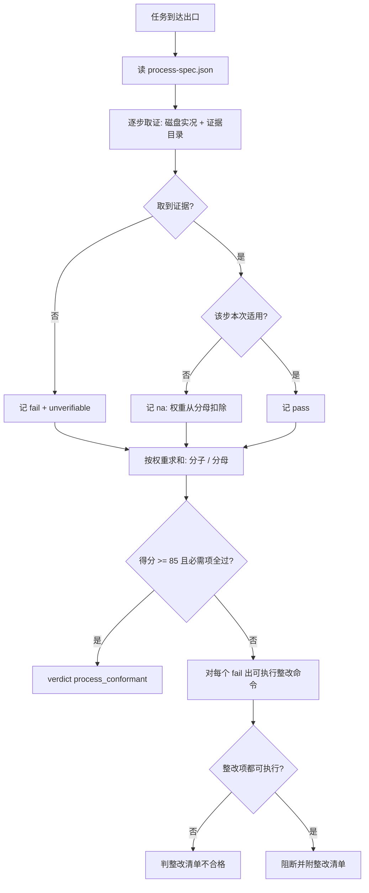

# Process Conformance Policy (流程合规判定基元)

## Overview

本规约是「任务整体有没有按约定的流程走」这件事的**唯一口径来源**：只出定义与判据。
取证交 `collect-process-evidence`，打分交 `score-process-conformance`，
整改交 `plan-process-rectification`，独立复核交 agent 层 `process-supervisor-agent`，
放行交 `process-supervisor`（L3）。

**它存在的理由**：池内 43 个 L3 门禁、14 道出厂检验**全部是单点检查**——
catalog 一致吗、树对得上吗、命名合规吗。**没有任何一个能力回答「整段流程走完了吗」。**
结果是：门禁可以逐道全绿，而流程整段没走（没查需求基线、没做分流、没走粒度门禁、没留变更记录）照样交付。
`workflows.md` §1 写了 8 步规范流转，但那是**散文**——没有探针，就没有强制力。

## 一、约定流程必须是数据，不是散文

唯一真相源：`docs/operations/process-spec.json`。每步必须含
`id` / `title` / `weight` / `required` / `evidence` / `probe` / `assert` / `rectify`。

**绑不上四类探针之一的步骤，不得进入本表。** 这与 `enforce-atomic-granularity` 同源：
写不出可测量具的口号，进不了流程。

## 二、九步、权重与必需项

| 步 | 约定动作 | 探针 | 权重 | 必需 |
| :---: | :--- | :--- | ---: | :---: |
| S1 | 取当前生效需求与基线 | file | 10 | ✅ |
| S2 | 判定增量还是完整规则审计 | file | 5 | — |
| S3 | 问题诊断先查问题台账 | file | 5 | — |
| S4 | 双流程分流判定且可复算 | exitcode | 15 | ✅ |
| S5 | 按需加载选中技能（≤ top-K） | exitcode | 10 | — |
| S6 | 写入过粒度门禁 / 契约变更过口径门禁 | exitcode | 20 | ✅ |
| S7 | 同步受影响的需求 / CLI / 界面 / 操作索引 | file | 15 | ✅ |
| S8 | 提交前生成并展示非空备注 | regex | 10 | ✅ |
| S9 | 交付前过输出规约门禁 | exitcode | 10 | — |

**权重合计 100。**

## 三、打分口径

| 项 | 取值 |
| :--- | :--- |
| 分子 | `status == pass` 的权重之和 |
| 分母 | 总权重 − `status == na` 的权重之和 |
| 通过 | 得分 **≥ 85** 且 **全部必需项 pass** |
| 单项三态 | `pass` / `fail` / `na` |

**必需项一票否决，不由加权稀释**：必需项是红线的同胞，靠权重摊平等于允许用别的高分买通它。

## 四、`na` 是独立第三态

不分场景地要求「写入类任务过粒度门禁」，在纯只读任务上会制造**假失败**；
把「没做」直接算过又会制造**假通过**。`na` 是唯一诚实的处置：**权重从分母扣除，且绝不当 pass**。

## 五、没有证据不等于走了这一步

取不到证据一律记 **`fail` + `unverifiable`**。禁止因为「看起来应该做了」而给 pass。
主上下文里「我记得我做了」不是证据——**能落在磁盘上的才叫证据**。

## 六、整改项必须可执行

每个 `fail` 项必须带一条可直接执行的命令或动作。含「加强 / 重视 / 注意 / 尽快」这类空话的
整改项判**不合格**（`plan-process-rectification` 退 1）。写不出命令的整改，等于没整改。

## When to Use

- 任务交付前需要回答「这次整体按流程走了吗、打几分」时；
- 需要把不合规项变成可执行整改清单时；
- 下游四个探针需要引用步骤表、权重、通过线与三态语义的唯一真相源时。

**触发禁区**：本规约只出定义与判据，**不取证、不打分、不整改、不写文件**；
纯闲聊式无工具问答不进入本流程（无产物即无可取证对象）。

## Workflow



1. `[probe:file]` 断言 `docs/operations/process-spec.json` 存在且可解析，缺失即退 2；
2. `[probe:length]` 断言九步权重合计 **100**，不等于 100 即判步骤表破损；
3. `[probe:regex]` 断言每步的 `probe` 落在四类闭集（`file`/`regex`/`exitcode`/`length`）内，越界即判粒度过粗；
4. `[probe:file]` 逐步取证：先查证据目录，再查仓库实况；两处都没有即记 `fail` + `unverifiable`；
5. `[probe:regex]` 断言 `fail` 项一律带 `unverifiable` 标记，缺失即判「把没证据当通过」；
6. `[probe:length]` 打分：分子 = pass 权重和，分母 = 总权重 − na 权重和，两者都必须打印；
7. `[probe:exitcode]` 断言通过条件为「得分 ≥ 85 **且**全部必需项 pass」，只满足其一即判不通过；
8. `[probe:length]` 断言 `na` 权重确实从分母扣除（分母 < 总权重），否则判 na 被当成了 pass；
9. `[probe:regex]` 对每个 `fail` 生成整改项，断言整改项非空且不含空话词；
10. `[probe:exitcode]` 全流程交 `process-supervisor` 裁决，任一环失败一律阻断，禁止「记录后继续」。

## Usage & Script

本规约是纯规约，无独立脚本；由四个探针 + 一个 agent 承载：

```bash
python3 skills/collect-process-evidence/scripts/collect_evidence.py --evidence <证据目录>
python3 skills/score-process-conformance/scripts/score_conformance.py --bundle <证据包>
python3 skills/plan-process-rectification/scripts/plan_rectification.py --bundle <证据包>
python3 skills/process-supervisor/scripts/supervise.py --evidence <证据目录>
```

## Success Contract

| 退出码 | 含义 |
| :--- | :--- |
| 0 | 得分 ≥ 85 且全部必需项 pass（`process_conformant`） |
| 1 | 未通过（附逐项明细与整改清单） |
| 2 | 输入不可读（spec 缺失、证据目录不存在、依赖脚本缺失） |

## Boundaries & Constraints

- **只出判据**：不取证、不打分、不整改、不写文件；
- **步骤表唯一**：九步与权重只存在于 `process-spec.json`，禁止下游另立；
- **必需项一票否决**：不接受加权摊平；
- **`na` 不得当 pass**：权重必须从分母扣除；
- **缺证据 = fail**：没有证据不等于走了这一步；
- **整改必须可执行**：写不出命令的整改判不合格；
- **确定性**：同输入连跑两次分数与逐项判定逐字节相同，禁止随机与时间参与。
