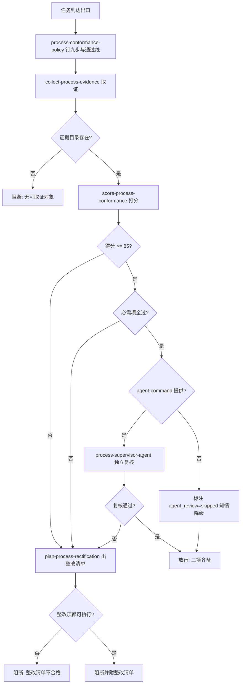

# Process Supervisor (流程监督员)

## Overview

本技能是「让所有任务都按约定的流程进行」的**出口门禁**。

池内 43 个 L3 门禁全是单点检查，**没有一个是流程级自检**。本技能补上这一环。

| 序 | 环节 | 承载技能 | 物理产物 | 不通过时 |
| :---: | :--- | :--- | :--- | :--- |
| 1 | 口径 | `process-conformance-policy` | 九步 / 权重 / 三态 / 通过线 | 步骤表缺失即阻断 |
| 2 | 取证 | `collect-process-evidence` | `evidence-bundle.json` | 无证据一律 fail+unverifiable |
| 3 | 打分 | `score-process-conformance` | 分子/分母/na + 得分 | < 85 或必需项失败即阻断 |
| 4 | 整改 | `plan-process-rectification` | 可执行整改命令清单 | 有 unresolved 即阻断 |
| 5 | 独立复核 | `process-supervisor-agent`（**agent 层**） | `agent-review.txt` | 复核失败即阻断 |

**为什么第 5 环要用 agent**：自己给自己打分必然偏松——主上下文里「我记得我做了」会污染取证。
交给一个**不共享上下文**的子智能体，它只能看到落在磁盘上的证据包；看不到的，就是没做。
`--agent-command` 未给出时退化为纯脚本打分，并在输出里标注 `agent_review=skipped`——
**这是知情降级，不是静默跳过**（分数会偏松，调用方必须知道）。

## When to Use

- 任务交付前需要一条可复算的流程放行判据时；
- 需要把不合规项变成可执行整改清单时；
- 需要给出「这次流程打了几分、哪几步没过」的实数证据时。

**触发禁区**：纯闲聊式无工具问答不经过本门禁（无产物即无可取证对象）；
本门禁只做裁决与阻断，不取证、不打分、不整改、不改文件。

## Workflow



1. `[probe:file]` 断言证据目录存在，缺失即阻断（无产物即无可取证对象）；
2. `[probe:file]` 断言三个 L2 依赖脚本存在，缺失即退 2（**绝不内置兜底判据**）；
3. `[probe:exitcode]` 调 `collect-process-evidence`：退 0 才继续，退 2 判输入不可读；
4. `[probe:exitcode]` 调 `score-process-conformance`：取回分子、分母、na 扣除、得分与必需项结果；
5. `[probe:length]` 断言得分 ≥ 85 **且** `required_all_pass == true`——两项必须同时成立；
6. `[probe:exitcode]` 调 `plan-process-rectification`：断言 `unresolved` 为空，非空即判整改清单不合格；
7. `[probe:regex]` 断言整改清单里的命令都是可直接执行形式（含脚本路径与参数）；
8. `[probe:exitcode]` 若有 `--agent-command`：以证据包为唯一输入拉起独立复核，结果写入 `agent-review.txt`；
9. `[probe:regex]` 无 `--agent-command` 时**必须**标注 `agent_review=skipped` 与「分数偏松」提示，禁止静默降级；
10. `[probe:exitcode]` 三项齐备（得分达标 + 必需项全过 + 整改无 unresolved）才退 0；任一失败退 1 并附明细。

## Usage & Script

```bash
# 纯脚本打分（会标注 agent_review=skipped）
python3 skills/process-supervisor/scripts/supervise.py --evidence <证据目录> --json

# 带独立复核
python3 skills/process-supervisor/scripts/supervise.py --evidence <证据目录> \
  --agent-command "python3 skills/process-supervisor/scripts/run_agent_review.py"
```

实测：

| 夹具 | 得分 | 必需项 | 退出码 |
| :--- | ---: | :--- | ---: |
| 空证据目录 | 20 / 100 = 20% | 未过 `S4,S6,S7,S8` | 1 |
| 合规证据 | 100 / 100 = 100% | 全过 | 0 |

## Success Contract

| 退出码 | 含义 |
| :--- | :--- |
| 0 | 流程合规（`process_conformant`） |
| 1 | 不合规（附逐项明细与可执行整改清单） |
| 2 | 输入不可读或依赖脚本缺失 |

## Boundaries & Constraints

- **只做裁决与阻断**：不取证、不打分、不整改、不改文件；
- **判据不在本层新增**：步骤与权重归 `process-conformance-policy`，取证/打分/整改归三个 L2；
- **agent 降级必须知情**：无独立复核时输出 `agent_review=skipped`，禁止静默；
- **缺证据一律 fail**：没有证据不等于走了这一步；
- **禁止「记录后继续」**：任一环失败即阻断，修复后从取证环重跑；
- 本门禁不替代任何单点门禁（`catalog-consistency-guard` 等），它是**流程级**的补充。
