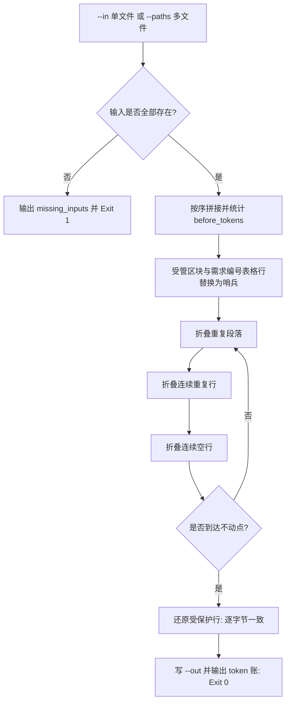

# Prune Redundant Context (保守语义无损裁剪)

## Overview

本技能是 L2 工序动作级工具，把 `measure-token-budget` 给出的数值基线变成实际下降。
它只做三件事：折叠连续重复行、折叠完全相同的重复段落、折叠连续空行；
**不改写、不概括、不删减任何首次出现的内容**，并逐字节保护 `CATALOG:BEGIN/END` 受管区块。

## When to Use

- 上下文超预算，需要按 `token-budget-policy` 的裁剪顺序落地时；
- 技能正文或文档出现大段粘贴导致重复时；
- 需要在交付前证明「裁剪后 token 下降且能力不变」的第一步时。

**触发禁区**：本技能不做语义压缩与内容改写；命中唯一事实（需求编号、表格行、受管区块）与独占事实时一律不动，禁止当作通用「精简器」使用。

## Prune Rules (裁剪规则)

| 规则 | 触发条件 | 处置 | 计数键 |
| :--- | :--- | :--- | :--- |
| 重复行折叠 | 连续 ≥2 行完全相同且非空 | 保留 1 行并追加 ` <!-- ×N -->` | `dup_line` |
| 重复段落折叠 | 连续 ≥3 行且整体出现 ≥2 次 | 保留首次出现，其余替为 `<!-- 重复段落已折叠 ×N -->` | `dup_paragraph` |
| 空行折叠 | 连续 ≥2 个空行 | 折叠为 1 个空行 | `blank` |
| 受管区块保护 | 位于 `<!-- CATALOG:BEGIN ... -->` 与 `<!-- CATALOG:END -->` 之间 | 逐字节不动 | 不计数 |
| 需求事实保护 | 输入位于 `docs/requirements/` 的编号行 / `REQ-*` 行 / 表格行 | 逐字节不动 | 不计数 |

token 估算沿用唯一标准公式（汉字约 1 token/字，ASCII 约 4 字节 1 token），与 `measure-token-budget`、`verify-token-reduction` 逐字一致；它是**确定性估算**，不是真实分词器。

## Workflow



1. `[probe:file]` 校验 `--in` 或 `--paths` 每个输入存在且为普通文件，任一缺失立即退 1；
2. `[probe:length]` 按序拼接输入并计算 `before_tokens` 作为下降分母；
3. `[probe:regex]` 用正则标记 `<!-- CATALOG:BEGIN ... -->` 至 `<!-- CATALOG:END -->` 区间及 `docs/requirements/` 的编号行、`REQ-*` 行、`|` 表格行为保护区；
4. `[probe:regex]` 折叠重复段落：仅处置连续 ≥3 行且整体出现 ≥2 次的段落，其余替为 `<!-- 重复段落已折叠 ×N -->`；
5. `[probe:regex]` 折叠连续重复行，追加 ` <!-- ×N -->` 计数注释；
6. `[probe:length]` 折叠连续空行，断言输出中不存在连续两个空行；
7. `[probe:length]` 迭代至不动点后还原保护区，断言受管区块内容与输入逐字节一致；
8. `[probe:exitcode]` 写出 `--out` 并输出 `before_tokens`/`after_tokens`/`saved_tokens`/`saved_ratio`/`removed_lines`/`rules_applied`，成功退 0。

## Usage & Script

```bash
# 单文件裁剪
python3 skills/prune-redundant-context/scripts/prune_context.py --in /tmp/prune-sample.md --out /tmp/prune-out-1.md --json

# 幂等复跑：第二次 saved_tokens 必为 0
python3 skills/prune-redundant-context/scripts/prune_context.py --in /tmp/prune-out-1.md --out /tmp/prune-out-2.md --json

# 多文件拼接裁剪
python3 skills/prune-redundant-context/scripts/prune_context.py --paths skills/token-budget-policy/SKILL.md skills/measure-token-budget/SKILL.md --out /tmp/prune-merged.md --json
```

## Success Contract

- Exit Code 0：裁剪完成（含零改动），`--out` 已写出，stdout 为合法 JSON；
- Exit Code 1：`--in` / `--paths` 任一输入不存在或不是普通文件（输出 `missing_inputs`），或两者都未给出；
- 字段语义：`saved_ratio = saved_tokens / before_tokens`（保留 4 位小数，`before_tokens = 0` 时记 0.0）；
- 幂等语义：以输出为输入再跑一次，`saved_tokens` 必须为 `0`、`removed_lines` 必须为 `0`、`rules_applied` 三键必须全为 `0`。

## Boundaries & Constraints

- 本技能**不删除事实**：不删编号、不删受管区块、不删验收证据、不删首次出现的任何内容；
- 裁剪是保守的：无法判定为「完全相同的重复」时不处置，宁可少省 token；
- 不做跨文件去重与跨节改写，避免同一事实被误判为冗余；
- 保护区还原是逐字节的，输出中受管区块与输入完全相同。
