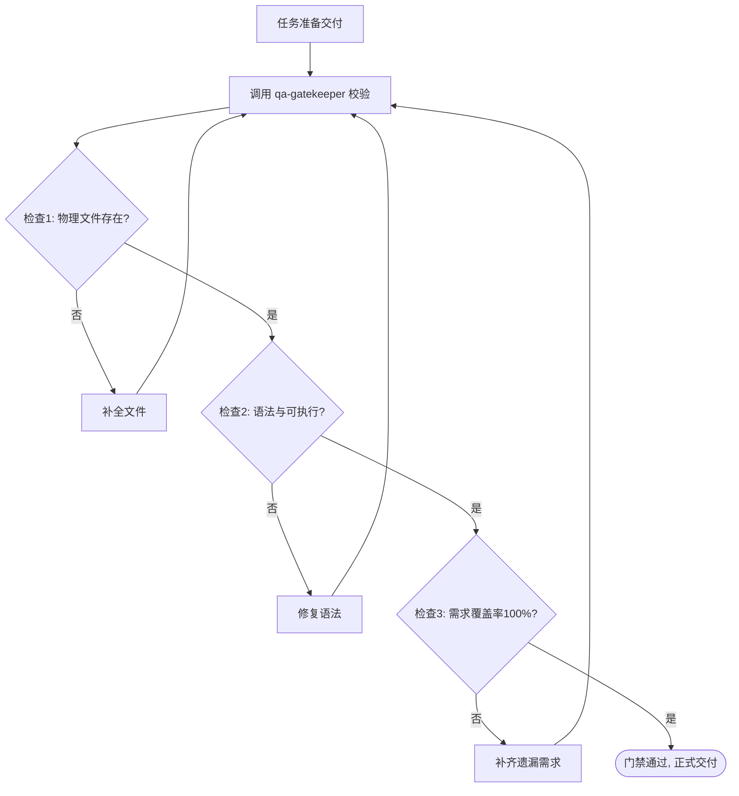

# QA Gatekeeper (交付门禁守卫)

## Overview

QA Gatekeeper 是管家防范大模型“幻觉完成”、“假完成”以及流程随机性脱落的核心防线。
在复杂代码、配置修改或工程构建任务结束前，必须严格通过本门禁的 Checklist 检验才能标记为完成。

## When to Use

- 在任何涉及文件修改、创建、删除的任务收尾交付前；
- 在执行多步骤复合作业、声明任务完成前；
- 用户要求提供高可靠性、经过验证的工程交付物时。

## Strict Rules & Checklist (硬性门禁清单)

任何声称“已完成”的交付物必须满足以下 4 项硬指标：

1. **物理落地验证 (Physical Existence Check)**：
   - 宣称创建或修改的文件，必须在磁盘上实际存在，文件大小大于 0；
   - 路径必须与需求规格完全一致，不可仅在回答中列出文本。

2. **语法与构建自检 (Syntax & Build Check)**：
   - 脚本（Python/Node/Shell 等）必须执行基本的静态语法检验（例如 `python3 -m py_compile` 或执行 `--help`）；
   - JSON/YAML 配置文件必须通过格式解析。

3. **需求闭环一致性 (Traceability & Requirement Fit)**：
   - 用户原始指令中的关键参数和约束是否全部得到兑现；
   - 是否存在遗漏未处理的子项。

4. **无脏数据与未决项 (Zero Orphan Artifacts)**：
   - 最终交付物中不得残留 `TODO: TBD`、`PLACEHOLDER`、`待补充` 等临时字样；
   - 临时生成的无用 debug 文件必须被清理或合规归档。

## Standard Workflow

## Boundaries & Constraints

- 门禁属于审查把关层，若发现问题，必须由具体执行层纠错后再提交门禁复核；
- 不允许任何跳过门禁直接交付的情况。
