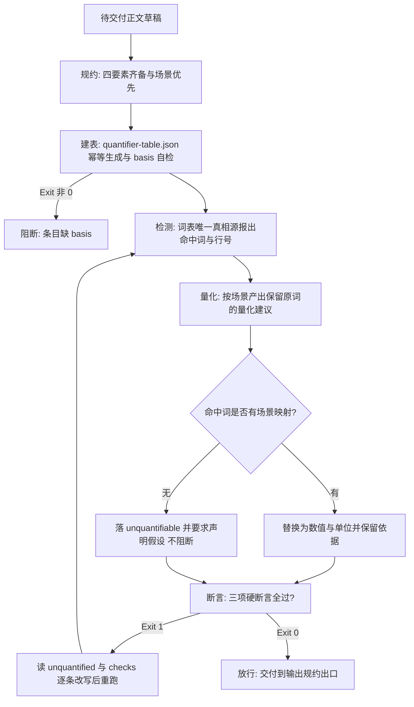

# Quantification Guard (量化交付门禁)

## Overview

Quantification Guard 是「修饰程度词必须量化」（`REQ-BUTLER-QUANTIFY-023`）的**唯一交付出口门禁**，
挂载于管家**「④ 输出规约」集群**（与 `chinese-output-guard`、`standard-output-framework`、
`milestone-progress-reporter`、`schema-guard`、`iconized-output-showcase`、`tail-metrics-showcase` 同集群）。

它把五块能力积木按依赖顺序串成一条可阻断的流水线：

| 环节 | 组成技能 | 级别 | 职责 |
| :--- | :--- | :--- | :--- |
| ① 规约 | `quantify-modifier-policy` | L1 | 定纪律：四要素齐备、场景优先、不可量化不得沉默、禁止程度词替换程度词 |
| ② 建表 | `build-quantifier-table` | L2 | 生成 `docs/operations/quantifier-table.json`，缺 `basis` 即不合格 |
| ③ 检测 | `detect-vague-modifier` | L2 | 全仓模糊词表唯一真相源；报出命中词、类别、行号与映射命中情况 |
| ④ 量化 | `quantify-modifier` | L2 | 按 `(term, domain)` 产出保留原词的量化建议；无映射落 `unquantifiable` |
| ⑤ 断言 | `verify-quantified-output` | L2 | 三项硬断言全过才退 0，否则列出词与行号 |

三条不可让渡的红线：

- **缺失映射不阻断，但必须声明假设**：查不到 `(term, domain)` 条目时，交付必须带
  `unquantifiable` 项与「需显式声明假设」提示（写明取值、单位、依据）。**门禁不因此阻断**——
  公开基准确实不存在时，阻断只会惩罚诚实；但**沉默交付**（既不量化也不声明假设）一律不通过。
- **禁止同义词替换糊过去**：「很快」→「非常快」、「严重」→「极其严重」、「多」→「较多」
  全部不合格。唯一合法方向是**引入数值与单位**；程度词叠用由断言 2 物理拦下。
- **场景优先**：同一个词在不同场景量化不同（「大」在日志场景 `>=100 MB`、在代码库场景 `>=1 MB`）。
  场景未声明时不得替调用方挑场景，只能落 `unquantifiable` 并要求先声明场景。

**词表与映射表口径唯一**：词表在 `detect-vague-modifier`，映射表在 `quantifier-table.json`，
本门禁不另写第三套清单。

## When to Use

- 管家「④ 输出规约」出口前的强制门禁：结论、报告、技能契约、验收说明交付前必须过；
- 交付物里出现程度词，需要判断该补数值还是该声明假设时；
- 词表或映射表变更后，需要端到端复核「建表 → 检测 → 断言」链路是否仍然自洽时。

**触发禁区**：纯代码交付、纯命令行片段、纯 JSON 载荷与纯数值报表不经过本门禁——它们整体属于豁免面；本门禁不评价数值取得是否合理，只判「有没有量、有没有声明假设」。

## Workflow



1. `[probe:file]` 以 `quantify-modifier-policy` 的四要素判据确认待交付正文草稿与场景声明已分离存放；
2. `[probe:exitcode]` 运行 `build-quantifier-table` 的脚本：自检缺 `basis` 条目则退 1 并阻断，`--check` 非 0 表示映射表陈旧需先重建；
3. `[probe:exitcode]` 运行 `detect-vague-modifier` 取命中词、类别与行号，退出码非 0 按输入缺失处理；
4. `[probe:exitcode]` 运行 `quantify-modifier` 产出量化建议，`unquantifiable` 项必须同时给出「需声明假设」提示才允许继续；
5. `[probe:regex]` 断言程度词叠用被拦下：出现「很快」「非常快」「极其严重」一类替换即判不合格，禁止同义词替换糊过去；
6. `[probe:exitcode]` 运行 `verify-quantified-output` 三项断言，退 0 才放行到「④ 输出规约」出口，退 1 则按 `unquantified` 与 `checks` 逐条改写后重跑。

## Usage & Script

本技能为纯编排技能，不自带脚本；五个环节的脚本均已就位，命令真实可跑：

```bash
# ② 建表：缺 basis 即退 1；--check 退 1 表示需重建
python3 skills/build-quantifier-table/scripts/build_quantifier_table.py --check

# ③ 检测：命中词、类别、行号与映射命中情况
python3 skills/detect-vague-modifier/scripts/detect_vague.py --text '数据量大' --domain 单表数据量 --json

# ④ 量化：有映射给数值与依据，无映射落 unquantifiable
python3 skills/quantify-modifier/scripts/quantify.py --text '数据量大' --domain 单表数据量 --json

# ⑤ 断言（门禁判定点，退出码即放行结论）
python3 skills/verify-quantified-output/scripts/verify_quantified.py --text '数据量大，单表 ≥10000000 行。' --domain 单表数据量 --json
```

## Success Contract

| 码 | 含义 | 门禁动作 |
| :--- | :--- | :--- |
| 0 | 五项链路全部通过：建表自检通过、检测完成、量化建议非空或已声明假设、三项断言全过 | 放行交付 |
| 1 | 映射表缺 `basis` 条目、文本存在未量化程度词、程度词替换程度词，或缺失 domain 映射 | 阻断，按 `unquantified` 与 `checks` 改写后重跑 |
| 2 | 输入缺失、文件不可读，或量化映射表不可读 | 阻断，先补齐输入或重建映射表 |

判定产物为 `verify-quantified-output` 的三字段 JSON：`success` / `unquantified` / `checks`。

## Boundaries & Constraints

- **只阻断不代写**：门禁不自动改写正文，改写必须显式执行并重跑，禁止静默放行；
- **缺映射不阻断**：无映射时只要求 `unquantifiable` + 显式假设，**不因缺映射退 1**；
  反之，**既不量化也不声明假设的沉默交付一律不通过**；
- **禁止同义词替换**：用另一个程度词替换程度词（很快 / 非常快 / 极其严重）零容忍，无宽容参数；
- **口径唯一**：词表口径只在 `detect-vague-modifier` 定义，映射表只由 `build-quantifier-table` 写入，
  本门禁不另写第三套清单；
- **不越集群**：含糊词（范围 / 指代 / 时序）交「具像化门禁」处理，本门禁只管程度词；
- **零第三方依赖**：全链路纯 Python 3 标准库，无随机数与时间戳，同一输入产出同一放行结论。
