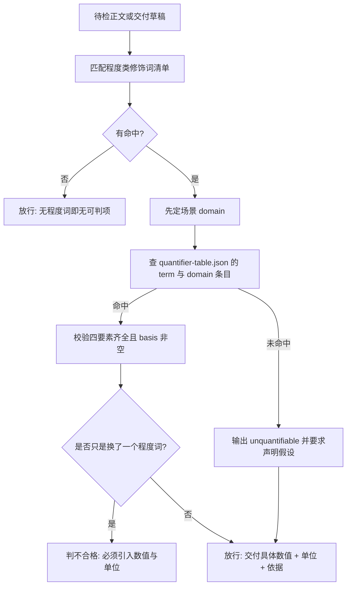

# Quantify Modifier Policy (程度词量化判定基元)

## Overview

**核心立场**：程度类修饰词不是修辞，而是**未落地的指标**。「大文件」「响应要快」「数据量大」
这类表述在机器看来没有真值条件——多大算大、多快算快，无法判定，也就无法验收。

**唯一纪律**：凡出现程度类修饰词，必须给出**量化四要素**，缺一不可：

| 要素 | 字段 | 含义 | 反例 |
| :--- | :--- | :--- | :--- |
| 场景 | `domain` | 该词出现在哪个可判定的场景里 | 只说「大文件」，不说日志场景还是代码库场景 |
| 数值或区间 | `quantified` | 可比较的阈值或区间，如 `>=180`、`P95<=200` | 写「比较大」「偏大」 |
| 单位 | `unit` | 数值的物理量纲，如 `cm`、`ms`、`行`、`%` | 只写 `>=180`，不写 `cm` |
| 依据 | `basis` | 公开统计、国家标准、行业惯例或本项目既有基线 | 拍脑袋给一个数，说不出出处 |

**缺 `basis` 的条目一律不合格**：没有依据的数值只是把模糊词换成了一个更具体的猜测，
问题从「无法判定」变成「错误且无法追溯」，比原来更糟。

### 场景优先原则（本规约的第一性原理）

**同一个词在不同场景量化不同**，不存在全局唯一的量化值：

| 模糊词 | 场景 | 量化结果 |
| :--- | :--- | :--- |
| 大 | 日志场景 | `>=100 MB` |
| 大 | 代码库场景 | `>=1 MB` |
| 大 | 单表数据量 | `>=10000000 行` |
| 快 | 接口响应 | `P95 <= 200 ms` |
| 快 | 单元测试 | `<=100 ms` |

因此判定顺序固定为「**先定场景，再取数值**」。场景未声明时，**不得替用户挑一个场景**——
那不是量化，那是又一次拍脑袋。

### 不可量化不得沉默

查不到映射时，处置只有一条：**输出 `unquantifiable` 并强制显式声明假设**，
写明「取了什么值 / 依据是什么 / 假设不成立时如何回滚」。**不阻断交付**：
公开基准确实不存在时，阻断只会惩罚诚实。

但**沉默**（既不量化、也不声明假设，直接照原样交付）是违规。

### 禁止用另一个程度词替换程度词

「很快」→「非常快」、「严重」→「极其严重」、「多」→「较多」**全部不合格**：
替换前后的可判定性完全相同，属于用同义词糊过去，比不改更差。
唯一合法的替换方向是**引入数值与单位**。

本规约只出判据，不检测：检测交 `detect-vague-modifier`，建表交 `build-quantifier-table`，
替换交 `quantify-modifier`，断言交 `verify-quantified-output`，门禁交 `quantification-guard`。

## Degree Word Inventory (程度类修饰词清单)

程度类（`category=degree`，必须量化）：

| 类型 | 词条 |
| :--- | :--- |
| 单字程度词 | 高、大、快、多、好 |
| 复合程度词 | 严重、频繁、明显、显著、较多、较高、偏低、偏高、丰富、完善、稳定 |

含糊类（`category=ambiguity`，由 `REQ-BUTLER-CONCRETIZE-024` 承接，本规约只做归口）：
范围含糊（若干 / 一些 / 部分 / 多个 / 等等）、指代含糊（相关 / 相应 / 等 / 其它 / 之类）、
时序含糊（尽快 / 必要时 / 适时 / 及时）。

**词表唯一真相源**：上述清单的物理载体是 `skills/detect-vague-modifier/scripts/detect_vague.py`
的模块级常量 `DEGREE_WORDS` 与 `AMBIGUITY_WORDS`，其余任何技能**不得再维护第二份词表**。

## When to Use

- 交付正文里出现「高 / 大 / 快 / 多 / 好 / 严重 / 频繁」等程度词，需要判定其是否合格时；
- 新增一条 `term / domain / quantified / unit / basis` 映射，判断其能否入表时；
- 收到「说法太虚」「没法验收」反馈，需要定位到具体未量化词时。

**触发禁区**：纯数值报表、命令与代码原文、以及已经带数值与单位的正文不经过本规约——它们本就没有待量化的修饰词，或整体属于豁免面。

## Workflow



1. `[probe:regex]` 用 `detect-vague-modifier` 的唯一词表逐条匹配程度类修饰词，逐条记 term 与位置；
2. `[probe:regex]` 为每条命中钉死场景 `domain`，场景只能来自正文上下文或调用方显式传参，禁止猜测；
3. `[probe:file]` 查 `docs/operations/quantifier-table.json` 中是否存在该 `term` 与 `domain` 的条目；
4. `[probe:length]` 校验四要素字段 `term` / `domain` / `quantified` / `unit` / `basis` 全部非空，`basis` 为空即判不合格；
5. `[probe:exitcode]` 未命中映射时输出 `unquantifiable` 并附「需声明假设」提示，不阻断交付；
6. `[probe:regex]` 断言替换文本引入了数值与单位，出现「很快」「非常快」「极其严重」这类程度词叠用即判不合格。

## Usage & Script

本技能为纯规约，无独立脚本；判据的物理执行由下游四个探针承载：

```bash
# 建表：生成 docs/operations/quantifier-table.json（幂等）
python3 skills/build-quantifier-table/scripts/build_quantifier_table.py

# 检测：命中的程度词与含糊词、类别、位置、是否已有映射
python3 skills/detect-vague-modifier/scripts/detect_vague.py --text '接口响应要快' --domain 接口响应 --json

# 替换：给出带数值与单位的量化建议，无映射则落 unquantifiable
python3 skills/quantify-modifier/scripts/quantify.py --text '接口响应要快' --domain 接口响应 --json

# 断言：输出中不存在未量化的程度词，退 0 才放行
python3 skills/verify-quantified-output/scripts/verify_quantified.py --text '接口响应 P95 ≤ 200 ms' --json
```

## Success Contract

本规约自身不含脚本，退出码语义由执行代理脚本承载：

| 退出码 | 含义 |
| :--- | :--- |
| 0 | 程度词已量化，或未命中程度词；`unquantifiable` 项已显式声明假设 |
| 1 | 存在未量化且未声明假设的程度词，或出现程度词替换程度词 |
| 2 | 输入缺失、文件不可读，或量化映射表不可读 |

判定产物为 `detect-vague-modifier` 的三段式 JSON：`hits` / `counts` / `unquantified`。

## Boundaries & Constraints

- 本规约只出判据，**不检测、不建表、不写文件、不阻断交付**；
- **禁止无依据量化**：`basis` 必须可追溯到公开统计、国家标准、行业惯例或本项目既有基线；
- **禁止跨场景套用**：日志场景的 `>=100 MB` 不得搬到代码库场景；
- **禁止程度词替换程度词**：「很快」→「非常快」一类改写一律判不合格；
- **不可量化不得沉默**：查不到映射必须输出 `unquantifiable` 并声明假设，禁止照原样沉默交付；
- 词表口径只在 `detect-vague-modifier` 定义，本规约不另写一套清单。
