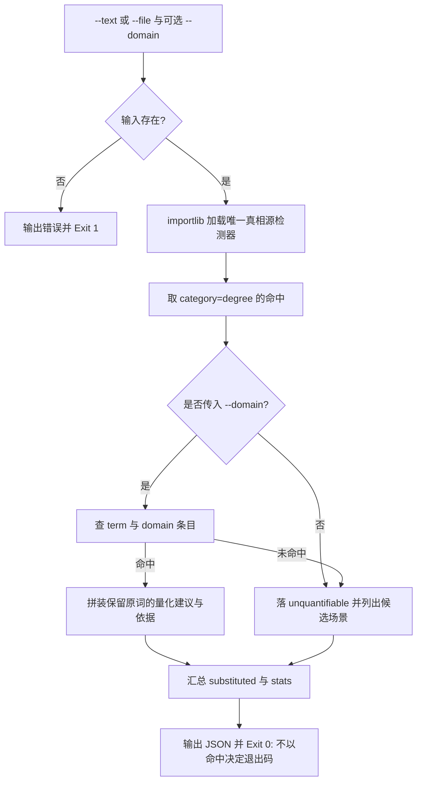

# Quantify Modifier (按场景量化替换)

## Overview

本技能是「修饰程度词必须量化」（`REQ-BUTLER-QUANTIFY-023`）流水线的**替换环节**：
把 `detect-vague-modifier` 报出的程度词命中，按 `(term, domain)` 查到四要素条目，
拼装成可直接落笔的量化替换建议。

| 要素 | 来源 | 输出位置 |
| :--- | :--- | :--- |
| 场景 | `--domain` | `domain` 字段 |
| 数值或区间 | `quantifier-table.json` 的 `quantified` | `to` 字段 |
| 单位 | 同条目的 `unit` | 与 `quantified` 拼成 `to` |
| 依据 | 同条目的 `basis` | `basis` 字段与 `suggestion` |

三条硬纪律：

1. **场景优先**：只有传入 `--domain` 才查表。未声明场景时**不替用户挑场景**——
   命中词一律落 `unquantifiable`，并在建议里列出该词已有的候选场景，要求先声明场景与假设。
   理由：场景是量化的前提，替用户选场景等于换一种方式拍脑袋。
2. **不可量化不得沉默**：无映射时输出 `unquantifiable` 并给出「需显式声明假设」提示，
   **但不阻断交付、不用命中决定退出码**（公开基准确实不存在时，阻断只会惩罚诚实）。
3. **保留原词、只补数值**：建议形如 `快 → P95<=200 ms（依据：行业常见 SLA 区间…）`，保留原词；
   出现程度强化词紧邻程度词（如「很快」「非常快」）时，建议里额外标注
   「属用另一个程度词替换程度词，一律不合格」。

替换源唯一：映射表 `docs/operations/quantifier-table.json` 由 `build-quantifier-table` 维护；
词表唯一真相源是 `detect-vague-modifier`（importlib 进程内加载，不起子进程）。

## When to Use

- 交付草稿里出现程度词，需要在落笔前换成可验收的数值与单位时；
- 需要判断某个程度词在当前场景下到底能不能给出量化值时；
- 上游门禁判定「未量化」后，需要产出具体替换建议与依据时。

**触发禁区**：本技能只产出建议、不改写用户文件、不做放行判定；含糊词（范围/指代/时序）不在此处理，交具像化管线。

## Workflow



1. `[probe:file]` 断言 `--text` 与 `--file` 至少给出一个且文件存在可读，否则输出错误并 Exit 1；
2. `[probe:exitcode]` 用 importlib 进程内加载 `skills/detect-vague-modifier/scripts/detect_vague.py`，加载失败按输入问题处理，禁止起子进程；
3. `[probe:regex]` 只取 `category=degree` 的命中；含蓄或含糊类命中一律不进入替换流程；
4. `[probe:file]` 传入 `--domain` 时查 `quantifier-table.json` 的 `(term, domain)` 条目，取得 `quantified` / `unit` / `basis`；
5. `[probe:length]` 拼装 `suggestion`：保留原词并附「→ 数值 单位（依据：…）」，三条内容任缺其一即判为不合格建议；
6. `[probe:exitcode]` 未传场景或查不到条目时输出 `unquantifiable` 与「需声明假设」提示，最终统一 Exit 0（不阻断交付）。

## Usage & Script

```bash
# 有场景且有映射：产出量化替换建议
python3 skills/quantify-modifier/scripts/quantify.py --text '接口响应要快' --domain 接口响应 --json

# 有场景且无映射：落 unquantifiable
python3 skills/quantify-modifier/scripts/quantify.py --text '这个方案很好' --domain 接口响应 --json

# 场景未声明：不替用户挑场景，落 unquantifiable 并列出候选场景
python3 skills/quantify-modifier/scripts/quantify.py --text '这个方案很好' --json

# 真实文档整篇扫描
python3 skills/quantify-modifier/scripts/quantify.py --file skills/fold-repeated-events/SKILL.md --json
```

## Success Contract

| 字段 | 类型 | 含义 |
| :--- | :--- | :--- |
| `success` | 布尔 | 处理是否完成 |
| `domain` | 字符串或 `null` | 调用方传入的场景 |
| `substituted` | 数组 | `[{"term","from","to","basis","line","suggestion"}]` |
| `unquantifiable` | 数组 | `[{"term","line","suggestion"}]`，`suggestion` 必含「需显式声明假设」语义 |
| `stats` | 对象 | `{"degree_hits","replaced","unquantifiable"}` |

`from` 为原词，`to` 为「数值 + 单位」，`suggestion` 为保留原词的完整建议串：
`快 → P95<=200 ms（依据：行业常见 SLA 区间：P95 不超过 200 ms 属快）`。

退出码：

| 码 | 含义 |
| :--- | :--- |
| 0 | 处理完成（`unquantifiable` 有多少条都不影响退出码） |
| 1 | 输入缺失（既无 `--text` 也无 `--file`），或 `--file` 指向的文件不存在/不可读 |

## Boundaries & Constraints

- **不发明数值**：只从映射表取 `quantified` 与 `unit`，查不到就落 `unquantifiable`，禁止现场编造阈值；
- **不阻断交付**：缺映射只要求声明假设，退出码 0；是否放行由 `verify-quantified-output` 与 L3 门禁判定；
- **禁止程度词替换程度词**：建议中出现「很快」这类叠用时额外标注不合格，不得把它当作替换结果；
- **不改写文件**：只输出建议 JSON，落笔由调用方执行；
- **确定性**：无随机数与时间戳，同一输入同一场景产出同一建议。
