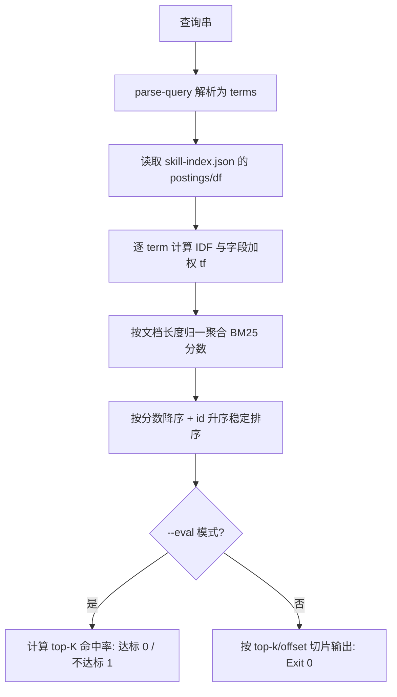

# Rank Skills BM25 (BM25 技能排序)

## Overview

本技能是 L2 工序动作级工具，对应 Google 检索链里的排序环节。
它在倒排索引上计算 BM25 分数，把「搜到的」变成「排好序的」。

## When to Use

- 需要按相关度返回技能候选时；
- 需要评测检索质量（top-K 命中率）时；
- 作为库被 `google-style-skill-search-router` / `select-skills-for-task` 导入时。

**触发禁区**：不负责生成片段（那是 `emit-search-snippet`）也不负责写日志（那是 `log-query-events`）。

## Workflow



1. `[probe:file]` 断言 `docs/operations/skill-index.json` 存在且含 `postings` / `df` / `avg_doc_len`；
2. `[probe:regex]` 调用 `parse-query` 把查询串解析为 terms；
3. `[probe:exitcode]` 逐 term 计算 `IDF = ln(1 + (N - df + 0.5) / (df + 0.5))`，字段加权 `tf` 按 `id > triggers > category_title > description` 累计；
4. `[probe:exitcode]` 按 `k1=1.2`、`b=0.75` 聚合分数并按 `(-score, id)` 稳定排序；
5. `[probe:length]` 按 `--top-k` / `--offset` 切片；`--eval` 模式下计算命中率并据此返回 0/1。

## Usage & Script

```bash
python3 skills/rank-skills-bm25/scripts/rank_skills.py --query "校验交付文件是否存在"
python3 skills/rank-skills-bm25/scripts/rank_skills.py --query "token 统计" --top-k 3 --offset 3
python3 skills/rank-skills-bm25/scripts/rank_skills.py --eval docs/requirements/execution/fixtures/retrieval-queries.json
```

## Success Contract

- Exit Code 0：排序完成，或 `--eval` 命中率达标；
- Exit Code 1：索引/查询不可读，或 `--eval` 命中率低于阈值；
- `--eval` 输出的 `details` 必须逐条给出查询是否命中，杜绝只给总分不给出处。

## Boundaries & Constraints

- 参数 `k1=1.2`、`b=0.75` 为固定常量，修改必须升 `index_version` 并重建索引；
- 零命中时返回空列表而非报错，由调用方决定后续动作。
