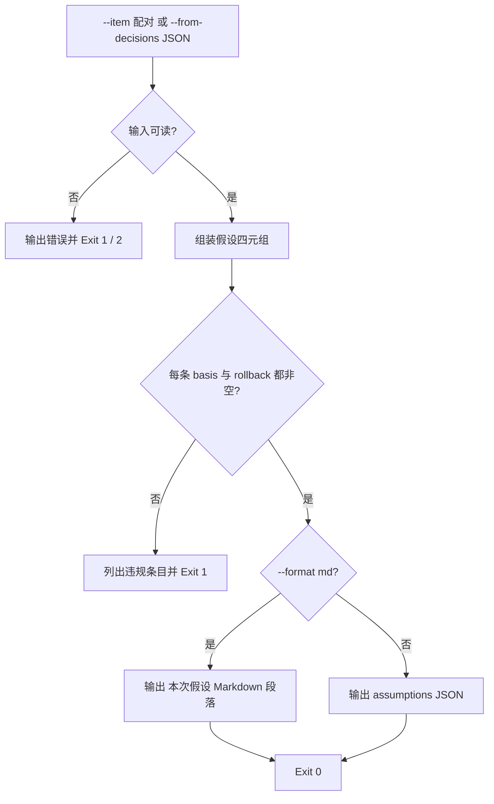

# Record Assumptions (假设留痕器)

## Overview

Record Assumptions 是 `one-shot-resolution-policy` 第 ③ 条「所作假设必须随交付给出」的物理执行层，
也是 `classify-decision-reversibility` 的下游：判定出来的 `decide_now` 项，由本技能转成交付清单里的 `assumptions` 段落。

它只做一件事——把决断写成**四元组「项 / 取值 / 依据 / 回滚方式」**，并对每条做硬校验：
缺 `basis` 或 `rollback` 一律 Exit 1。**假设不是免责声明**，写不出依据与回滚方式的决断等于没留痕。

## When to Use

- 一次任务收尾、准备交付回复，需要附上「本次假设」段落时；
- 把 `classify-decision-reversibility` 的输出批量转成假设条目时；
- 复核某条假设「凭什么它能被追溯、能回滚」时。

**触发禁区**：本技能只产出假设文本，不修改交付物本身；没有自行决断项的任务不产出假设段。

## Workflow



1. [probe:file] 断言输入来源存在：`--item` 槽位至少一个，或 `--from-decisions` 指向真实存在的可读 JSON 文件；
2. [probe:regex] 从 `--from-decisions` 解析判定结果，只挑 `verdict == "decide_now"` 的项，`default_choice` 作为 `value`，原样带上 `basis` 与 `rollback`；
3. [probe:length] 逐条校验 `basis` 与 `rollback` 均非空，空的进 `violations` 并列出 `seq` / `item` / `missing`；
4. [probe:exitcode] 存在任一违规条目即 Exit 1，绝不降级为警告继续输出；
5. [probe:length] 全部通过后按 `--format md|json` 输出，四字段顺序固定为「项 / 取值 / 依据 / 回滚方式」。

## Usage & Script

```bash
# 命令行配对：--item 开启新条目，后三键按顺序填充
python3 skills/record-assumptions/scripts/record_assumptions.py \
  --item "阈值取值" --value "0.9" --basis "与既有口径一致" --rollback "改回原常量并重跑断言" \
  --format md

# 从判定结果导入（自动只取 verdict=decide_now 的项，default_choice 作为 value）
python3 skills/classify-decision-reversibility/scripts/classify_decision.py \
  --item "阈值取 0.85 还是 0.9" --item "删除旧的日志目录" --redline R1 --json > /tmp/decisions.json
python3 skills/record-assumptions/scripts/record_assumptions.py \
  --from-decisions /tmp/decisions.json --format md

# JSON 模式：交付清单直接吃 {"success":true,"assumptions":[...]}
python3 skills/record-assumptions/scripts/record_assumptions.py \
  --from-decisions /tmp/decisions.json --format json

# 同类字段可继续追加多组
python3 skills/record-assumptions/scripts/record_assumptions.py \
  --item "命名风格" --value "kebab-case" --basis "与仓库既有目录一致" --rollback "批量重命名回原风格" \
  --item "输出目录" --value "docs/requirements" --basis "需求侧是权威真相源" --rollback "文件与指引行一并挪回"
```

## Success Contract

- Exit Code 0：全部假设条目齐备（`basis` 与 `rollback` 非空），结果由 stdout 承载（Markdown 段落或 `{"success":true,"assumptions":[...]}`）；
- Exit Code 1：存在缺 `basis` / `rollback` 的条目（逐条列出 `seq` / `item` / `missing`），或没有任何可记录的条目；
- Exit Code 2：`--from-decisions` 指向的文件不存在、不可读，或不是合法判定 JSON。

## Boundaries & Constraints

- **四元组不可减字段**：`item` / `value` / `basis` / `rollback` 是交付清单的固定形状，不得改名为 `label` / `text`；
- **依据必须具体**：本技能只做非空断言，但填「按经验判断」这类无依据表述视为不合格留痕；
- **只留痕不改交付物**：本技能不写入任何业务文件，只产出文本供交付回复粘贴；
- **红线不复制**：红线 R1~R5 的唯一真相源是 `fastlane-redline-policy`，本技能不判定、不复写红线，
  只透传上游 `classify-decision-reversibility` 的 `decide_now` 结论并补齐依据与回滚方式；
- **确定性**：解析与渲染只依赖输入与固定字段顺序，禁止随机数、时间戳与外部网络；
- **顺序即配对**：`--item` 开启新条目槽位，后三键填充当前槽位，顺序错位会产生错误配对，故 value/basis/rollback 先于 item 出现时直接拒绝。
