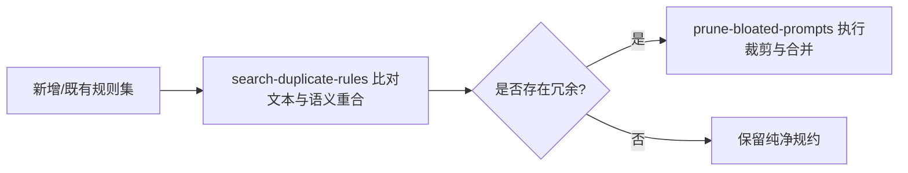

# Redundancy Detector (冗余检测与防膨胀)

## Overview

Redundancy Detector 负责持续监控管家管控层与提示词库，防止新增规则引入同义反复与过度设计，保障规则池的高紧凑度。

## Workflow

```mermaid
flowchart LR
    Candidate[新增/既有规则集] --> Compare[search-duplicate-rules 比对文本与语义重合]
    Compare --> Check{是否存在冗余?}
    Check -->|是| Prune[prune-bloated-prompts 执行裁剪与合并]
    Check -->|否| Keep[保留纯净规约]
```

## Boundaries

- 重点检测规则表达冗余，不裁剪业务层必须的参数配置。
