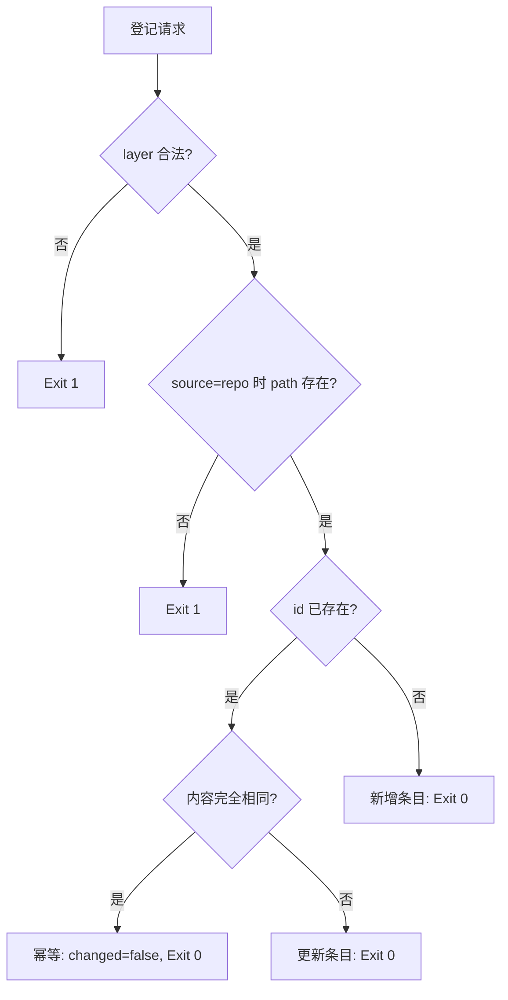

# Register Execution Layer (非技能执行层登记)

## Overview

本技能是 L2 工序动作级工具，负责把技能层之外的五种执行层（命令 / 智能体 / 接口 / 协议 / 插件）登记进
`docs/operations/execution-layers.json`，让它们和技能一样能进树、能被验证、能被检索。

## When to Use

- 新增 CLI 命令、接入新 API 或 MCP 连接器、安装插件时；
- 首次使用某个宿主能力（如 `subagent`）并希望它出现在树里时；
- 需要列出当前六层执行层清单时（`--list`）。

**触发禁区**：技能层不由本工具登记（它由 `sync_catalog.py` 自动派生）。

## Workflow



1. `[probe:regex]` 校验 `--layer` ∈ {skill, cli, agent, api, mcp, plugin}，非法即退出 1；
2. `[probe:file]` `--source repo` 时断言 `--path` 指向的真实文件/目录存在；
3. `[probe:regex]` 校验 `--id` 唯一或内容一致（内容一致视为幂等，不报错）；
4. `[probe:file]` 写回 `docs/operations/execution-layers.json`（键排序、无时间戳）；
5. `[probe:exitcode]` 输出 `changed` / `action` 后返回 0。

## Usage & Script

```bash
python3 skills/register-execution-layer/scripts/register_layer.py --list
python3 skills/register-execution-layer/scripts/register_layer.py \
  --add --id skill-pool --layer cli --path bin/skill-pool --description "技能池管理与门禁 CLI"
python3 skills/register-execution-layer/scripts/register_layer.py \
  --add --id subagent --layer agent --source host --description "宿主提供的子智能体能力"
python3 skills/register-execution-layer/scripts/register_layer.py --remove --id skill-pool
```

## Success Contract

- Exit Code 0：登记成功、幂等命中或 `--list` 输出完成；
- Exit Code 1：层名非法、`source=repo` 缺路径/路径不存在、id 冲突且内容不同、或移除不存在的 id；
- 幂等：同一参数连续执行，第二次 `changed == false`。

## Boundaries & Constraints

- 只登记**执行层条目**，不写技能契约、不改 catalog；
- `source=host` 的条目允许 `path` 为空，但在树中必须标注为宿主能力。
