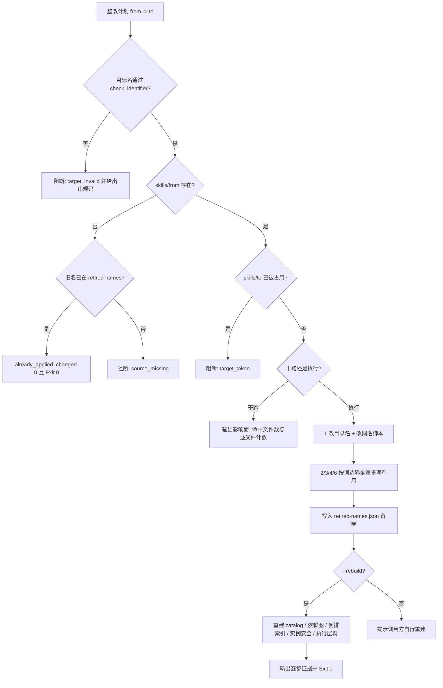

# Rename Execution Layer (执行层命名整改器)

## Overview

本技能是 `capability-naming-policy` 中「改名六处同步契约」的物理执行层。

**改名不是只改目录名。** 只改目录名的改名，会在下一个门禁立刻被判为悬空引用——
它没有解决问题，只是把问题推给了未来。本技能强制一次改完六处：

| # | 同步对象 | 位置 |
| :---: | :--- | :--- |
| 1 | 目录名 | `skills/<from>/` → `skills/<to>/`，配套脚本 `<from_>.py` → `<to_>.py` |
| 2 | 技能 ID | `skill-catalog.json` 的 `id` 与 `name`，以及全部派生产物 |
| 3 | 契约头 | `skills/<to>/SKILL.md` 的 YAML Frontmatter `name` |
| 4 | 组装边 | 全池 `composition` / `depends_on` 引用 |
| 5 | 树与索引 | `execution-tree.json` / `.md`、`skill-index.json`、`layer-graph.json`、`instance-safety.json` |
| 6 | 文档与登记 | `docs/**` 受控正文与受管区块、`execution-layers.json` |

### 换代必须落在词边界上

追加后缀式改名会让**新名把旧名整体包含为自己的前缀**。
若用纯子串替换，第二次运行会把已经改好的新名再改一遍，产生双重后缀。
因此本技能的扫描与替换都用词边界正则 `(?<![a-z0-9-])旧名(?![a-z0-9-])`。

### 幂等与留痕

- 每个旧名写入 `docs/operations/retired-names.json`，作为 `verify-layer-naming` 的悬空引用扫描输入；
- 重复执行同一计划时命中 `already_applied` 分支，`changed_files_total = 0`，退出码仍为 0。

## When to Use

- 命名体检报出违规、需要按清单整改时；
- 需要在不破坏组装边与索引的前提下把某个执行层改名时；
- 需要先看影响面再决定是否整改时（用 `--dry-run`）。

**触发禁区**：本技能只改名，**不改层级、不改功能、不做命名判定**（判定归 `audit-layer-naming`）；不处理非执行层文件（如业务源码）的重命名；不修改 `retired-names.json` 之外的任何登记表语义。

## Workflow



1. `[probe:file]` 加载 `naming_rules.py`，缺失即输出 `rules_missing` 并退 2（目标名校验必须与体检用同一份判据）；
2. `[probe:regex]` 解析整改计划（`--plan` 的 `{"renames":[...]}` 或 `--rename from=to`），空计划或字段缺失即退 2；
3. `[probe:regex]` 校验目标名：调 `check_identifier(target, level)`，任一违规码命中即阻断并输出逐条理由（**非法目标名绝不落地**）；
4. `[probe:file]` 判定源状态：`skills/<from>/` 不存在且旧名已在 `retired-names.json` 即判 `already_applied`（幂等分支），否则判 `source_missing` 阻断；
5. `[probe:file]` 判定目标占用：`skills/<to>/` 已存在即判 `target_taken` 阻断（**绝不覆盖已有执行层**）；
6. `[probe:length]` 干跑模式按词边界统计每个待改名的命中文件数与次数，输出影响面后退出，**不写任何文件**；
7. `[probe:exitcode]` 执行模式第 1 步：`os.rename` 目录，并若存在 `scripts/<from_>.py` 则一并改名为 `scripts/<to_>.py`；
8. `[probe:regex]` 执行模式第 2/3/4/6 步：对全仓文本文件（跳过 `.git` / `__pycache__` / `node_modules`）做词边界替换，逐个记录改写文件清单；
9. `[probe:file]` 把映射写入 `docs/operations/retired-names.json`（含改名前缀、目标名、理由、改写文件数），供悬空引用扫描；
10. `[probe:exitcode]` `--rebuild` 时按序重建 catalog → 依赖图 → 倒排索引 → 实例安全 → 执行层树，五者全部 exit 0 才算整改成立；任一失败即退 1。

## Usage & Script

```bash
# 1) 干跑：只看影响面，不写任何文件
python3 skills/rename-execution-layer/scripts/rename_layer.py \
  --plan docs/requirements/execution/renames-pkg007.json --dry-run --json

# 2) 执行整改并重建全部派生产物
python3 skills/rename-execution-layer/scripts/rename_layer.py \
  --plan docs/requirements/execution/renames-pkg007.json --apply --rebuild --json

# 3) 单条临时改名（不入计划文件）
python3 skills/rename-execution-layer/scripts/rename_layer.py \
  --rename "old-skill-id=new-skill-id" --apply --rebuild

# 4) 非法目标名必须被拦（含禁词与非动作形态）
python3 skills/rename-execution-layer/scripts/rename_layer.py \
  --rename "find-duplicate-rules=helper-util-stuff" --dry-run
# → blocked / target_invalid / banned_word: 命中禁词：helper、stuff、util
```

实测基线（PKG-007 三轮整改）：

| 旧名 | 新名 | 命中文件数 |
| :--- | :--- | ---: |
| `find-duplicate-rules` | `search-duplicate-rules` | 14 |
| `concise-chinese-bold` | `concise-chinese-bold-guard` | 19 |
| `google-style-skill-search` | `google-style-skill-search-router` | 28 |

合计改写 61 个文件，五件派生产物全部重建成功，二次运行 `changed_files_total = 0`。

## Success Contract

| 退出码 | 含义 |
| :--- | :--- |
| 0 | 干跑完成（`would_rename`）/ 整改成功（`renamed`）/ 已是目标状态（`already_applied`） |
| 1 | 目标名非法（`target_invalid`）、目标被占用（`target_taken`）、源不存在（`source_missing`）、重建失败 |
| 2 | 输入不可读（计划非法、判据模块缺失、catalog 缺失） |

JSON 契约：`{"success","verdict","mode","renames":[{"from","to","status","changed_files","steps"}],"changed_files_total","rebuild":[...]}`；
`verified 闭集`：`would_rename` / `renamed` / `already_applied` / `target_invalid` / `target_taken` / `source_missing`。

## Boundaries & Constraints

- **六处一次改完**：只改目录名的改名一律不接受，未同步的派生产物会在下一个门禁被判悬空引用；
- **目标是不可非法**：落地前必须过 `check_identifier`，禁词与错误形态在干跑阶段就被拦住；
- **幂等**：重复执行同一计划必须 `changed_files_total = 0` 且退 0，否则说明替换不是词边界安全的；
- **不改层级、不改功能**：本技能只改名字与引用，层级归属与功能语义由上游技能负责；
- **不覆盖已有执行层**：`skills/<to>/` 存在即阻断，绝不静默覆盖；
- **重建必须全绿**：`--rebuild` 的五件产物任一非 0 即判整改未成立，禁止「改名成功但索引还是旧的」。
