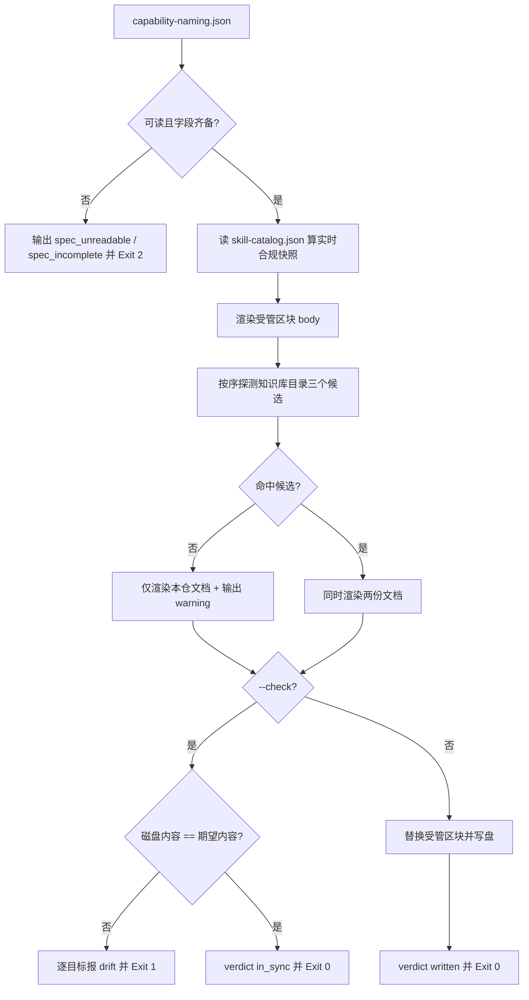

# Render Capability Naming (命名规范文档渲染器)

## Overview

本技能把 `docs/operations/capability-naming.json` 单向渲染成两份人读文档的受管区块：

| 目标 | 路径 | 作用 |
| :--- | :--- | :--- |
| 本仓文档 | `docs/operations/capability-naming.md` | 本仓执行层命名的口径说明与实时合规快照 |
| 知识库文档 | `<全局规则>/knowledge/common/capability_naming_spec.md` | 跨项目继承的通用能力层命名唯一权威源 |

**单一真相源是 JSON。** 本技能只做「数据 → 受管区块」的单向渲染，
任何规则表都不允许人工手写——同一事实一旦有两处写法，必然漂移，漂移之后
audit 脚本与门禁脚本会对同一个技能给出两种结论。

### 知识库路径自动探测（兼容合并前后两种布局）

| 序 | 候选 | 适用布局 |
| :---: | :--- | :--- |
| 1 | `$DSH_GLOBAL_RULES_DIR/knowledge/common` | 显式指定 |
| 2 | `<repo>/../全局规则/knowledge/common` | 合并前：`Skill池` 与 `全局规则` 平级 |
| 3 | `<repo>/../knowledge/common` | 合并后：仓库位于 `全局规则/skills` |

三者按序探测，取第一个存在的目录。全部不可用时**只渲染本仓文档并给出告警**，退出码仍为 0
（知识库不可达不应阻断本仓的规则可读性）。

### 受管区块与人工内容

文档 = 头部（版本块与分工说明，生成时写入）+ `<!-- CAPNAMING:BEGIN -->` 受管区块 + `<!-- CAPNAMING:END -->`。
重渲染时只替换受管区块内部，标记之外的人工内容保留。

## When to Use

- 修改了 `capability-naming.json`（增删动词、加禁词、调段数上限）之后，需要把变更同步到两份人读文档时；
- 需要确认「文档里的规则表与真相源是否一致」时（用 `--check`）；
- 交付验收需要给出「规范文档存在且与真相源零漂移」的证据时。

**触发禁区**：本技能只渲染文档，**不做命名判定、不改名、不重建索引**；不渲染 `SKILL.md` / `README.md`；不改动受管标记之外的人工内容。

## Workflow



1. `[probe:file]` 加载 `docs/operations/capability-naming.json`，缺失即输出 `spec_unreadable` 并退 2（**绝不内置兜底词表**）；
2. `[probe:regex]` 断言真相源必需字段齐备（`outputs` / `syntax` / `verb_vocabulary` / `shapes` / `contract_sync` 与成对的受管标记），缺任一即退 2；
3. `[probe:exitcode]` 复用 `naming_rules.py` 的规则引擎算一次实时合规快照，让文档里的合规率是**实数而非声称**；
4. `[probe:regex]` 渲染受管区块正文：四要素表、六层分类表、四种形态表、层级绑定表、语法约束表、动词词汇表、编排名词表、禁词表、同义归一表、单厂白名单、六处同步契约表、实时合规快照；
5. `[probe:file]` 按候选顺序探测知识库目录（`$DSH_GLOBAL_RULES_DIR` → `<repo>/../全局规则/knowledge/common` → `<repo>/../knowledge/common`），取第一个存在的；
6. `[probe:file]` 对每个目标读取现有内容：若已存在受管标记则**只替换标记内部**，标记之外的人工内容原样保留；不存在则按头部 + 标记结构新建；
7. `[probe:length]` `--check` 模式下逐目标比对磁盘内容与期望内容，任一不一致即记 `drift` 并退 1，**不写任何文件**；
8. `[probe:exitcode]` 写盘模式逐目标写盘并记录字节数，写失败即退 2；
9. `[probe:regex]` 知识库目录不可用时输出 `warning` 与全部候选路径，退出码仍为 0（不阻断本仓）；
10. `[probe:exitcode]` 输出 `verdict`（`in_sync` / `written` / `drift_detected`）与逐目标状态，`--check` 幂等：连续两次 `--check` 结果必须一致。

## Usage & Script

```bash
# 1) 渲染两份文档（本仓 + 知识库）
python3 skills/render-capability-naming/scripts/render_naming_spec.py --write --json

# 2) 漂移检测（CI / 门禁用）
python3 skills/render-capability-naming/scripts/render_naming_spec.py --check --json
```

实测输出（首次渲染）：

| 目标 | 路径 | 字节 |
| :--- | :--- | ---: |
| 本仓文档 | `docs/operations/capability-naming.md` | 11906 |
| 知识库文档 | `全局规则/knowledge/common/capability_naming_spec.md` | 12874 |

第二次 `--check` 输出 `verdict = in_sync`、`drift = 0`、退出码 0，证明渲染幂等。

## Success Contract

| 退出码 | 含义 |
| :--- | :--- |
| 0 | 写盘成功，或 `--check` 下全部目标与真相源一致（`verdict = in_sync`） |
| 1 | `--check` 下存在漂移（`verdict = drift_detected`，逐目标给出期望与实际字节数） |
| 2 | 输入不可读（真相源缺失/字段不全/受管标记为空、写盘失败） |

JSON 契约：`{"success","mode","verdict","spec","spec_version","knowledge_dir","knowledge_dir_candidates","compliance":{...},"written","drift","targets":[{"name","path","status","bytes"}],"warning"?}`；
`targets[].status` 闭集为 `in_sync` / `drift` / `written` / `write_failed` / `unreadable`。

## Boundaries & Constraints

- **禁止双写**：规则表只由 JSON 生成，本技能不接受任何人工维护的规则表；
- **只替换受管区块**：标记之外的人工内容必须保留，否则人工补充会每次重渲染都被清掉；
- **知识库不可达不阻断**：只告警并渲染本仓文档，退出码仍为 0；
- **不做判定、不改名**：本技能只把已有口径渲染成人读形态，判定与整改归 `audit-layer-naming` 与 `rename-execution-layer`；
- **快照必须是实数**：文档里的合规率取自实时扫描，不得写死；
- **幂等**：同一真相源连续两次渲染，第二次必须 `drift = 0` 且不产生字节变化。
