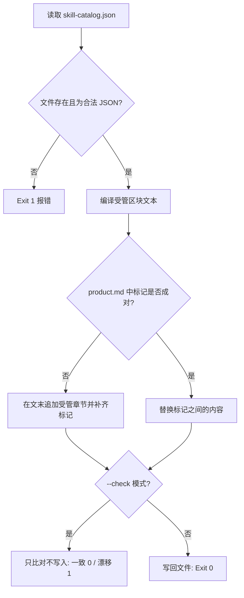

# Render Catalog Docs (受管区块生成器)

## Overview

本技能是 L2 工序动作级工具，负责把「组装关系」这份事实从 `SKILL.md` Frontmatter 单向搬运到文档层。
它只写标记之间的受管区块，区块外的一切文字原样保留，因此可以无限次重跑而不产生噪音 diff。

## When to Use

- 新增、删除技能，或修改任一技能的 `level` / `composition` 之后；
- 需要更新 `docs/requirements/product.md` 里的组装关系表时；
- CI 或门禁需要判断「文档是否已经落后于代码」时（使用 `--check`）。

**触发禁区**：不得用它改写区块外的正文；也不得用它替代 `sync_catalog.py`（后者负责生成 catalog 本体）。

## Workflow



1. `[probe:file]` 读取并断言 `docs/operations/skill-catalog.json` 存在且非空；
2. `[probe:regex]` 校验 JSON 必含 `total_skills`、`levels_summary`、`skills` 三个字段；
3. `[probe:regex]` 编译受管区块（级别分布 + 全部带 composition 的条目表）；
4. `[probe:regex]` 定位 `<!-- CATALOG:BEGIN ... -->` 与 `<!-- CATALOG:END -->`；缺失则在文末补齐；
5. `[probe:exitcode]` `--check` 模式下仅比对，返回 0（一致）/ 1（漂移）；默认模式写回并返回 0。

## Usage & Script

```bash
# 生成/刷新受管区块
python3 skills/render-catalog-docs/scripts/render_docs.py

# 漂移检测：不改文件，一致返回 0，漂移返回 1
python3 skills/render-catalog-docs/scripts/render_docs.py --check

# 指定目标文件（默认 docs/requirements/product.md）
python3 skills/render-catalog-docs/scripts/render_docs.py --target docs/requirements/product.md
```

## Success Contract

- Exit Code 0：写入成功，或 `--check` 模式下文档已是最新；
- Exit Code 1：catalog JSON 缺失/非法，或 `--check` 检测到漂移；
- 幂等：同一份 catalog 连续运行两次，文件内容逐字节相同。

## Boundaries & Constraints

- 只写 `<!-- CATALOG:BEGIN -->` 与 `<!-- CATALOG:END -->` 之间的内容；
- 不生成时间戳、不写随机数，保证 diff 只反映真实变更。

## Forbidden

- 禁止人工编辑受管区块内部（会被下一次运行覆盖）。
