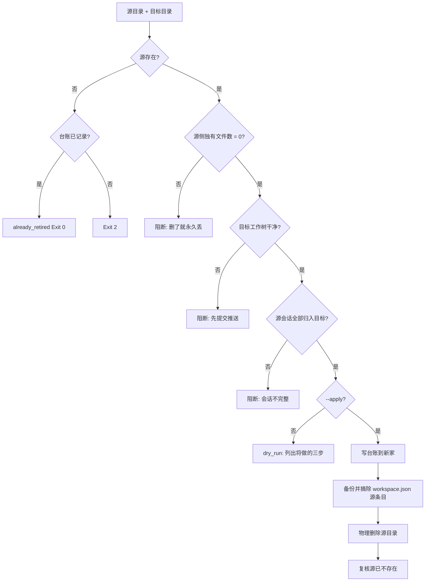

# Retire Legacy Workspace (旧工作区退役器)

## Overview

**子 树 合 并 不 等 于 迁 移。** PKG-007 把内容并进了新家、历史也保留了，
却把源目录留成「只读镜像」——那不是迁移，是复制。实测**两轮就分叉 44 个文件**。

本技能负责把源目录**真正退场**，并把顺序钉死（顺序错了会留下「注册项指向不存在路径」的中间态）。

## When to Use

- 一次合并已完成、需要让源目录物理消失时；
- 需要把「退役」这件事做成可回滚、可复核的动作时。

**触发禁区**：不用于删除未合并的目录、不用于清理普通临时目录；
本技能只退役**已被新家完整承接**的工作区。

## Workflow



1. `[probe:file]` 断言源目录与目标目录都存在，缺失即退 2（源已不存在且台账已记录 → 幂等 `already_retired`）；
2. `[probe:file]` 断言 `workspace.json` 可读，不可读即退 2；
3. `[probe:length]` **核心断言**：逐文件比对，源侧独有文件数必须为 **0**。源文件比目标旧（`content_mismatch`）是**预期状态**，目标多出文件也是预期的，唯一风险是「只存在于将被删除那一侧」；
4. `[probe:exitcode]` 断言目标仓库工作树干净（`git status --porcelain` 为空），有未提交变更即阻断；
5. `[probe:length]` 断言源工作区的每条 `sessionId` 都已在目标工作区的 `sessionIds` 内，缺一条即阻断；
6. `[probe:file]` 干跑模式输出将做的三步（写台账 / 摘注册 / 删目录）并退出，**不写任何文件**；
7. `[probe:file]` 写退役台账到**新家**（源路径 / 目标路径 / 源 HEAD / 迁移会话数 / 回滚方式），不写在将被删除的目录里；
8. `[probe:file]` 备份 `workspace.json` 为 `.bak-<时间戳>`，然后移除源工作区条目；
9. `[probe:file]` **第 8 步之后**才物理删除源目录（先摘注册再删目录，避免悬空注册项）；
10. `[probe:exitcode]` 复核源路径不存在，输出 `status=retired` 并退 0。

## Usage & Script

```bash
# 干跑
python3 skills/retire-legacy-workspace/scripts/retire_workspace.py \
  --source <源目录> --target <目标目录>

# 执行
python3 skills/retire-legacy-workspace/scripts/retire_workspace.py \
  --source <源目录> --target <目标目录> --apply --json
```

实测：源与目标差异 50 处但**源侧独有文件 0 个** → 通过「不丢文件」断言；
目标工作树有 12 项未提交 → 被第 4 步阻断（正确行为）。

## Success Contract

| 退出码 | 含义 |
| :--- | :--- |
| 0 | 干跑完成 / 退役成功 / 已是目标状态（幂等） |
| 1 | 前置断言不成立（源侧有独有文件 / 目标未入库 / 会话不完整） |
| 2 | 输入不可读（路径缺失、workspace.json 不可解析） |

## Boundaries & Constraints

- **不丢文件是唯一硬门**：源侧独有文件数必须为 0，其余差异属预期；
- **顺序不可调换**：必须先摘注册再删目录；
- **台账写在新家**：写进将被删除的目录等于没写；
- **先备份后改动**：没有 `.bak-<时间戳>` 就不许改 `workspace.json`；
- **幂等**：源已不存在且台账已记录时退 0；
- **只读目标**：本技能不修改目标仓库内容，只要求它干净。
