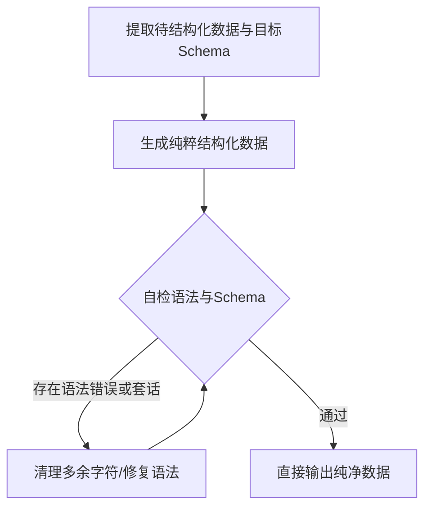

# Schema Guard (结构化输出守卫)

## Overview

Schema Guard 是用于杜绝大模型输出随机性、保证结构化数据强确定性的执行规约 Skill。
在程序化接口、管道中继、自动化工作流等场景中，输出必须满足严格的机器可读性，不能包含“好的，以下是为您生成的...”等自然语言闲聊，也不能包含非法未闭合的 JSON。

## When to Use

- 用户要求输出“纯 JSON”、“严格 YAML”、“特定 Schema”、“结构化数据”、“无需任何废话直接输出数据”时；
- 上游管道需要直接解析输出作为下一步参数或落盘时；
- 批量数据抽取与转换任务。

## Strict Rules (强约束规则)

1. **绝对纯净 (Zero Extra Text)**：
   - 严禁任何前言、引导词、解释说明、结束致谢；
   - 严禁包含未经用户要求的多余 Markdown 格式（除非用户显式要求包含 ```json 围栏）；
   - 首字符必须为有效数据的起始符（例如 `{` 或 `[` 或 YAML 首行），尾字符必须为对应的合法闭合符。

2. **Schema 契约 (Contract Adherence)**：
   - 必须严格遵守用户给出的字段名（区分大小写）、数据类型（Number 不能输出为带引号的 String）、嵌套层级；
   - 必填字段绝不能缺失，未知或空值严格按规范置为 `null` 或空列表 `[]`，不可省略字段。

3. **内置自检 (Self-Validation)**：
   - 模型在输出前，在上下文内部必须先反向执行解析校验（如 JSON 解析语法、逗号与括号配对、转义字符正确性）；
   - 可调用配套脚本 `skills/schema-guard/scripts/validate_schema.py` 辅助进行格式验证与修复。

## Standard Workflow



## Boundaries & Constraints

- 本技能专职负责结构化与格式规约，不篡改源数据的业务逻辑真实性；
- 若用户需求同时包含解释和数据，应引导用户明确拆分或者输出带有 `explanation` 字段的统一 JSON 对象。
