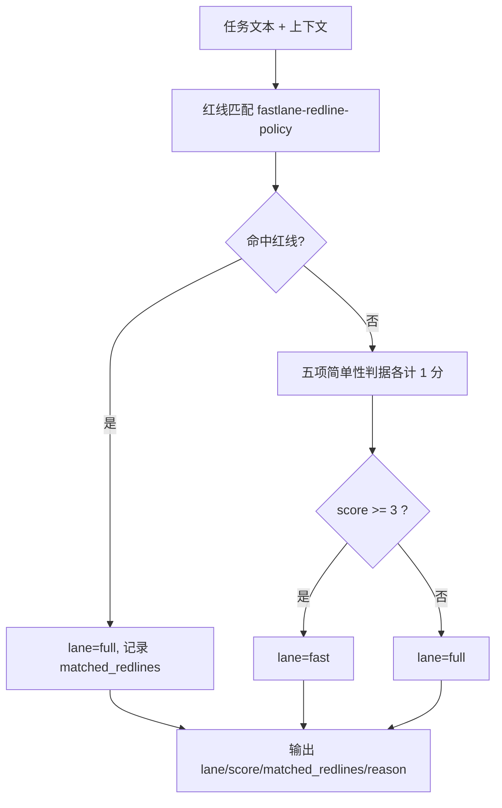

# Score Task Lane (双流程分流判定)

## Overview

本技能是 L2 工序动作级工具，把「这件事该走快车道还是完整流程」变成一次可复算的计算。
判定只依赖任务文本与显式上下文参数，不含随机、不含时间依赖，因此同样输入必然同样输出。

## When to Use

- 收到任何任务后的第一件事：判断走哪条流程；
- 需要向用户解释「为什么这个任务要重流程」时（读取 `reason` 与 `matched_redlines`）；
- 需要审计历史任务分流是否合理时。

**触发禁区**：纯问候、纯确认类交互不经过分流判定。

## Workflow



1. `[probe:regex]` 对任务文本执行 R1~R4 红线匹配，并用 `--files` 判定 R5；
2. `[probe:regex]` 命中任一红线即锁定 `lane=full`；
3. 未命中时 `[probe:exitcode]` 计算五项简单性判据得分：只读、单文件、可逆、步骤 ≤3、命中现成技能；
4. `[probe:exitcode]` 按 `score ≥ 3 → fast`、`score < 3 → full` 定档；
5. `[probe:regex]` 断言输出 JSON 必含 `lane` / `score` / `matched_redlines` / `reason` 四个字段。

## Usage & Script

```bash
python3 skills/score-task-lane/scripts/score_lane.py --task "读取并解释 docs/requirements/index.md"
python3 skills/score-task-lane/scripts/score_lane.py --task "把 README 的标题改一下" --files 1 --steps 2
python3 skills/score-task-lane/scripts/score_lane.py --task "删除旧的日志目录" --files 3
```

## Success Contract

- Exit Code 恒为 0：判定结果通过 stdout JSON 承载，退出码不承载语义；
- stdout JSON 必含 `lane`（`fast`/`full`）、`score`（0~5）、`matched_redlines`（数组）、`reason`（字符串）；
- 确定性：同一输入重复执行结果完全一致。

## Boundaries & Constraints

- 本技能只**判定**，不执行任务，也不改变任务本身；
- 分值方向固定为「越简单分越高」：5 项简单性判据各 1 分，阈值 3。
