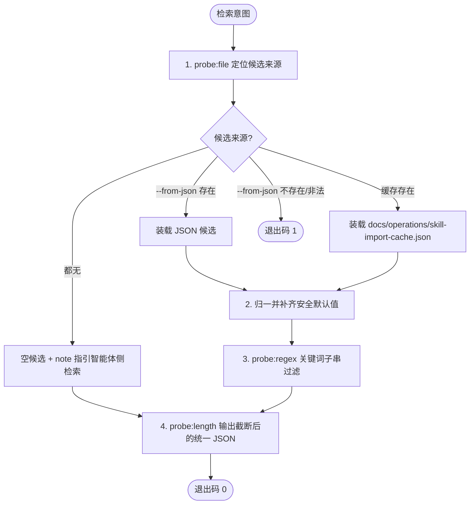

# Search GitHub Skill (GitHub 外部技能检索)

## Overview

本技能是「GitHub 技能引入管线」的第 1 步（T16，REQ-BUTLER-IMPORT-012）。
它把外部技能检索的结果收敛为一份**统一结构的候选清单 JSON**，供下游 `audit-imported-skill` 直接消费。

诚实边界：本脚本**不联网**。真实检索由智能体侧工具（`find_dsh_plugin`、web 检索、`gh` CLI）完成；
脚本只负责**装载 → 归一 → 过滤 → 截断**四件事，绝不伪造候选、绝不静默补数据。

## When to Use

**正触发**：
- 用户要求「找现成技能 / 从 GitHub 引入技能 / 有没有处理 PDF 的技能」等外部资产发现意图；
- 作为 `skill-import-pipeline` 的第 1 步被串联调用；
- 需要把一批人工或工具检索到的候选条目落成统一 JSON，供审计脚本消费。

**触发禁区**：本技能只做候选结构化与过滤，**不执行许可/安全审计**（交 `audit-imported-skill`）、**不改写技能契约**（交 `normalize-skill-contract`）、**不决定集群归属**（交 `place-skill-into-cluster`）、**不联网**（网络检索属于智能体侧工具职责）。

## Workflow



**有序步骤**：

1. `[probe:file]` 按优先级解析候选来源：`--from-json` 指定的文件 → `docs/operations/skill-import-cache.json` → 空；文件不存在即判失败（退出码 1）。
2. `[probe:regex]` 解析 JSON 负载，兼容 `{"candidates":[...]}` 与裸数组两种形态；对每条候选按 `name/url/license/has_scripts/stars/description` 归一，`license` 缺省为 `UNKNOWN`、`has_scripts` 缺省为 `False`。
3. `[probe:regex]` 用 `--query` 对 `name + description` 做不区分大小写的**子串**匹配；`--query` 为空则返回全部候选。
4. `[probe:length]` 按 `--limit`（默认 8）截断候选数组，输出统一结构 JSON 到 stdout。
5. `[probe:exitcode]` 断言进程退出码：正常输出恒为 0（即使候选为空），仅来源文件不可用或非法时为 1。

## Usage & Script

```bash
# 1. 无可候选来源时：返回合法 JSON、candidates 为空、带 note 指引，退出码 0
python3 skills/search-github-skill/scripts/search_skill.py --query "pdf"

# 2. 由智能体侧检索工具产出候选 JSON 后，经 --from-json 传入做结构化与过滤
python3 skills/search-github-skill/scripts/search_skill.py \
  --query "pdf" --limit 2 --from-json /tmp/candidates.json

# 3. 脚本化调用（强制 JSON，等价于默认行为）
python3 skills/search-github-skill/scripts/search_skill.py --query "" --json

# 4. 断言失败路径：文件不存在必须退出 1
python3 skills/search-github-skill/scripts/search_skill.py --from-json /tmp/不存在.json; echo "exit=$?"
```

## Success Contract

| 退出码 | 语义 |
| :--- | :--- |
| `0` | 正常输出统一结构 JSON；`candidates` 允许为空数组（空结果是合法结果，不是失败） |
| `1` | `--from-json` 指定的文件不存在，或不是合法 JSON / 结构非法 |

输出结构：

```json
{
  "success": true,
  "query": "pdf",
  "source": "from-json|cache|none",
  "candidates": [
    {"name": "...", "url": "...", "license": "MIT", "has_scripts": true, "stars": 12, "description": "..."}
  ]
}
```

- `source == "none"` 时额外输出 `note` 字段，指引改用智能体侧检索工具并经 `--from-json` 传入；
- 本技能只读候选来源，**不写入任何文件**。

## Boundaries & Constraints

- **严禁联网**：脚本不得 import `urllib` / `requests` / `socket`，检索由智能体侧工具完成；
- **严禁伪造候选**：无来源时必须返回空数组 + note，不得编造名称、URL、星标或许可；
- **只做结构化与判定**：不做许可裁决、不做安全结论、不改契约、不定集群归属，四者分别归属下游三个 L2 技能与 `place-skill-into-cluster`；
- 字段缺失一律走安全默认值（`license=UNKNOWN`、`has_scripts=False`、`stars=0`），不得以缺失为由丢弃候选。
