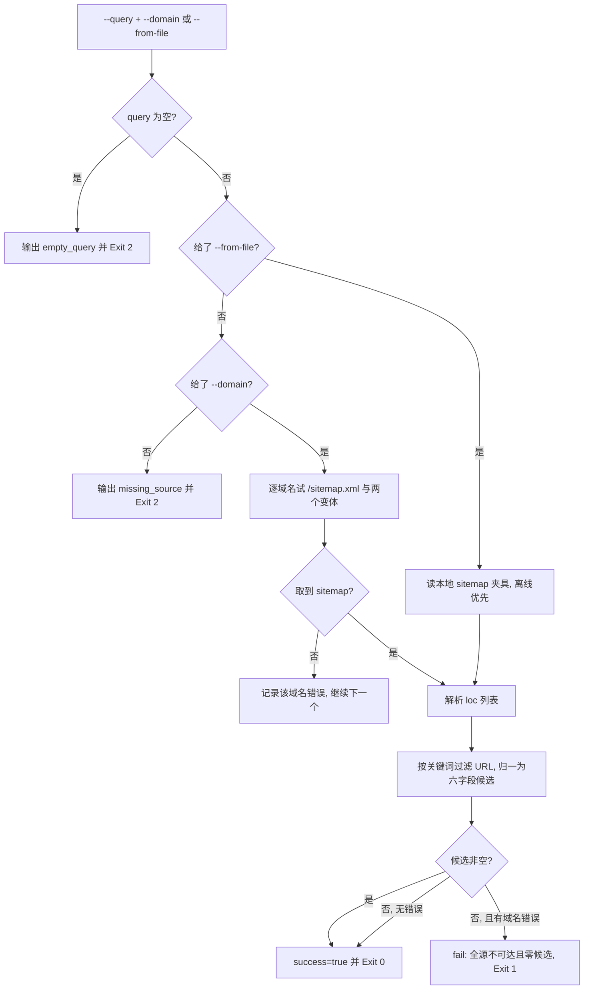

# Search Official Source (官网 / 官方文档源检索器)

## Overview

本技能是 `multi-source-search-policy` 四类源里的 **official-site** 实现。

**为什么走 sitemap 而不是搜索引擎**：`sitemap.xml` 是**站点自己声明的**页面全集——
来源可追溯、结果可复现、不依赖第三方排序。搜索引擎结果会随排序策略漂移：
同一个查询今天第 1 名明天第 7 名，写不进可复算的判据。

## When to Use

- 需要从官方站点/官方文档里找执行层入口，而 GitHub 上没有或不够权威时；
- 需要给出「来源可追溯」的检索证据（域名 + sitemap 地址）时。

**触发禁区**：只读检索，不下载页面正文、不写任何文件、不携带凭据；
需要登录或付费墙的站点不在本技能范围内。

## Workflow



1. `[probe:regex]` 校验 `--query` 非空，空查询即输出 `empty_query` 并退 2（空查询不是检索）；
2. `[probe:file]` 优先走 `--from-file`：夹具不存在或不可解析即退 2（离线与回归测试路径）；
3. `[probe:regex]` 无夹具时必须给 `--domain`，缺失即输出 `missing_source` 并退 2（**无从检索不是零结果**）；
4. `[probe:exitcode]` 逐域名依次尝试 `/sitemap.xml`、`/sitemap_index.xml`、`/sitemap-index.xml`，任一成功即停；
5. `[probe:regex]` 解析 `<loc>` 列表并断言其为绝对 URL，非 URL 条目直接丢弃；
6. `[probe:regex]` 按关键词做大小写不敏感子串过滤，命中即归一为六字段候选（`source=official-site`、`has_scripts=null`）；
7. `[probe:length]` 按 URL 去重后排序，取 `--limit` 条，保证同输入恒得同顺序；
8. `[probe:exitcode]` 零候选且存在域名错误一律退 1，并逐域名给出错误——**全源不可达是失败，不是「没找到」**。

## Usage & Script

```bash
# 联网：从官方站点 sitemap 检索
python3 skills/search-official-source/scripts/search_official.py --query infographic --domain docs.example.com

# 离线：读本地 sitemap 夹具（回归与演示）
python3 skills/search-official-source/scripts/search_official.py --query infographic \
  --from-file docs/requirements/execution/fixtures/sitemap-official-sample.xml
```

## Success Contract

| 退出码 | 含义 |
| --- | --- |
| 0 | 正常输出（候选可非空） |
| 1 | 全部域名都失败且零候选（失败绝不静默为「没找到」） |
| 2 | 输入不可读（缺 query/domain/from-file、夹具不可解析） |

## Boundaries & Constraints

- **只读**：不下载页面正文、不写文件、不携带任何凭据；
- **来源可追溯**：只走站点自声明 sitemap，不依赖第三方搜索排序；
- **失败不静默**：全源不可达必须显式失败，禁止返回空清单当成功；
- **`has_scripts` 保持 `null`**：官网源无法判定脚本面，写 `false` 是假阴性；
- **确定性**：同输入恒得同一顺序与同一条数，禁止随机、禁止时间参与。
