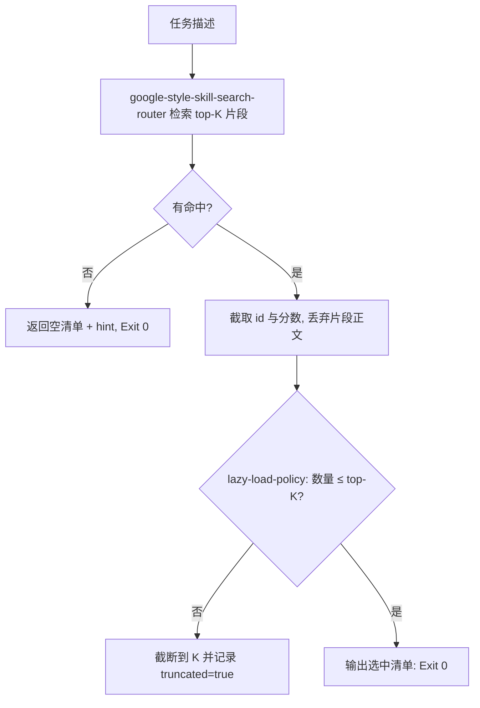

# Select Skills For Task (选技清单生成)

## Overview

本技能是 L2 工序动作级工具，把「这个任务该用哪些技能」变成一份可核对的 id 清单。
它是按需加载的闸门：**清单之外的技能，一律不许被读**。

## When to Use

- 接到任务、准备分派执行层之前；
- 需要向用户说明「本次会用到哪几个技能」时；
- 作为 `on-demand-dispatcher` 的第一步时。

**触发禁区**：本技能不读技能正文，也不做任务分流的快慢判定。

## Workflow



1. `[probe:file]` 断言 `skill-index.json` 存在，否则提示先重建索引；
2. `[probe:exitcode]` 调用检索取得排序结果，只取 `id` / `level` / `score` 三个字段；
3. `[probe:length]` 按 `--top-k`（默认 5）截断，超出部分丢弃并置 `truncated=true`；
4. `[probe:regex]` 断言输出中不含任何技能正文（无 `content` / `body` 字段）后返回 0。

## Usage & Script

```bash
python3 skills/select-skills-for-task/scripts/select_skills.py --task "校验交付文件是否存在"
python3 skills/select-skills-for-task/scripts/select_skills.py --task "生成可缩放查看器" --top-k 3
```

## Success Contract

- Exit Code 0：清单产出完成（可为空清单，附 `hint`）；
- Exit Code 1：索引缺失或参数非法；
- 输出 `selected` 数组长度恒 ≤ `top_k`。

## Boundaries & Constraints

- **只读检索结果，不读技能正文**：本步骤产生的上下文开销与 top-K 成正比，与技能池规模无关；
- 空清单是合法结果，不得为「凑数」返回低分技能。
