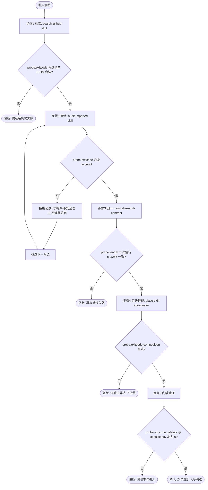

# Skill Import Pipeline (GitHub 技能引入管线总控)

## Overview

本技能是「GitHub 技能引入管线」的第 5 步（T20，REQ-BUTLER-IMPORT-012），也是该管线的**唯一总控入口**。
外部优质技能进入本池，不允许从零手写，也不允许绕过任何一步；五步缺一步不得入库。

两条不可让渡的口径：

1. **引入即纳管**：任何外部技能必须完整经过「检索 → 审计 → 契约归一 → 定级挂载 → 门禁验证」，
   落地后即成为受管资产（统一契约 + 编目归属 + 门禁可验），不存在「先放着以后再规范」的中间态；
2. **拒绝必留痕**：被拒绝的候选**必须**给出明确许可/安全理由，写入拒绝记录，**不得静默丢弃**、不得跳过不记录改选下一候选。

落点：新增集群「**⑦ 技能引入与演进**」。

## When to Use

**正触发**：
- 用户要求「从 GitHub 引入一个技能 / 找一个现成技能并入池 / 把外部 Skill 纳管」;
- 需要批量评估外部候选并择优引入，且要求可审计的拒绝理由；
- 已明确要新增外部能力，且该能力不属于池内已有技能覆盖范围。

**触发禁区**：本技能是**引入外部资产**的总控，不适用于池内已有技能的修改或重命名（交 `dsh-butler` 动态造物路径）、不适用于纯代码审阅（交 `mcp-implementation-security-review` / `security-best-practices`）、也不代替人工对含脚本候选的逐行安全审查。

## Workflow



**有序步骤**（每步都必须落到物理探针，探针不过即阻断，不得带病推进）：

1. `[probe:file]` **检索**：调用 `search-github-skill` 产出候选清单 JSON；本地无来源时先由智能体侧检索工具（`find_dsh_plugin` / web 检索）取候选，再经 `--from-json` 传入；候选清单必须真实落地。
2. `[probe:exitcode]` **审计**：逐候选调用 `audit-imported-skill`；退出码 0 方可进入下一步，退出码 1 的候选必须把 `reasons` 写入拒绝记录后改选下一候选，**禁止静默丢弃**。
3. `[probe:length]` **归一**：对 `accept` 候选调用 `normalize-skill-contract` 生成统一契约；同参数二次运行比对 `sha256`，必须逐字节一致（幂等基线）。
4. `[probe:exitcode]` **定级挂载**：调用 `place-skill-into-cluster` 取得集群归属与建议父级，校验 `composition` 依赖边合法；判定通过后由人工/管家按建议执行接线，落点「⑦ 技能引入与演进」。
5. `[probe:exitcode]` **门禁验证**：执行 `./bin/skill-pool validate` 与 `./bin/skill-pool consistency`，两者退出码必须均为 0；任一非 0 视为整体未完成，回滚本次引入。

## Usage & Script

```bash
# ── 步骤 1 检索：结构化候选清单（本地无来源时先由智能体侧工具取候选）
python3 skills/search-github-skill/scripts/search_skill.py --query "pdf" --from-json /tmp/candidates.json
echo "exit=$?"

# ── 步骤 2 审计：逐候选裁决（0=accept，1=reject 且必须记录理由）
python3 skills/audit-imported-skill/scripts/audit_skill.py --candidate /tmp/candidate.json
echo "exit=$?"

# ── 步骤 3 归一：生成统一契约，连续两次比对 sha256 必须一致
python3 skills/normalize-skill-contract/scripts/normalize_skill.py \
  --name pdf-toolkit --level L2 --description "PDF 解析与文本抽取工序技能"

# ── 步骤 4 定级挂载：取集群归属与建议父级（只判定不写盘）
python3 skills/place-skill-into-cluster/scripts/place_skill.py --name pdf-toolkit --dry-run
echo "exit=$?"

# ── 步骤 5 门禁验证：两者退出码必须均为 0
./bin/skill-pool validate && ./bin/skill-pool consistency
echo "exit=$?"
```

## Success Contract

| 退出码 | 语义 |
| :--- | :--- |
| `0` | 五步全部通过：候选已归一纳管、composition 合法、`validate` 与 `consistency` 均退出 0 |
| `1` | 任一步阻断：候选结构化失败 / 全部候选被拒 / 幂等基线失效 / 依赖边非法 / 门禁非 0 |

**必须交付的引入记录**（缺一即视为未完成）：

| 记录项 | 说明 |
| :--- | :--- |
| 候选清单 | 检索来源（`from-json` / 缓存 / 智能体侧工具）与结构化结果 |
| 审计裁决 | 每个候选的 `decision`；被拒候选必须附许可/安全理由 |
| 归一哈希 | `normalize-skill-contract` 输出的 `sha256`，以及二次运行的等值证据 |
| 归属建议 | `cluster`（落点「⑦ 技能引入与演进」）、`suggested_parents`、`composition_ok` |
| 门禁证据 | `./bin/skill-pool validate` 与 `./bin/skill-pool consistency` 的退出码 |

## Boundaries & Constraints

- **五步缺一不可**：跳过审计、跳过归一或跳过门禁的「快速引入」一律无效，引入即纳管是硬规约；
- **拒绝必留痕**：被拒候选必须写明许可/安全理由并保留记录，禁止静默丢弃，禁止「先引入后补审计」；
- **不替代人工安全审查**：`has_scripts=true` 的候选即使审计通过，仍必须由人工逐行审脚本后才能接线；
- **不越权写入**：管线的写盘动作仅限 `normalize-skill-contract` 的契约文件生成与人工确认后的接线，禁止本技能直接改写 `docs/`、`bin/` 或编目文件；
- **落点唯一**：新建与引入技能统一挂载至「⑦ 技能引入与演进」集群，不得散落到其他集群；
- 引入完成后必须通过 `./bin/skill-pool validate` 与 `./bin/skill-pool consistency` 双门禁（二者 Exit Code 均为 0）才算交付。
